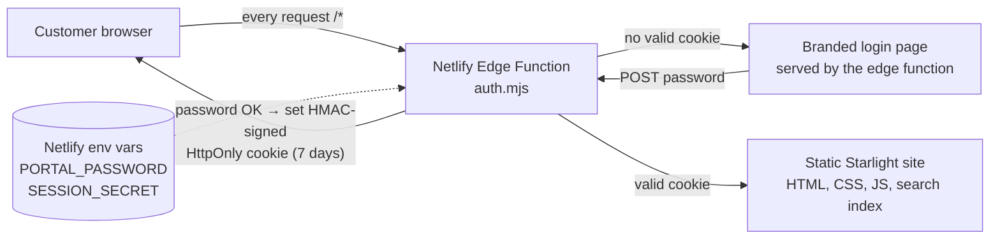

# Neopix Customer Documentation Portal

A private, password-protected documentation site for customers. Markdown in,
polished docs out — with **every page and static asset gated behind
authentication at the edge**.

| | |
|---|---|
| Site generator | [Astro Starlight](https://starlight.astro.build) (static, Markdown-first) |
| Authentication | Netlify Edge Function (`netlify/edge-functions/auth.mjs`) with HMAC-signed session cookies |
| Hosting | Netlify (free tier is sufficient) |
| External services | **None** — no database, no auth provider, no servers |

## Architecture



In plain text:

```
Browser ──(any URL, incl. /_astro/*.css, /pagefind/*)──▶ Edge Function (auth.mjs)
            │                                              │
            │  no/invalid/expired cookie                   │  valid signed cookie
            ▼                                              ▼
        Login page (served inline,                  Static site from CDN
        never exposes content)                      (built by `astro build`)
```

Key properties:

- **Nothing bypasses the gate.** The edge function is mounted at `path: "/*"`,
  so HTML, CSS, JS, images, and the search index are all protected.
- **Stateless auth.** The session is an HMAC-SHA256-signed, expiring token in an
  `HttpOnly; Secure; SameSite=Lax` cookie. No session store, no database.
- **Fails closed.** If `PORTAL_PASSWORD` or `SESSION_SECRET` is missing or the
  secret is too short, the function returns 503 and serves no content.

## Project structure

```
├── astro.config.mjs            # Starlight config: title, sidebar, branding
├── netlify.toml                # Build command, publish dir, Node version
├── netlify/edge-functions/
│   ├── auth.mjs                # The auth gate (login, logout, session check)
│   └── lib/session.mjs         # Pure Web-Crypto token + password logic (unit-tested)
├── src/
│   ├── content/docs/           # ← write your Markdown here
│   ├── styles/custom.css       # Neopix-inspired theme (orange / dark navy)
│   └── assets/logo.svg
├── test/                       # node --test suite for the auth layer
└── .env.example                # Documents required environment variables
```

## Setup (local development)

```bash
npm install
npm run dev        # docs site at http://localhost:4321 (no auth gate locally)
npm test           # auth + session unit tests
npm run build      # production build to dist/
```

To exercise the auth gate locally, use the Netlify CLI:

```bash
npm i -g netlify-cli
cp .env.example .env          # then edit values
netlify dev                   # runs the site WITH the edge function
```

## Deployment (Netlify)

1. Push this repository to GitHub/GitLab/Bitbucket.
2. In Netlify: **Add new site → Import an existing project** and pick the repo.
   Build settings are read automatically from `netlify.toml`
   (`npm run build` → publish `dist/`).
3. Before the first deploy, set the environment variables under
   **Site configuration → Environment variables**:
   - `PORTAL_PASSWORD` — the access password you hand to customers
     (a strong passphrase).
   - `SESSION_SECRET` — 32+ random characters. Generate with:
     `node -e "console.log(crypto.randomBytes(32).toString('hex'))"`
4. Deploy. Every push to the default branch now builds and deploys
   automatically — that *is* the CI/CD pipeline; no extra workflow files needed.
5. Optional: add a custom domain (e.g. `docs.weareneopix.com`) in
   **Domain management**. Netlify provisions TLS automatically.

### Verifying the deployment

- Open the site in a private window → you must land on the login page.
- Request a static asset directly (e.g. `/pagefind/pagefind.js`) → must
  redirect to `/login`, not serve the file.
- Sign in with the password → docs load; `/logout` signs you out.

## Authentication setup & operations

- **Rotating the password:** change `PORTAL_PASSWORD` in Netlify and redeploy
  (env var changes require a redeploy to take effect for edge functions).
  Existing sessions stay valid until they expire.
- **Forcing everyone to re-login:** rotate `SESSION_SECRET` — all existing
  cookies become invalid instantly.
- **Session lifetime:** 7 days, set by `SESSION_TTL_SECONDS` in
  `netlify/edge-functions/auth.mjs`.

## Writing documentation

Add or edit `.md`/`.mdx` files under `src/content/docs/`. Each file needs
frontmatter with at least a `title`. **The sidebar is fully auto-generated from
the folder structure — no configuration needed**: folder names become sidebar
sections, page titles become sidebar entries. Push to the default branch and
Netlify redeploys.

Non-technical contributors: see **[HOW-TO-ADD-DOCS.md](./HOW-TO-ADD-DOCS.md)**
for a 3-step guide that works entirely from the GitHub web interface.

## Security considerations

- **Edge-level gating** protects static assets, search indexes, and HTML alike —
  there is no "client-side only" protection anywhere.
- **Secrets live only in Netlify environment variables**; the repo contains
  `.env.example` with placeholders and `.gitignore` excludes `.env*`.
- Cookies are `HttpOnly` (no JS access), `Secure` (HTTPS only),
  `SameSite=Lax` (CSRF mitigation), and HMAC-signed with expiry (no tampering).
- Password and token comparisons are **constant-time** (HMAC-then-compare).
- Failed logins are delayed ~400 ms to slow brute-forcing; the login page and
  all responses send `X-Robots-Tag: noindex`, `X-Frame-Options: DENY`,
  `X-Content-Type-Options: nosniff`, and `Cache-Control: no-store` where
  appropriate.
- The `next` redirect parameter is sanitized against open redirects.
- Known trade-off: a **single shared password** means revocation is all-or-nothing.
  That is the right simplicity trade-off for a small customer base; see below
  for the upgrade path.

## Estimated hosting costs

| Item | Cost |
|---|---|
| Netlify free tier (100 GB bandwidth, 300 build min, 1M edge invocations / month) | **$0** |
| Custom domain (optional, e.g. docs.weareneopix.com subdomain of an owned domain) | $0 |
| External services | $0 |
| **Total** | **$0/month** for typical docs traffic |

A documentation portal for even hundreds of customers stays comfortably inside
the free tier. If traffic ever exceeds it, Netlify Pro is $19/member/month.

## Future improvements

1. **Per-customer credentials** — swap the shared password for a small user
   list (still env-var based: `user:hash` pairs) or a hosted IdP
   (Auth0/Clerk/Supabase Auth) validated by the same edge function. The gate
   architecture doesn't change.
2. **Rate limiting** — Netlify's built-in rate limiting rules, or a counter in
   Netlify Blobs, to lock out repeated failed logins per IP.
3. **Audit logging** — log successful/failed logins to a drain for visibility.
4. **Per-customer content** — Starlight supports multiple sidebars/sections;
   combined with per-user auth, different customers could see different docs.
5. **Versioned docs** — `starlight-versions` plugin when products need
   version-pinned documentation.
