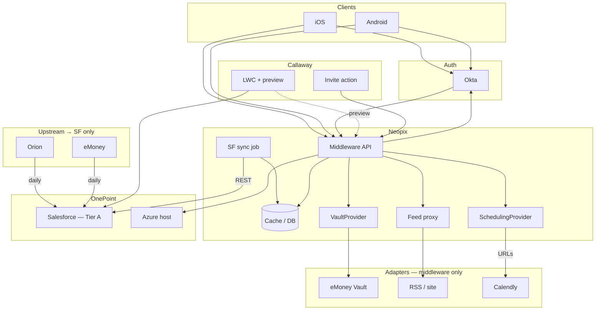
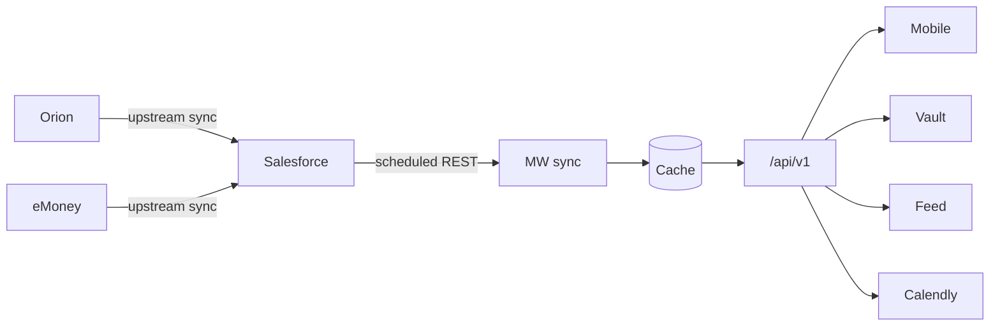
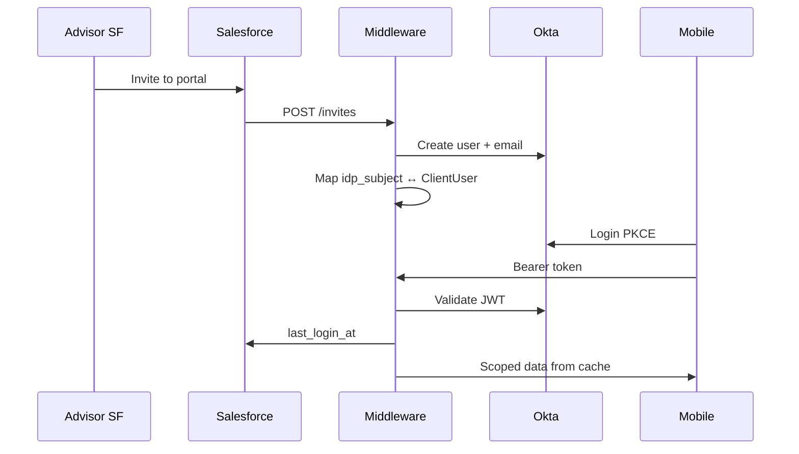
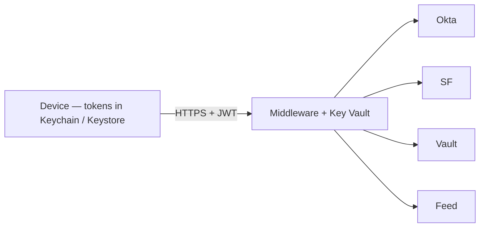

> Purpose: The locked systems picture for Phase 1 — how the client portal is assembled, where money and identity data move, who owns each surface, and the security posture this delivery accepts.  
> Not this doc: Product narrative ([prd](/product/prd/)), story-level behaviour (`05-specs/*/02-specify.md`), field maps ([data-model](/03-data/data-model/)), per-system integration contracts ([04-integrations](/04-integrations/readme/)), or pinned runtime stack / CI / cost (see [engineering proposal](/06-engineering/tech-spec-proposal/) — Proposed only).

Authority: Accepted ADRs in [constitution](/01-constitution/constitution/) win on decisions. Pack `02-specify.md` files win on UI and acceptance behaviour. This document explains the system those decisions produce; it does not reopen them.  
Last updated: 2026-07-21

---

## How to read

| If you need… | Start here |
|---|---|
| What this doc owns vs specs / integrations | [Document boundaries](#document-boundaries) |
| End-to-end systems picture | [§1 Context](#1-context) |
| Data tiers, sync path, net worth rules | [§2 Data plane](#2-data-plane) |
| Party and asset ownership | [§3 Ownership](#3-ownership) |
| Domain → source → pack | [§4 Domains](#4-domains) |
| Invite, login, preview, impersonation | [§5 Identity](#5-identity) |
| Screen → source orientation | [§6 Screens](#6-screens) |
| API surface orientation | [§7 API map](#7-api-map) |
| Security posture (CISO / IT skim) | [§9 Security baseline](#9-security-baseline) |
| Cross-cutting quality (perf, a11y, 100k scale, analytics out, …) | [§10 Quality attributes](#10-quality-attributes) |
| Related docs | [Related](#related) |

---

## Document boundaries

This file is the **systems SoT** for how the portal is put together. It is not the behaviour SoT and not the integration contract SoT.

| Concern | Authoritative home | Role of this architecture doc |
|---|---|---|
| Product vision, personas, pilot bar | [prd.md](/product/prd/) | Summarizes only what the system must support |
| Why a decision exists | [constitution](/01-constitution/constitution/) (ADRs) | Applies Accepted decisions; does not invent new ones |
| Entities and Salesforce field maps | [data-model.md](/03-data/data-model/) | Names entities in context; never invents API names |
| How Okta / SF / vault / Azure connect | [04-integrations/](/04-integrations/readme/) | Points at contracts; does not redefine sequences or credentials |
| User-visible behaviour, errors, pack NFRs | `05-specs/*/02-specify.md` | Domain tables here are **orientation** — specify wins on conflict |
| Request/response shapes | `05-specs/*/05-contracts/` (OpenAPI) | §7 is an index only — OpenAPI wins on conflict |
| Cross-cutting security posture | This doc §9 | Specs add story-level detail (e.g. E02); they must not soften §9 |
| Cross-cutting quality (perf defaults, a11y, reliability, 100k scale, …) | This doc §10 | Pack NFRs add domain budgets; tech-spec covers how to build/test |
| Cross-cutting data plane (tiers, NW formula, dual AA, flags) | This doc §2 | Packs consume these rules; Planning/Portfolio specify edge cases |
| Stack versions, CI/CD, cost | [tech-spec-proposal.md](/06-engineering/tech-spec-proposal/) (Proposed guideline) → Phase B `tech-spec.md` after stack lock | Explains constraints; does not pin SKUs |

Rule of thumb: If the question is *“what does the client see and accept?”* → specify. If it is *“which system is allowed to hold or compute this?”* → architecture (and ADRs). If it is *“how do we call Okta / Salesforce / vault?”* → integrations.

Intentionally not expanded here: per-screen acceptance demos, MoSCoW story lists, OpenAPI schemas, sprint plans, and Azure SKUs. Those belong in packs, contracts, delivery, or Phase B.

---

## 1. Context

OnePoint’s Phase 1 client portal is a **mobile-first** experience for invited households, with advisors and firm administrators working from **Salesforce** — not a second admin product.

| Layer | Technology / party | Responsibility |
|---|---|---|
| Client apps | React Native (iOS / Android) — Neopix | Present gated domains; authenticate via Okta; call middleware only |
| Middleware | API + sync jobs on OnePoint Azure — Neopix | AuthZ, Salesforce sync/cache, invites, flags, domain aggregates, adapters |
| CRM / config | Salesforce + LWC — Callaway | Person Accounts, preferences, invite action, advisor preview |
| Identity | Okta — OnePoint IT | Client IdP; admin principals for support impersonation |
| Hosting | OnePoint Azure / GitHub / stores | Runtime, repos, and distribution OnePoint owns |

Upstream portfolio and planning systems (**Orion**, **eMoney**) feed **Salesforce** on a firm-owned cadence. Middleware never becomes a second integration hub for those platforms in this delivery: it reads Tier A from Salesforce, and reaches vault, insights feed, and scheduling only through replaceable adapters.



Explicitly out of Neopix SOW this delivery: live Orion Connect from middleware, direct eMoney Tier B API reads for planning facts, and an Orion holdings staging/Redshift path as middleware ingest. Those remain firm or future-scope decisions ([ADR-025](/01-constitution/constitution/#adr-025--tier-b-and-tier-c-in-neopix-sow)).

---

## 2. Data plane

The middleware data plane is designed so the mobile app has **one** trusted API, Salesforce remains the **system of record for CRM-synced facts**, and missing upstream data fails honestly rather than looking complete.

### Tiers

| Tier | Source | Role in this delivery |
|:---:|---|---|
| A | Salesforce (REST sync into middleware cache) | Identity, accounts, balances, holdings/performance when present, team, feature flags, invites; planning facts as eMoney→SF lands |
| B | eMoney API (direct) | **Out of SOW** — institution link/relink via eMoney-hosted WebView only; planning display facts arrive through Salesforce |
| C | Orion holdings feed (API / staging / Redshift) | **Out of SOW** — holdings and performance are consumed only when present in Salesforce Tier A |

If holdings or performance rows are absent in Salesforce, middleware returns an empty list or marks fields `unavailable`. Neopix does not invent figures and does not call Orion Connect to “fill the gap” ([ADR-003](/01-constitution/constitution/#adr-003--no-orion-connect-api-in-neopix-scope), [ADR-024](/01-constitution/constitution/#adr-024--holdings--orion-performance-source)).

### Daily path



Salesforce is expected to complete its Orion/eMoney sync jobs on a daily cycle (target window after ~7 AM ET). Middleware then refreshes its cache on a schedule aligned to that window. Environments: `dev` (fixtures and local mocks), `staging` (SF sandbox + non-prod Okta), `prod` (live dependencies after security gates in §9.9).

| Degradation | Client-visible behaviour |
|---|---|
| SF sync late or partial | Serve last-good cache; show **data as of**; omit or mark sections `unavailable` when required facts are missing |
| Holdings / performance absent in SF | Empty lists or omitted fields — never fabricated values |
| Vault, feed, or Calendly unavailable | Retryable error or hide the affordance per pack specify — do not fail unrelated domains |

### Aggregation (locked)

Portfolio and planning must not silently merge incompatible taxonomies. The locked rules:

```
Per account: Orion managed wins on duplicates; eMoney contributes held-away / not-under-mgmt; never double-count.

Net worth = Σ Orion AUM
          + Σ eMoney external accounts
          + insurance cash value
          − eMoney liabilities
  (recomputed in middleware from SF-synced inputs — do not trust eMoney display totals)

Portfolio  → Orion managed accounts only; allocation = portfolio_orion
Planning   → NW as above; allocation = planning_combined
Home       → NW when planning is enabled; otherwise Orion allocation teaser only
```

Dual allocation scopes are intentional ([ADR-010](/01-constitution/constitution/#adr-010--dual-allocation-scopes)). Home without eMoney planning follows [ADR-029](/01-constitution/constitution/#adr-029--home-without-emoney).

### Effective flags

Domain visibility is not hardcoded in the app. Middleware resolves **effective flags** and exposes them on `/me`:

```
effective = platform_feature_flags
          ∩ firm_mandatory ON
          ∩ admin_advisor_book_defaults
          ∩ advisor_household_overrides
```

The option catalog is owned in configuration specify ([CFG-04](/05-specs/03-configuration/02-specify/#cfg-04--publish-the-domain-option-catalog)). Advisors and administrators change options in Salesforce — there is no separate config SPA ([ADR-006](/01-constitution/constitution/#adr-006--all-advisor-and-admin-configuration-in-salesforce)).

---

## 3. Ownership

Clear ownership keeps discovery decisions enforceable in delivery. Neopix builds the client runtime; Callaway owns Salesforce packaging; OnePoint owns identity, hosting, data quality, and store distribution.

| Party | Owns |
|---|---|
| Neopix | Middleware and mobile applications; Phase 1 Figma; Salesforce→middleware sync; Okta wiring inside middleware; vault, insights-feed, and scheduling adapters |
| Callaway | Salesforce field map, LWC surfaces, preference objects, invite-to-portal action |
| OnePoint | Accuracy of data in Salesforce; vault and feed product access; Azure subscription; Okta tenant; GitHub; App Store / Play accounts |

| Asset | Owner |
|---|---|
| Middleware runtime | OnePoint Azure |
| Mobile repository | OnePoint GitHub |
| Salesforce metadata | Callaway Bitbucket |
| Okta tenant | OnePoint IT |

The full SOW boundary is [ADR-023](/01-constitution/constitution/#adr-023--neopix-sow-vs-client-integration-boundary). Hosting obligations (Key Vault, TLS, environments) are in [azure-hosting.md](/04-integrations/azure-hosting/). Concrete runtime recommendations (not locked): [tech-spec-proposal.md](/06-engineering/tech-spec-proposal/). Pin SKUs and versions in Phase B `tech-spec.md` after stack lock.

---

## 4. Domains

Each client-facing domain has a single primary data story. Packs under `05-specs/` own behaviour and contracts; this table is orientation only.

| Domain | Primary reads | Spec pack |
|---|---|---|
| Home | Composite `/home` from domain aggregates | [E04](/05-specs/04-home/01-overview/) |
| Portfolio | Salesforce Tier A — Orion-managed AUM, accounts, holdings, performance | [E07](/05-specs/07-portfolio/01-overview/) |
| Planning | eMoney→Salesforce facts plus Orion AUM for net-worth merge | [E08](/05-specs/08-planning/01-overview/) |
| Documents | eMoney Vault through `VaultProvider` | [E09](/05-specs/09-documents/01-overview/) |
| Insights | External RSS/website feed via middleware proxy | [E06](/05-specs/06-insights/01-overview/) |
| Team | Salesforce Account Team plus Calendly booking URLs | [E05](/05-specs/05-my-team/01-overview/) |
| Action Required | Middleware-computed concrete alerts | [E10](/05-specs/10-alerts/01-overview/) |
| Configuration | Salesforce preference objects → effective flags on `/me` | [E03](/05-specs/03-configuration/01-overview/) |

Personas, milestones, and product in/out of scope live in [prd.md](/product/prd/). Decision history lives in [constitution](/01-constitution/constitution/).

### Components

| Component | What it does in this delivery |
|---|---|
| Mobile (React Native) | Authenticates with Okta OIDC (authorization code + PKCE; MFA not enforced). Talks only to middleware. Gates UI from `/me` flags. Shows **data as of** on financial screens. Opens eMoney WebView for institution-first link/relink ([ADR-040](/01-constitution/constitution/#adr-040--institution-first-emoney-linking)). Manual held-away entry and nickname write-back are Won't. |
| Middleware (Neopix) | Validates JWTs and scopes every domain call; runs Salesforce sync into cache; provisions invites; resolves effective flags; computes net worth, dual allocations, and Action Required; fronts vault, feed, and scheduling through ports. |
| Salesforce (Callaway) | Holds the field map and preference model; hosts LWC config and client-view preview; fires invite to middleware. |
| Upstream (OnePoint-owned) | Orion and eMoney sync into Salesforce. Neopix does not hold Orion Connect or Tier B eMoney read credentials for this delivery. |

---

## 5. Identity

Access is **invite-only**. Advisors create or select a Person Account in Salesforce and invite the client to the portal. Middleware provisions the Okta user, maps `idp_subject` to the client record, and validates every subsequent mobile API call with a Bearer token.



Normative IdP and story detail: [okta.md](/04-integrations/okta/) · [E02 Users](/05-specs/02-users/02-specify/).

Advisor preview. Salesforce LWC calls `POST /api/v1/config/preview-session`, then iframes the returned `previewUrl` (Neopix-hosted web client). Same `/api/v1` APIs and effective flags as the real household; book-scoped only. Detail and delivery phasing: [ADR-047](/01-constitution/constitution/#adr-047--advisor-preview-requires-a-web-deliverable-client-surface) · [E03](/05-specs/03-configuration/02-specify/).

Login-as-client is for Okta admin principals only (audited `AdminImpersonationSession`, 60-minute idle end). It does not replace advisor LWC preview. No standalone admin SPA ([ADR-006](/01-constitution/constitution/#adr-006--all-advisor-and-admin-configuration-in-salesforce)).

---

## 6. Screens

Orientation map from primary screens to middleware sources. Behaviour and edge cases remain in pack specify documents.

| Screen | Middleware source | Notes |
|---|---|---|
| Portfolio — accounts, holdings, performance | Salesforce Tier A | Missing holdings/performance → empty or `unavailable` |
| Portfolio — allocation | `portfolio_orion` from Salesforce | Kept separate from planning allocation taxonomy |
| Planning — overview / net worth | Salesforce (eMoney→SF + Orion AUM) | Net worth recomputed in middleware; Planning tab hidden when not enrolled |
| Planning — Monte Carlo / expenses | Salesforce-synced eMoney fields | Expenses read-only; no direct Tier B API |
| Planning — linked accounts | Salesforce + eMoney WebView | Institution-first link/relink; manual create Won't |
| Home — net worth, Orion teaser, Action Required | Planning aggregate, Salesforce, alerts | Net worth hidden when planning is off |
| Documents / Insights / Team | Vault adapter, feed proxy, Salesforce team | Failures isolated per domain |
| Configuration | Salesforce preference objects | Consumed as effective flags on `/me` |

---

## 7. API map

All mobile traffic uses the `/api/v1` prefix. **Canonical paths and schemas** live in each pack’s OpenAPI under `05-specs/*/05-contracts/openapi.yaml` ([pack index](/05-specs/readme/#pack--adr--contracts)). A composed root OpenAPI is deferred to Phase B.

The table below is an orientation index only — not an inventory to implement from.

| Area | Representative entrypoints | Pack |
|---|---|---|
| Identity / configuration | `POST /invites`, `GET /me` | E02, E03 |
| Home | `GET /home` | E04 (composite) |
| Portfolio / Planning / Documents | `/portfolio/*`, `/planning/*`, `/documents*` | E07–E09 |
| Insights / Team / Alerts | `/insights*`, `/team*`, `/alerts` | E06, E05, E10 |
| Meta | `GET /meta/data-as-of` | Cross-cutting |

If this map disagrees with pack OpenAPI or specify, **OpenAPI and specify win**. Update this section afterward.

---

## 8. Core principles (index)

These Accepted ADRs are the load-bearing decisions behind the diagrams above. Full context and consequences live in the constitution.

| ADR | Principle |
|---|---|
| [ADR-001](/01-constitution/constitution/#adr-001--middleware-as-the-only-mobile-data-plane) | Mobile calls middleware only — no direct Salesforce, Orion, or eMoney APIs from the app |
| [ADR-002](/01-constitution/constitution/#adr-002--salesforce-tier-a-default-source) | Salesforce is the default Tier A ingest for middleware |
| [ADR-003](/01-constitution/constitution/#adr-003--no-orion-connect-api-in-neopix-scope) | No Orion Connect credentials or live Connect calls in Neopix runtime |
| [ADR-004](/01-constitution/constitution/#adr-004--daily-data-cadence-and-data-as-of) | Daily sync cadence; financial UI shows data as of |
| [ADR-007](/01-constitution/constitution/#adr-007--okta-invite-via-middleware) | Portal invite path is Salesforce → middleware → Okta |
| [ADR-008](/01-constitution/constitution/#adr-008--middleware-on-onepoint-azure) | Middleware runs on OnePoint-owned Azure |

---

## 9. Security baseline

This section is the **source of truth for security posture in this delivery**: trust boundaries, authentication and authorization obligations, session and impersonation controls, compensating controls for Accepted risk ADRs, logging and ops signals, and gates before real client data or store submission.

Supporting detail (without redefining this baseline): [okta.md](/04-integrations/okta/) · [azure-hosting.md](/04-integrations/azure-hosting/) · [data classification](/03-data/data-model/#data-classification--handling) · [E02](/05-specs/02-users/02-specify/).

### 9.1 Deferred (intentional)

Not every control belongs in discovery. The following are explicitly deferred so their absence is a planned gate, not an oversight:

| Item | Gate |
|---|---|
| Azure SKU choice, WAF, Private Link, and similar network appliances | Phase B tech-spec + OnePoint security review |
| Certificate pinning policy and formal penetration-test vendor | OnePoint security before store submission / cohort expansion |
| APM and paging vendor selection | Phase B — **signal obligations in §9.7 still apply** |
| Firm MFA enrollment and biometric unlock as product gates | Superseding ADR ([ADR-046](/01-constitution/constitution/#adr-046--mfa-off-for-this-delivery-client-mobile), [ADR-031](/01-constitution/constitution/#adr-031--biometric-unlock)) |

### 9.2 Trust boundaries

Secrets and financial authority stay off the device. The mobile app holds only session tokens in platform secure storage and display DTOs; middleware holds validated identity, cached Salesforce facts, and short-lived vault URLs, with long-lived secrets in Azure Key Vault.



| Zone | May hold | Must not hold |
|---|---|---|
| Device | Access and refresh tokens in Keychain / Keystore; on-screen DTOs | Salesforce passwords, Okta Admin API secrets, vault API secrets, Orion credentials |
| Middleware | Validated JWT claims; Salesforce sync cache; short-lived vault download URLs; secrets retrieved from Key Vault | Long-term document binaries; invented financial figures |
| Salesforce | CRM and Tier A financial facts; portal flags; invite triggers | Mobile refresh tokens; vault document binaries |
| Okta | User directory and authentication sessions | Financial account payloads |

### 9.3 AuthN / AuthZ

| Control | Obligation |
|---|---|
| Client authentication | Okta OIDC authorization code + PKCE; MFA is not enforced for the client app this delivery ([ADR-046](/01-constitution/constitution/#adr-046--mfa-off-for-this-delivery-client-mobile)) |
| JWT validation | Every mobile API call verifies signature, `iss`, `aud`, and `exp`, then maps `sub` to `ClientUser` |
| Opaque errors | Login, forgot-password, and disabled/removed paths must not enumerate accounts (E02 NFR-07) |
| Household authorization | Domain APIs are scoped to the authenticated Person Account’s CRM parent tree — no cross-parent access |
| Account visibility | Household-wide Orion financial accounts under that parent ([ADR-026](/01-constitution/constitution/#adr-026--householding-and-account-privacy)); compensating controls in §9.5 |
| Advisor preview | Household-scoped preview token; web surface only ([ADR-047](/01-constitution/constitution/#adr-047--advisor-preview-requires-a-web-deliverable-client-surface)) |
| Admin access | Distinct Okta admin principals ([okta §6](/04-integrations/okta/#6-claims--role-model)); never provisioned through the client invite path |
| Salesforce sync user | Read-only ingest; write-back limited to fields listed in E02 and pack contracts (invite, login, legal, profile proposal) |

### 9.4 Sessions & impersonation

| Event | Effect |
|---|---|
| Client logout on this device | Revoke refresh for **this** device only (C-03) |
| Disable, remove, password change, or email change | Revoke **all** refresh tokens for the user (C-26) |
| Impersonation idle | Middleware ends the session after **60 minutes** (AD-04) |
| Token storage | Keychain / Keystore only — never AsyncStorage, application logs, or crash reports (NFR-03) |

Impersonation is authorized in middleware after admin JWT validation — it is **not** an Okta “act-as” token swap. Audit rows retain admin, client, start, and end timestamps for at least two years unless compliance requires longer (AD-01, AD-03–05, NFR-06).

### 9.5 Compensating controls (Accepted risk ADRs)

MFA off ([ADR-046](/01-constitution/constitution/#adr-046--mfa-off-for-this-delivery-client-mobile)). This delivery relies on invite-only provisioning, OnePoint-owned Okta password policy, Explicit Off MFA on the client Okta application (an unexpected MFA challenge is treated as misconfiguration — there is no in-app MFA UX), revoke-all on security events (C-26), and opaque authentication errors. Risk acceptance: OnePoint security (with Neopix).

Household-wide account visibility ([ADR-026](/01-constitution/constitution/#adr-026--householding-and-account-privacy)). Authorization remains limited to the authenticated person’s CRM parent tree; multi-household / spouse identity switch is Won't (C-22); per-person FAR filtering waits for compliance rules in a later phase; full SSN/TIN never appears on the mobile API. Risk acceptance: OnePoint compliance.

### 9.6 Logging (must not)

Do not log access tokens, refresh tokens, passwords, full SSN/TIN, vault API secrets, or Okta Admin API secrets. Truncate email and phone in logs and metrics.

### 9.7 Ops signals (required; vendor Phase B)

Neopix must emit operational signals even before an APM vendor is chosen: authentication failure spikes, invite funnel (SP-03), Salesforce sync miss, vault error rate, impersonation start/end, and middleware health. Stale financial data is surfaced through `data_as_of` plus an ops alert — never by inventing fresher numbers.

### 9.8 Abuse → mitigation

| Abuse or failure | Mitigation |
|---|---|
| Stolen device refresh token | Platform secure storage plus revoke-all on password, email, disable, or remove |
| Cross-household IDOR | JWT → ClientUser → parent-tree checks on every domain API |
| Impersonation misuse | Admin-only role, durable audit, 60-minute idle end |
| Advisor preview privilege escape | Household-scoped preview; no book elevation |
| Integration secret exfiltration | Secrets in Key Vault; read-only Salesforce sync user; limited write-back |
| Vault download URL replay | Short-lived URLs with refresh on expiry |
| Account enumeration via login | Opaque authentication errors |
| Invented balances for demos | Forbidden — fixtures, empty lists, or `unavailable` only |
| Accidental MFA challenge in the app | Treat as Okta misconfiguration; no MFA UX this delivery |
| Orion credential sprawl into middleware | Forbidden by ADR-003 |

### 9.9 Before real client data / store

Build may proceed on fixtures ([READY.md](/ready/)). The following must be true before production client data or store submission:

- [ ] Application secrets live in Key Vault (or OnePoint-approved equivalent) — never in git  
- [ ] Client Okta MFA-off policy and admin group/claim are configured ([okta §6](/04-integrations/okta/#6-claims--role-model))  
- [ ] Middleware storage/cache model has been shared with OnePoint for security review  
- [ ] All middleware endpoints use TLS; secret-dependent paths fail closed if Key Vault is unavailable  
- [ ] Impersonation audit sink is writable and retained at least two years  
- [ ] OnePoint security review completed before store submission  

---

## 10. Quality attributes

Cross-cutting product and system obligations for Phase 1. They bind the portal the client experiences (invite → login → Home → money / plan / docs / team / alerts) and the systems behind it. Security detail stays in [§9](#9-security-baseline). Pack `02-specify.md` NFRs add domain budgets and must not soften this section. How to implement (CI, OTel, test layers, SKUs) lives in the [engineering proposal](/06-engineering/tech-spec-proposal/) — Proposed until stack lock.

| Attribute | Phase 1 bar (summary) | Detail |
|---|---|---|
| Security | §9 baseline | [§9](#9-security-baseline) |
| Performance | Pack p95 + login path | [§10.1](#101-performance) |
| Reliability | Identity 99.5%; honest degrade elsewhere | [§10.2](#102-reliability) |
| Resilience | Fail closed; no fabricated money | [§10.3](#103-resilience) |
| Observability (ops) | §9.7 signals from day one | [§10.4](#104-observability-ops) |
| Scalability | Design for ~100k client users without refactor | [§10.5](#105-scalability) |
| Maintainability | Spec-before-code; contracts; migrations | [§10.6](#106-maintainability) |
| Testing strategy | CI fixtures + AuthZ; staging live | [§10.7](#107-testing-strategy) |
| Usability | Figma + specify empty/error copy | [§10.8](#108-usability) |
| Accessibility | Critical-path platform a11y | [§10.9](#109-accessibility) |
| Product / user analytics | Won't ([ADR-022](/01-constitution/constitution/#adr-022--phase-1-explicit-exclusions)) | [§10.10](#1010-product--user-analytics-wont) |

### 10.1 Performance

The client judges the app by how fast invite, login, Home, and money/plan/docs feel — not by sync job duration.

| Path | Obligation |
|---|---|
| Interactive login → `/me` ready or wait state | Within E02 NFR-01 (5s p95 under normal load), excluding CRM provisioning wait (C-19) |
| Domain reads (team, insights, portfolio, planning, docs, alerts) | Pack NFR p95 budgets when middleware cache is warm (typically 1–1.5s) |
| Flag / option changes | Visible on next foreground refresh or re-login within E03 NFR-02 (≤ 5 minutes after successful SF→MW sync) — no store release |
| Financial freshness | Daily SF cadence + `dataAsOf` on figures ([ADR-004](/01-constitution/constitution/#adr-004--daily-data-cadence-and-data-as-of)). Do not invent “live Orion” latency |

Interactive GETs read middleware projections (PostgreSQL). Salesforce bulk I/O stays on the sync worker — not on the request path ([tech-spec](/06-engineering/tech-spec-proposal/)).

### 10.2 Reliability

| Concern | Obligation |
|---|---|
| Identity / session APIs | 99.5% monthly availability excluding planned maintenance (E02 NFR-02) |
| Domain surfaces | Prefer last-good cache, empty, or `unavailable` over a hard crash of Home or tab shell |
| Insights / feed | Must not break Home (IC NFR-03) |
| Pilot honesty | Live vs fixture bar in [prd §5.2](/product/prd/#52-live-vs-fixture-bar-pilot-discipline) — fixtures are labeled, not silent stand-ins for pilot “done” |

### 10.3 Resilience

When Okta, Salesforce, vault, or the insights feed fails, the product stays trustworthy:

- Missing secrets or Key Vault unavailability → fail closed on secret-dependent paths (§9.9).
- Upstream outage → retryable error, omit section, or `unavailable` — never fabricate balances, allocation, performance, or plan figures.
- Broken team photos → initials fallback (MT NFR-03); expired vault URLs → refresh (DOC NFR-02).
- Auth and disable/remove paths → revoke sessions as specified (C-26); opaque errors (E02 NFR-07).

### 10.4 Observability (ops)

Required from the first vertical slice — before an APM vendor is chosen (§9.7): authentication failure spikes, invite funnel (SP-03), Salesforce sync miss, vault error rate, impersonation start/end, middleware health, and correlation ids. Stale financial data is visible via `dataAsOf` plus ops alert — not by freshening numbers in the UI.

Crash reporting on mobile before store submission. Vendor/SKU selection is Phase B; signal obligations are not.

### 10.5 Scalability

Pilot cohort size ([prd §5.1](/product/prd/#51-pilot-definition-of-done) — on the order of several invited households) is a go-live gate, not the architecture ceiling.

Design target: support growth to about **100,000** enabled client users (Okta-backed `ClientUser` / invited portal population) and corresponding household read traffic without a structural rewrite of the Phase 1 data plane (mobile → middleware → PostgreSQL projections; Salesforce Tier A sync on a worker; household-scoped AuthZ).

| Design rule | Why |
|---|---|
| Interactive path stays cache/projection reads | 100k users must not turn every Home open into live Salesforce chatter |
| Sync worker scales independently of API | Daily SF ingest and catch-up jobs must not block login or tab reads |
| AuthZ is parent-tree scoped with indexed lookups | Household isolation must remain correct and fast as user count grows ([ADR-026](/01-constitution/constitution/#adr-026--householding-and-account-privacy)) |
| Stateless API tier | Horizontal scale-out of middleware instances behind the load balancer without sticky-session inventiveness |
| Bounded hot payloads | Home and tab payloads stay summary-sized; deep lists paginate (docs, insights, holdings) |

Concurrent peak sessions will be a fraction of registered users. Capacity planning in Phase B sizes Azure SKUs and Postgres for the 100k registered population and the concurrent peak OnePoint confirms at stack lock. Do not ship a pilot-only schema or AuthZ model that must be thrown away to reach 100k.

Out of this delivery’s scale story: multi-region active-active, per-tenant sharding programs, and real-time push fan-out (OS push is Won't).

### 10.6 Maintainability

Spec-before-code ([AGENTS](/agents/)); pack OpenAPI as machine-readable API SoT; generated/typed clients; versioned DB migrations in deploy; one transport error envelope with UX copy from specify. Domain behaviour changes land in specify (and ADR/PRD when needed) before implementation PRs. Prefer company names and stable package IDs (`E0N`, story IDs) in tickets.

### 10.7 Testing strategy

Ship tests with the feature ([tech-spec §7](/06-engineering/tech-spec-proposal/#7-build-practices)):

- Unit tests for domain rules from specify/ADRs.
- Contract tests against OpenAPI with fixture adapters.
- AuthZ/tenancy denial cases for every household-scoped path (required in CI).
- Adapter/worker tests for sync and failure paths without live SF in PR CI.
- Mobile tests for flags and empty / `unavailable` / error envelopes; device E2E only for critical paths as needed.

PR CI stays deterministic (mock IdP, fixtures). Staging proves live sandboxes. Never invent SF API names or fake balances in tests.

### 10.8 Usability

Figma is layout authority for shell and screens. Specify owns behaviour, gating, and empty/error/unavailable copy. Shared presentation states from E01 (loading, empty, retryable error) apply across domains. Nav shell follows [ADR-045](/01-constitution/constitution/#adr-045--nav-shell-v1-vs-v2-3-vs-4-tabs) and planning-hidden rules ([ADR-029](/01-constitution/constitution/#adr-029--home-without-emoney)). Advisor configure/preview stays in Salesforce + web preview ([ADR-047](/01-constitution/constitution/#adr-047--advisor-preview-requires-a-web-deliverable-client-surface)) — not a second client admin product.

### 10.9 Accessibility

Critical paths — accept invite, log in, Home, Portfolio/Planning/Docs reads, Action Required, basic Profile — must be operable with platform accessibility features (Dynamic Type / font scaling, VoiceOver / TalkBack labels on primary controls, adequate contrast on core chrome). No separate WCAG certification program or full audit gate this delivery unless OnePoint adds one in Phase B security/release review. Domain packs do not invent inaccessible-only flows for Must stories.

### 10.10 Product / user analytics (Won't)

Not in Phase 1: product analytics SDKs, screen/funnel event pipelines, marketing or behavioural analytics warehouses, or client-facing “insight from usage” features ([ADR-022](/01-constitution/constitution/#adr-022--phase-1-explicit-exclusions)).

This is distinct from ops observability (§10.4 / §9.7): auth failures, invite funnel, sync miss, vault errors, impersonation audit, and health are required engineering signals — not product analytics.

UX implication: no in-app consent for analytics SDKs, no usage-based personalization, and no dependency on analytics dashboards for pilot success. Pilot learning uses qualitative feedback and ops signals already in scope.

Indicative delivery Cost if pulled later: [P2-06](/05-specs/readme/#phase-2-post-v1) (specialist instrumentation role). Reopening requires a superseding ADR — do not add SDKs “quietly” in build.


## Related

| Document | Role |
|---|---|
| [prd](/product/prd/) · [glossary](/product/glossary/) | Product story and shared vocabulary |
| [constitution](/01-constitution/constitution/) | Architecture Decision Records |
| [data-model](/03-data/data-model/) | Entities, Salesforce mappings, [data classification](/03-data/data-model/#data-classification--handling) |
| [04-integrations](/04-integrations/readme/) | Per-system normative contracts |
| [status](/04-integrations/status/) | Living operational blockers |
| [05-specs](/05-specs/readme/) · [pack index](/05-specs/readme/#pack--adr--contracts) | Behaviour packs and pack → contract index |
| [06-engineering](/06-engineering/readme/) · [proposal](/06-engineering/tech-spec-proposal/) | Engineering guideline (Proposed); Phase B SoT after stack lock |
