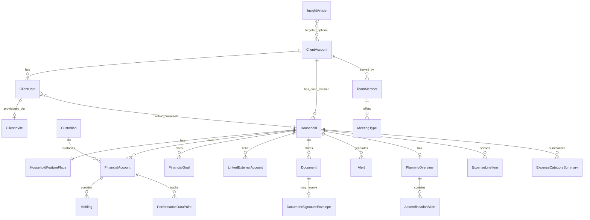

> Purpose: Canonical entity definitions for middleware API, Salesforce mapping, and mobile DTOs.  
> Bundle: [README.md](/readme/) · [READY.md](/ready/) · [AGENTS.md](/agents/)  
> Architecture: Tier A = Salesforce REST sync → local cache → mobile API. Holdings/performance from SF ([ADR-024](/01-constitution/constitution/#adr-024--holdings--orion-performance-source)). Tier B/C direct ingest out of Neopix V1 SOW ([ADR-025](/01-constitution/constitution/#adr-025--tier-b-and-tier-c-in-neopix-sow)). NW formula: ADR-038. Dual allocation taxonomies: ADR-010.  
> See also: [architecture.md](/02-architecture/architecture/), [constitution.md](/01-constitution/constitution/), [integrations/](/04-integrations/readme/).

Last updated: July 19, 2026 (product folder rename; data classification section)

---

## Data classification & handling

Normative security context: [architecture §9](/02-architecture/architecture/#9-security-baseline). This section is the **data-class SoT** for what may appear where.

| Class | Examples | Mobile API | Middleware logs | Device storage |
|---|---|---|---|---|
| Public / firm content | Insights articles (non-PII) | Yes | OK | Cache OK |
| Client PII | Name, email, phone, address, DOB | Yes (need-to-know fields) | Truncate email/phone; never full SSN | Tokens only in Keychain/Keystore; no PII in AsyncStorage |
| Financial | Balances, holdings, NW, performance | Yes when flagged on | No raw dumps; ids + amounts only as required for debug with redaction policy | Display DTOs in memory; no offline financial DB this delivery unless Phase B says otherwise |
| Restricted identity | Full SSN/TIN (`Account.OASP_FSC__SSN__c`) | Never | **Never** | Never |
| SSN last-4 | `ssn_last4` when present | Yes (profile) | Avoid; prefer omit | Not persisted locally beyond session DTOs |
| Secrets | Okta Admin API, SF creds, vault API keys, feed auth | Never | **Never** | Never |
| Session | Access / refresh tokens | N/A (held by app) | Never | Keychain / Keystore only |
| Audit | Impersonation sessions | Admin APIs only | Audit store ≥ 2 years | N/A |

Rules:

1. Missing financial facts → empty list / `unavailable` / fixtures — never invent.  
2. Document binaries live in vault only — middleware may proxy short-lived URLs, not retain blobs ([ADR-030](/01-constitution/constitution/#adr-030--document-vault-api-path)).  
3. Household-wide FA visibility this delivery ([ADR-026](/01-constitution/constitution/#adr-026--householding-and-account-privacy)) does not authorize cross-parent access.  
4. Profile proposals may carry PII diffs; staff decide in Salesforce — mobile never receives another person’s login identity.

---

## Conventions

| Column | Meaning |
|---|---|
| PK | Primary key |
| FK | Foreign key |
| UK | Unique key |
| Req | Required in production |
| Source | Upstream system **and** field path — see notation below |
Source notation
| Pattern | Meaning | Example |
|---|---|---|
| `System Object.field` | Direct map from upstream schema | `FinServ__FinancialAccount__c.FinServ__Balance__c` |
| `System Object.field (TBD)` | Expected map; pending field audit | `FinServ__FinancialHolding__c.Symbol__c (TBD)` |
| `A \ | B` | First available wins at ingest | `FinServ__FinancialAccount__c.LastUpdated__c` \| `OASP_FSC__Performance_as_of_Date__c` |
| `Middleware (computed)` | Derived in middleware; not stored upstream | `Middleware Σ FinancialAccount.market_value` |
| `Middleware` | Middleware-owned persistence only | `Middleware uuid` |
| `—` | No upstream field |  |

System prefixes: `SF` = Salesforce (sole CRM ingest for identity/flags/accounts) · `Orion` = reference only for field-gap analysis (not called by middleware) · `IdP` = OIDC ID token / user directory API (implementation: Okta — see §13.3) · `eMoney` = reference for planning field names · `Vault` = eMoney Vault · `InsightsFeed` = external insights feed (V1 RSS/JSON via standardized doc — see §6) · `Calendly` (scheduling adapter) · `DocuSign` · `Mobile` = device-local

ID formats: `uuid` for middleware/API; Salesforce 18-char IDs in `sf_*` fields; external system IDs in `*_external_id` fields.

Money: `decimal(19,4)` + `currency` (ISO 4217, default `USD`).  
Percent: `decimal(8,4)` stored as decimal (e.g. `0.0523` = 5.23%).  
Timestamps: UTC ISO 8601; display timezone per `ClientAccount.timezone` (default `America/New_York`).

Callaway field audit: Verified API names for `Account`, `FinServ__FinancialAccount__c`, and `OASP_FSC__Custodian__c` come from the Callaway `onepoint-bfg--test` sandbox export (**external resource**: Salesforce data-model export). Prefer that export over Orion doc defaults when they differ.

---

## Salesforce account hierarchy (observed org structure)

People are **Person Accounts** — `Account` records with `IsPersonAccount = true` (not standalone `Contact` records). Orion portfolio data uses **sibling child Accounts** under the same parent CRM Account:

```
Account (parent / CRM household)           ← middleware ClientAccount — client wrapper
│
├── Account[] (Person Account)           ← middleware ClientUser — IsPersonAccount = true
│      Account.ParentId → parent
│
└── Account[] (Orion-synced child)       ← may map to middleware Household and/or ClientEntity — confirm with OnePoint
       │   OASP_FSC__Category__c = Household (observed); OnePoint: "Client Entity" is FA primary owner
       │
       └── FinServ__FinancialAccount__c[]  ← primary owner lookup → Client Entity Account (not Person Account)
            ├── FinServ__FinancialAccountRole__c[] (FAR) — person ↔ FA link; Related Contact often blank today
            └── FinServ__FinancialHolding__c[] — often absent in sandbox; V1 source of truth is SF Tier A ([ADR-024](/01-constitution/constitution/#adr-024--holdings--orion-performance-source)) — missing → empty / unavailable, do not invent
```

Workshop 6 (OnePoint): To retrieve all financial accounts for a CRM household: **parent Account → all Client Entities → all Financial Accounts**. A given household can have **multiple Client Entities**; each Client Entity groups accounts for an investment purpose and carries an Orion ID.

Terminology note: Middleware entity `Household` currently maps to the Orion-synced child `Account` (Client Entity RT, `OASP_FSC__Category__c` = `Household`). OnePoint distinguishes **Client Entity** (FA primary owner) from **household** (CRM parent). Open: confirm whether a separate `ClientEntity` middleware entity is required or whether `Household` should be renamed.

| SF layer | Middleware entity | Filter / join | Cardinality |
|---|---|---|---|
| `Account` (parent) | `ClientAccount` | Parent RT — TBD | 1 parent → N persons + N Orion children |
| `Account` (Person Account) | `ClientUser` | `IsPersonAccount = true` AND `ParentId` = parent | N persons → **1** parent |
| `Account` (Orion child) | `Household` (and/or `ClientEntity` — TBD) | `IsPersonAccount = false` + **Client Entity** RT; `OASP_FSC__Category__c` = `Household` — observed Callaway | 1+ children per parent; N → N `FinancialAccount` |
| `FinServ__FinancialAccount__c` | `FinancialAccount` | Primary owner → Client Entity child `Account`; confirm `FinServ__Household__c` vs `Household_Organization__c` | 1 → N `Holding` |
| `FinServ__FinancialAccountRole__c` | `FinancialAccountRole` | `FinServ__RelatedContact__c` → Person Account Contact (often blank) | N roles per FA |

Orion orphan accounts: When Orion keys are not exchanged with SF, Orion creates duplicate child Accounts. Ingest should exclude orphans not linked to the CRM parent (flag TBD with Callaway). Mobile invite is **per Person Account** — advisors enable individuals, not Orion duplicates.

Account visibility: Household-wide account visibility this delivery ([ADR-026](/01-constitution/constitution/#adr-026--householding-and-account-privacy)). Per-person FAR filtering is out of scope until a superseding ADR.

Each Person Account has a paired `Contact` (`Account.PersonContactId`) — middleware uses the **Person Account** (`Account.Id`) as primary key via `ClientUser.sf_person_account_id`; ingest `PersonContactId` only when an SF integration requires the Contact Id.

Callaway to confirm: Person vs Orion child **record type** developer names; `ParentId` vs `AccountContactRelation` for person → parent link; Client Entity vs Household RT mapping.

---

## Entity relationship overview



---

## 1. Identity & access

### 1.1 `ClientAccount`

CRM **parent** Account — client wrapper in Salesforce. **Person Accounts** and **Orion household** child Accounts both use `Account.ParentId` → this record (different record types).

| Attribute | Type | Req | Source | Description |
|---|---|:---:|---|---|
| `id` | uuid | PK | Middleware | Internal API identifier |
| `sf_account_id` | string(18) | UK | `Account.Id` | Parent Account Id |
| `name` | string(255) |  | `Account.Name` | Client / family display name |
| `primary_advisor_sf_user_id` | string(18) | FK | `Account.OwnerId` | Lead advisor User Id |
| `service_team_sf_ids` | string[] |  | `AccountTeamMember.UserId` | Related advisor/staff User Ids; query where `AccountTeamMember.AccountId` = parent `Account.Id` |
| `relationship_start_date` | date |  | `Account.FinServ__RelationshipStartDate__c` | FSC Account field `FinServ__RelationshipStartDate__c` — date client started with the firm |
| `timezone` | string(64) | Yes | `Account.TimeZone__c` | Callaway custom field on Account (not standard SF or FSC); IANA timezone for display |
| `data_as_of` | datetime |  | Middleware (computed) | Latest snapshot timestamp across synced children |
| `created_at` | datetime | Yes | `Account.CreatedDate` |  |
| `updated_at` | datetime | Yes | `Account.LastModifiedDate` |  |

Ingest filter: `Account.IsPersonAccount = false` AND `Account.ParentId` IS NULL AND parent record type — TBD.

FSC Account fields: `FinServ__RelationshipStartDate__c` and other FinServ fields on parent Account must be confirmed on Callaway's parent record type. See [FinServ Account custom fields](https://developer.salesforce.com/docs/atlas.en-us.financial_services_cloud_object_reference.meta/financial_services_cloud_object_reference/fsc_api_objects_account_custom_fields.htm).

---

### 1.2 `ClientUser`

Individual client — a Salesforce **Person Account** (`Account` where `IsPersonAccount = true`). May or may not have mobile login (`idp_subject` null until invited). Belongs to exactly **one** parent `ClientAccount` via `Account.ParentId`. When authenticated, scoped to parent `ClientAccount` and may access **one or all** child `Household` rows under that parent (see §14 #4).

Includes **My Profile** fields for this delivery (personal info, address, suitability, proposal-based edit under staff review — [E02](/05-specs/02-users/02-specify/) **C-05**–**C-07**, **A-09**). Full auto-commit profile/suitability edit remains Won't ([ADR-022](/01-constitution/constitution/#adr-022--phase-1-explicit-exclusions)). `GET /profile` returns a `ClientUser` payload with a nested `suitability` object (Must subset below).

Name and contact fields live on the **`Account`** object ([Person Account fields](https://developer.salesforce.com/docs/atlas.en-us.object_reference.meta/object_reference/sforce_api_objects_account.htm)). Salesforce also creates a paired `Contact` (`Account.PersonContactId`) — middleware does **not** use `Contact` as the primary identity.

Financial Services Cloud (managed package): Contact-level FinServ fields are read on Person Account via the `FinServ__` namespace and `__pc` suffix — e.g. `Contact.FinServ__Occupation__c` → `Account.FinServ__Occupation__pc`. See [FinServ Contact Custom Fields](https://developer.salesforce.com/docs/atlas.en-us.financial_services_cloud_object_reference.meta/financial_services_cloud_object_reference/fsc_api_objects_contact_custom_fields.htm).

| Attribute | Type | Req | Source | Description |
|---|---|:---:|---|---|
| `id` | uuid | PK | Middleware |  |
| `sf_person_account_id` | string(18) | UK | `Account.Id` | Person Account Id; `IsPersonAccount = true` |
| `sf_person_contact_id` | string(18) | UK | `Account.PersonContactId` | Paired Contact Id — read-only; for SF integrations only |
| `client_account_id` | uuid | FK | `Account.ParentId` | Middleware FK → `ClientAccount.id` |
| `active_household_id` | uuid | FK | Middleware | Selected child `Household` when N > 1; null = use `is_primary` or aggregate — **TBD** |
| `household_ids` | uuid[] |  | Middleware (computed) | All child households synced for parent |
| `first_name` | string(40) | Yes | `Account.FirstName` | Max 40 chars in SF; greeting unless `preferred_name` set |
| `middle_name` | string(40) |  | `Account.MiddleName` | Max 40 chars in SF |
| `last_name` | string(80) | Yes | `Account.LastName` | Max 80 chars in SF |
| `full_name` | string(203) | Yes | `Account.Name` | SF compound field; **read-only**; auto-generated from `Salutation`, `FirstName`, `MiddleName`, `LastName` |
| `email` | string(255) | UK | `Account.PersonEmail` | Login match candidate; must match `IdP OIDC email` claim when authenticated |
| `phone` | string(40) |  | `Account.PersonHomePhone` | Click-to-call display |
| `mobile_phone` | string(40) |  | `Account.PersonMobilePhone` |  |
| `date_of_birth` | date |  | `Account.PersonBirthdate` | Standard Person Account field; SF label **Birthdate** |
| `ssn_last4` | string(4) |  | `Account.FinServ__LastFourDigitSSN__pc` | FSC Contact field `FinServ__LastFourDigitSSN__c`; encrypted; last 4 only |
| `occupation` | string(80) |  | `Account.FinServ__Occupation__pc` | FSC Contact field `FinServ__Occupation__c` |
| `employer` | string(255) |  | `Account.FinServ__CurrentEmployer__pc` | FSC Contact field `FinServ__CurrentEmployer__c` |
| `mailing_street` | string(255) |  | `Account.PersonMailingStreet` |  |
| `mailing_city` | string(40) |  | `Account.PersonMailingCity` | Max 40 chars in SF |
| `mailing_state` | string(20) |  | `Account.PersonMailingState` | Max 20 chars in SF |
| `mailing_postal_code` | string(20) |  | `Account.PersonMailingPostalCode` |  |
| `mailing_country` | string(40) |  | `Account.PersonMailingCountry` | Max 40 chars in SF |
| `risk_tolerance` | enum |  | `Account.FinServ__RiskTolerance__c` | FSC Account field `FinServ__RiskTolerance__c`; documented values include `Aggressive`, `Conservative`, `Moderate`, `None` |
| `time_horizon` | enum |  | `Account.FinServ__TimeHorizon__c` | FSC Account field `FinServ__TimeHorizon__c`; documented values include `Long Term`, `Medium Term`, `Short Term` |
| `investment_objective` | enum |  | `Account.FinServ__InvestmentObjectives__c` | FSC Account field `FinServ__InvestmentObjectives__c` (multipicklist); middleware may collapse to one display value |
| `investment_experience` | enum |  | `Account.FinServ__InvestmentExperience__c` | FSC Account field `FinServ__InvestmentExperience__c` |
| `liquidity_needs` | enum |  | `(TBD)` — Callaway field audit | Required on Must Personal Information suitability (**C-06**); omit from API until SF field confirmed — do not invent |
| `annual_income` | decimal(19,4) |  | `Account.FinServ__AnnualIncome__pc` | FSC Contact field `FinServ__AnnualIncome__c` |
| `income_range` | enum |  | `Middleware (computed)` | Mobile band label; derive from `annual_income` unless Callaway confirms a custom picklist |
| `net_worth` | decimal(19,4) |  | `Account.FinServ__NetWorth__c` | FSC Account field `FinServ__NetWorth__c` — suitability display only; not Planning NW ([ADR-038](/01-constitution/constitution/#adr-038--net-worth-calculation)) |
| `net_worth_range` | enum |  | `Middleware (computed)` | Mobile band label; derive from `net_worth` unless Callaway confirms a custom picklist |
| `last_reviewed_at` | date |  | `Account.FinServ__LastReview__c` | FSC Account field — **read/optional** on profile; not required by **C-06** Must table |
| `next_review_at` | date |  | `Account.FinServ__NextReview__c` | FSC Account field — **read/optional** on profile; not required by **C-06** Must table |
| `relationship_role` | enum | Yes | `(TBD)` | `primary_client`, `spouse`, `partner`, `trustee`, `beneficiary`, `other` — no standard SF field; pending Callaway field audit |
| `idp_subject` | string(128) | UK | `IdP OIDC sub` | OIDC subject (`sub`); null when person has no mobile login; SF write-back `Account.Okta_User_Id__c` (§13.3) |
| `role` | enum |  | `IdP OIDC role` | `client`, `administrator`; null when not authenticated |
| `status` | enum |  | `IdP User.status` \| `SF Account.Mobile_Status__c` | `not_invited`, `invited`, `active`, `disabled`, `removed`; null when not authenticated |
| `last_login_at` | datetime |  | Middleware | Updated on each successful interactive login |
| `sf_last_login_at` | datetime |  | `Account.Last_Mobile_Login__c` | **Write-back** to Person Account for advisor visibility ([A-08](/05-specs/02-users/02-specify/)) |
| `mfa_enrolled` | boolean |  | `IdP User.mfaEnrolled` | Read-only from IdP; MFA not enforced this delivery ([ADR-046](/01-constitution/constitution/#adr-046--mfa-off-for-this-delivery-client-mobile)) |
| `biometric_enabled` | boolean |  | Mobile (device keychain) | Device-local preference |
| `is_mobile_user` | boolean | Yes | Middleware (computed) | `true` when `idp_subject` is set |
| `preferred_name` | string(80) |  | `Account.FinServ__PreferredName__pc` | FSC Contact field `FinServ__PreferredName__c` |
| `avatar_initials` | string(4) |  | Middleware (computed) | From `Account.FirstName` + `Account.LastName` |
| `client_since` | date |  | `Account.CreatedDate` (date part) | **Client since** on My Profile hub (**C-05** / **C-06**); not parent `relationship_start_date` |
| `terms_accepted_at` | datetime |  | `Account.Mobile_Terms_Accepted_At__c` | **Write-back** after legal accept ([C-24](/05-specs/02-users/02-specify/)) |
| `terms_accepted_version` | string(64) |  | `Account.Mobile_Terms_Accepted_Version__c` | Version id from middleware config |
| `privacy_accepted_at` | datetime |  | `Account.Mobile_Privacy_Accepted_At__c` | **Write-back** after legal accept |
| `privacy_accepted_version` | string(64) |  | `Account.Mobile_Privacy_Accepted_Version__c` | Version id from middleware config |
| `edit_status` | enum |  | `SF Mobile_Profile_Proposal__c.Status` | Derived from latest proposal: `view`, `pending_review`, cleared after decision |
| `attention_banner_text` | string(512) |  | Middleware / alerts | Profile proposal decision / missing-field cue copy |
| `attention_required` | boolean |  | Middleware (computed) | True when missing required fields or unread proposal decision |
| `pending_review_since` | datetime |  | `SF Mobile_Profile_Proposal__c.Submitted_At__c` | When a `pending` proposal exists |
| `profile_updated_at` | datetime |  | `Account.LastModifiedDate` | Last Person Account profile change |
| `created_at` | datetime | Yes | `Account.CreatedDate` |  |
| `updated_at` | datetime | Yes | `Account.LastModifiedDate` |  |

Ingest filter: `Account.IsPersonAccount = true` AND `Account.ParentId = :parentAccountId`.

`Account.Name`: Do not write from middleware — ingest only.

FSC field access on Person Account: Contact-origin FinServ fields use `__pc` on `Account` (e.g. `FinServ__Occupation__pc`). Account-origin FinServ fields use `__c` on `Account` (e.g. `FinServ__RiskTolerance__c`). See [FinServ Contact custom fields](https://developer.salesforce.com/docs/atlas.en-us.financial_services_cloud_object_reference.meta/financial_services_cloud_object_reference/fsc_api_objects_contact_custom_fields.htm) and [FinServ Account custom fields](https://developer.salesforce.com/docs/atlas.en-us.financial_services_cloud_object_reference.meta/financial_services_cloud_object_reference/fsc_api_objects_account_custom_fields.htm).

Do not expose via mobile API: `Account.FinServ__TaxId__pc` (full SSN/TIN; FSC Contact field `FinServ__TaxId__c`).

**`GET /profile` suitability nested object** (this delivery — **C-06** Must): `risk_tolerance`, `time_horizon`, `investment_objective`, `liquidity_needs` (omit until SF field confirmed), `income_range`, `net_worth_range`. Optional extras when present: `investment_experience`, `last_reviewed_at`, `next_review_at` — all sourced from attributes above; not a separate table.

Not suitability: `PartyProfileRisk` (standard FSC) is KYC/AML risk category (`High` / `Medium` / `Low`), not investment risk tolerance.

---

### 1.3 `ClientInvite`

Provisioning record when advisor clicks **Invite to client portal** in Salesforce (Workshop 4). SF triggers middleware; middleware **syncs CRM data then provisions IdP user** and sends invite email (implementation: Okta — §13.3).

#### Provisioning sync steps (`POST /api/v1/invites`)

| Step | SF read | Middleware write |
|:---:|---|---|
| 1 | Person `Account` by `personAccountId` (`IsPersonAccount = true`) | `ClientUser` |
| 2 | Parent `Account` via `ClientUser.Account.ParentId` | `ClientAccount` |
| 3 | Sibling child `Account` records where `ParentId` = parent, `IsPersonAccount = false` (Orion household RT) | `Household[]` (0..N) |
| 4 | Per child: `FinServ__FinancialAccount__c`, holdings, performance, planning, flags | `FinancialAccount[]`, `Holding[]`, etc. |
| 5 | `AccountTeamMember` on parent | `TeamMember[]` on `ClientAccount` |
| 6 | — | IdP provision + invite email; set `ClientUser.idp_subject` |
| 7 | — | `ClientInvite` audit row |

Re-sync on schedule (`SFSyncBatch`) and on login refresh; invite triggers **initial materialization** for that person's parent account tree.

| Attribute | Type | Req | Source | Description |
|---|---|:---:|---|---|
| `id` | uuid | PK | Middleware |  |
| `sf_person_account_id` | string(18) | FK | `SF Account.Id` (Person Account) | Invited person |
| `client_account_id` | uuid | FK | `SF Account.ParentId` → `ClientAccount.sf_account_id` | Parent account synced |
| `household_ids` | uuid[] |  | Middleware (computed) | Child households synced at invite time |
| `invited_by_sf_user_id` | string(18) | Yes | `SF User.Id` (advisor) | Who clicked invite; write-back `Mobile_Invited_By__c` |
| `last_resent_by_sf_user_id` | string(18) |  | `SF User.Id` | Who last resent; write-back `Mobile_Invite_Last_Resent_By__c` |
| `idp_subject` | string(128) | UK | `IdP User.id` (after create) | OIDC `sub` assigned by IdP |
| `email` | string(255) | Yes | `SF Account.PersonEmail` | Invite destination |
| `status` | enum | Yes | Middleware | `pending`, `syncing`, `sent`, `accepted`, `failed`, `cancelled` — SF picklist `Mobile_Invite_Status__c` also includes `not_invited` (no `ClientInvite` row until invite) |
| `sync_completed_at` | datetime |  | Middleware | SF tree materialized |
| `idp_invite_ref` | string(128) |  | `IdP` invite reference |  |
| `sent_at` | datetime |  | Middleware |  |
| `last_resent_at` | datetime |  | Middleware | Write-back `Mobile_Invite_Last_Resent__c` |
| `accepted_at` | datetime |  | Middleware | First successful login |
| `error_message` | string(512) |  | Middleware | On `failed` |
| `created_at` | datetime | Yes | Middleware |  |

Write-back to Person Account: `Mobile_Invite_Status__c`, `Mobile_Status__c`, `Okta_User_Id__c` (`idp_subject`), `Mobile_Invited_By__c`, `Mobile_Invite_Last_Resent__c`, `Mobile_Invite_Last_Resent_By__c` — see [02-specify.md](/05-specs/02-users/02-specify/) contracts appendix.

Note: IdP user profile lives in middleware/IdP — `Okta_User_Id__c` on Person `Account` is the standard write-back of `idp_subject`.

---

### 1.3a `Mobile_Profile_Proposal__c` (Salesforce) / middleware proposal mirror

Client-submitted profile field proposals pending staff review ([A-09 / C-07](/05-specs/02-users/02-specify/)).

| Attribute | Type | Req | Source | Description |
|---|---|:---:|---|---|
| `id` | uuid / SF Id | PK | Middleware / SF |  |
| `sf_person_account_id` | string(18) | FK | `SF Mobile_Profile_Proposal__c.Person_Account__c` |  |
| `status` | enum | Yes | SF | `pending`, `approved`, `rejected`, `superseded` |
| `field_diffs` | json | Yes | SF `Field_Diffs__c` | Proposed field → value map |
| `submitted_at` | datetime | Yes | SF `Submitted_At__c` |  |
| `submitted_by_client_user_id` | uuid | Yes | SF `Submitted_By_Client__c` |  |
| `reviewed_by_sf_user_id` | string(18) |  | SF `Reviewed_By__c` |  |
| `reviewed_at` | datetime |  | SF `Reviewed_At__c` |  |
| `review_note` | string(512) |  | SF `Review_Note__c` |  |

---

### 1.4 `AdminImpersonationSession`

Audit trail when administrator uses login-as-client on native app (Workshop 3).

| Attribute | Type | Req | Source | Description |
|---|---|:---:|---|---|
| `id` | uuid | PK | Middleware |  |
| `admin_idp_subject` | string(128) | Yes | `IdP OIDC sub` (admin) |  |
| `admin_sf_user_id` | string(18) |  | `SF User.Id` (admin lookup) |  |
| `impersonated_client_account_id` | uuid | FK | — |  |
| `impersonated_household_id` | uuid | FK | — | Optional — specific child household |
| `impersonated_client_user_id` | uuid | FK | — |  |
| `started_at` | datetime | Yes | Middleware |  |
| `ended_at` | datetime |  | Middleware |  |
| `reason` | string(255) |  | Middleware | Support ticket ref |

---

## 2. Configuration

> Terminology (Workshop 4): Feature flags = platform/code-level (provider swaps, rollout control, new features ship disabled). Configurable options = per-client visibility stored in Salesforce — what Callaway's LWC manages. `HouseholdFeatureFlags` and related objects implement configurable options; middleware merges with `FirmFeaturePolicy` and `AdvisorBookFeatureDefaults` per [03-configuration/05-contracts/resolution.md](/05-specs/03-configuration/05-contracts/resolution/).

### 2.1 `FirmFeaturePolicy`

Firm-wide mandatory features — advisors cannot disable. List TBD (OnePoint firm stakeholders).

| Attribute | Type | Req | Source | Description |
|---|---|:---:|---|---|
| `id` | uuid | PK | `SF Firm_Feature_Policy__c.Id` |  |
| `feature_key` | string(64) | UK | `SF Firm_Feature_Policy__c.Feature_Key__c` | CFG-04 snake_case keys — e.g. `portfolio_ytd_realized_gl` |
| `is_mandatory` | boolean | Yes | `SF Firm_Feature_Policy__c.Is_Mandatory__c` | If true, always ON for all clients |
| `updated_by_sf_user_id` | string(18) |  | `SF Firm_Feature_Policy__c.LastModifiedById` | Admin only |
| `updated_at` | datetime | Yes | `SF Firm_Feature_Policy__c.LastModifiedDate` |  |

---

### 2.2 `AdvisorBookFeatureDefaults`

Default feature template for all clients under a primary advisor. Applies on book transfer to new advisor.

| Attribute | Type | Req | Source | Description |
|---|---|:---:|---|---|
| `primary_advisor_sf_user_id` | string(18) | PK | `SF Advisor_Book_Feature_Defaults__c.Advisor_User__c` | Advisor User Id |
| `feature_key` | string(64) | PK | `SF Advisor_Book_Feature_Defaults__c.Feature_Key__c` |  |
| `enabled` | boolean | Yes | `SF Advisor_Book_Feature_Defaults__c.Enabled__c` | Default for new clients |
| `set_by_role` | enum | Yes | `SF Advisor_Book_Feature_Defaults__c.Set_By_Role__c` | `administrator` only for book-level |
| `updated_at` | datetime | Yes | `SF Advisor_Book_Feature_Defaults__c.LastModifiedDate` |  |

---

### 2.3 `HouseholdFeatureFlags`

Per-household overrides — advisor toggles individual clients; admin can also set. Middleware returns **effective** flags after merging §2.1–2.3.

| Attribute | Type | Req | Source | Description |
|---|---|:---:|---|---|
| `household_id` | uuid | PK, FK | `SF Mobile_Feature_Flags__c.Account__c` → child `Household.sf_account_id` | Per Orion child household |
| `portfolio_enabled` | boolean | Yes | `SF Mobile_Feature_Flags__c.Portfolio_Enabled__c` | Master portfolio tab |
| `portfolio_provider` | enum | Yes | `SF Mobile_Feature_Flags__c.Portfolio_Provider__c` | `orion`, `investnet`, `none` |
| `portfolio_ytd_realized_gl` | boolean | Yes | `SF Mobile_Feature_Flags__c.Portfolio_YTD_Realized_GL__c` | Subject to firm mandatory list |
| `planning_enabled` | boolean | Yes | `SF Mobile_Feature_Flags__c.Planning_Enabled__c` |  |
| `planning_overview` | boolean | Yes | `SF Mobile_Feature_Flags__c.Planning_Overview__c` |  |
| `planning_expenses` | boolean | Yes | `SF Mobile_Feature_Flags__c.Planning_Expenses__c` |  |
| `planning_goals` | boolean | Yes | `SF Mobile_Feature_Flags__c.Planning_Goals__c` |  |
| `planning_linked_accounts` | boolean | Yes | `SF Mobile_Feature_Flags__c.Planning_Linked_Accounts__c` |  |
| `planning_monte_carlo` | boolean | Yes | `SF Mobile_Feature_Flags__c.Planning_Monte_Carlo__c` |  |
| `documents_enabled` | boolean | Yes | `SF Mobile_Feature_Flags__c.Documents_Enabled__c` |  |
| `documents_upload` | boolean | Yes | `SF Mobile_Feature_Flags__c.Documents_Upload__c` |  |
| `documents_docusign` | boolean | Yes | `SF Mobile_Feature_Flags__c.Documents_DocuSign__c` | Remains **false** until in-app signing ships (**DOC-08** Won't) |
| `insights_enabled` | boolean | Yes | `SF Mobile_Feature_Flags__c.Insights_Enabled__c` |  |
| `team_enabled` | boolean | Yes | `SF Mobile_Feature_Flags__c.Team_Enabled__c` |  |
| `team_scheduling` | boolean | Yes | `SF Mobile_Feature_Flags__c.Team_Scheduling__c` |  |
| `profile_enabled` | boolean | Yes | `SF Mobile_Feature_Flags__c.Profile_Enabled__c` | My Profile hub / Personal Information; full auto-commit profile edit remains Won't ([ADR-022](/01-constitution/constitution/#adr-022--phase-1-explicit-exclusions)) |
| `updated_by_sf_user_id` | string(18) |  | `SF Mobile_Feature_Flags__c.LastModifiedById` | Advisor or admin who last changed |
| `updated_by_role` | enum |  | `SF Mobile_Feature_Flags__c.Updated_By_Role__c (TBD)` | `advisor`, `administrator` |
| `updated_at` | datetime | Yes | `SF Mobile_Feature_Flags__c.LastModifiedDate` |  |

---

## 3. Portfolio (Salesforce sync)

> Data source: All portfolio entities ingested from Salesforce (Orion managed package objects and/or custom fields). If holdings/performance are missing in SF, flag as field gap — not middleware Orion integration. See §13.2 for Orion reference hierarchy used in gap analysis.

### 3.1 `Household`

Child Salesforce `Account` — one row per Orion Household synced via OASP Data Sync for FSC. Observed Callaway org: record type Client Entity, `OASP_FSC__Category__c` = `Household`, `FinServ__SourceSystemId__c` = `Household-{firmId}-{householdId}`. Portfolio, planning, and per-household feature flags scope here. Balances and performance come from OASP fields on this Account (not a separate summary object).

| Attribute | Type | Req | Source | Description |
|---|---|:---:|---|---|
| `id` | uuid | PK | Middleware | Internal API identifier |
| `client_account_id` | uuid | FK | `Account.ParentId` | Middleware FK → `ClientAccount.id` |
| `sf_account_id` | string(18) | UK | `Account.Id` | Child Account Id |
| `sf_parent_account_id` | string(18) | FK | `Account.ParentId` | Denormalized parent Id |
| `name` | string(255) |  | `Account.Name` | Household display name (Orion full name) |
| `source_system_id` | string(100) | UK | `Account.FinServ__SourceSystemId__c` | OASP external Id; observed e.g. `Household-1165-18235` |
| `owner_sf_user_id` | string(18) | FK | `Account.OwnerId` | Account owner (SF User) |
| `orion_status` | string(32) |  | `Account.Orion_Status__c` | Callaway custom picklist e.g. `Linked` |
| `is_active` | boolean |  | `Account.OASP_FSC__Active__c` | OASP `Active` → SF checkbox |
| `is_orion_synced` | boolean | Yes | Middleware (computed) | `true` when `orion_status` = `Linked` (observed value) |
| `is_primary` | boolean |  | Middleware (computed) \| custom field (TBD) | Default household when N > 1 — **TBD with client** |
| `managed_household_value` | decimal(19,4) |  | `Account.OASP_FSC__Managed_Household_Value__c` | OASP rollup (SUM managed financial accounts) |
| `household_balance` | decimal(19,4) | Yes | `Account.OASP_FSC__Household_Balance__c` | Home / list header |
| `household_cash_balance` | decimal(19,4) |  | `Account.OASP_FSC__Household_Cash_Balance__c` | OASP `Household Cash Balance` |
| `unrealized_gain_loss` | decimal(19,4) |  | `Account.OASP_FSC__Unrealized_Gain_Loss__c` | Currency(16,2) on household Account |
| `realized_gain_loss_ytd` | decimal(19,4) |  | `Account.OASP_FSC__Realized_G_L_YTD__c` | Currency(16,2) on household Account |
| `realized_gain_loss_prior_year` | decimal(19,4) |  | `Account.OASP_FSC__Realized_Gain_Loss_Previous_Year__c` | Currency(16,2) on household Account |
| `performance_as_of` | datetime | Yes | `Account.OASP_FSC__Performance_as_of_Date__c` | Observed Callaway; performance snapshot timestamp |
| `performance_mtd` | decimal(8,4) |  | `Account.OASP_FSC__Performance_MTD__c` | Observed Callaway; Percent(7,2) in SF |
| `performance_qtd` | decimal(8,4) |  | `Account.OASP_FSC__Performance_QTD__c` | Observed Callaway; Percent(7,2) in SF |
| `performance_ytd` | decimal(8,4) |  | `Account.OASP_FSC__Performance_YTD__c` | Observed Callaway; Percent(7,2) in SF |
| `performance_1yr` | decimal(8,4) |  | `Account.OASP_FSC__Performance_1YR__c` | Observed Callaway; Percent(7,2) in SF |
| `performance_3yr` | decimal(8,4) |  | `Account.OASP_FSC__Performance_3YR__c` | Observed Callaway; Percent(7,2) in SF |
| `performance_5yr` | decimal(8,4) |  | `Account.OASP_FSC__Performance_5YR__c` | Observed Callaway; Percent(5,2) in SF |
| `performance_10yr` | decimal(8,4) |  | `Account.OASP_FSC__Performance_10YR__c` | Observed Callaway; Percent(5,2) in SF |
| `statement_delivery` | string(32) |  | `Account.OASP_FSC__Statement_Delivery__c` | OASP bi-directional CRM field; not mobile |
| `data_as_of` | datetime |  | Middleware (computed) | `performance_as_of` \| `SFSyncBatch.completed_at` — display fallback |
| `created_at` | datetime | Yes | `Account.CreatedDate` |  |
| `updated_at` | datetime | Yes | `Account.LastModifiedDate` |  |

Ingest filter: `Account.IsPersonAccount = false` AND `Account.ParentId = :parentAccountId` AND record type **Client Entity** AND `OASP_FSC__Category__c` = `Household` (observed Callaway). Confirm `ParentId` vs flat household model with Callaway.

Do not expose via mobile API: `Account.OASP_FSC__SSN__c` (encrypted tax Id).

Source provenance: Verified against Callaway `onepoint-bfg--test` sandbox Account export (external resource).

---

### 3.2 `Custodian`

Custodian reference data — synced from Orion **Data Sync for FSC** (`OASP_FSC__Custodian__c`). Org-wide lookup table; middleware resolves `FinancialAccount.custodian_id` from the financial account’s `OASP_FSC__Custodian__c` lookup.

| Attribute | Type | Req | Source | Description |
|---|---|:---:|---|---|
| `id` | uuid | PK | Middleware |  |
| `sf_custodian_id` | string(18) | UK | `OASP_FSC__Custodian__c.Id` | SF record Id |
| `name` | string(255) | Yes | `OASP_FSC__Custodian__c.Name` | Display name (e.g. `Charles Schwab`, `Fidelity`) |
| `orion_external_id` | string(64) | UK | `OASP_FSC__Custodian__c.OASP_FSC__Orion_Id__c` | Text(80) External ID; also `OASP_FSC__Custodian_ID__c` (numeric Orion key) |
| `created_at` | datetime | Yes | `OASP_FSC__Custodian__c.CreatedDate` |  |
| `updated_at` | datetime | Yes | `OASP_FSC__Custodian__c.LastModifiedDate` |  |

Ingest: Full sync of all `OASP_FSC__Custodian__c` rows each `SFSyncBatch` (low cardinality). Join via `FinServ__FinancialAccount__c.OASP_FSC__Custodian__c` (or equivalent financial account object Callaway confirms).

---

### 3.3 `FinancialAccount`

Single managed investment account (brokerage, IRA, trust account, etc.). Sourced from `FinServ__FinancialAccount__c` (FSC + OASP fields). Verified against Callaway sandbox Financial Account export (external resource).

| Attribute | Type | Req | Source | Description |
|---|---|:---:|---|---|
| `id` | uuid | PK | Middleware |  |
| `household_id` | uuid | FK | `FinServ__FinancialAccount__c.FinServ__Household__c` \| `FinServ__FinancialAccount__c.Household_Organization__c (TBD)` → `Household.sf_account_id` | Confirm which lookup is populated for Client Entity households |
| `sf_financial_account_id` | string(18) | UK | `FinServ__FinancialAccount__c.Id` | SF record Id |
| `orion_account_external_id` | string(64) | UK | `FinServ__FinancialAccount__c.FinServ__SourceSystemId__c` | External ID |
| `display_name` | string(255) | Yes | `FinServ__FinancialAccount__c.Name` | Client-facing label |
| `account_number_masked` | string(32) |  | `FinServ__FinancialAccount__c.FinServ__FinancialAccountNumber__c` (masked) | e.g. `****4821` |
| `custodian_id` | uuid | FK | `FinServ__FinancialAccount__c.OASP_FSC__Custodian__c` → `Custodian.sf_custodian_id` | Lookup to §3.2 |
| `account_type` | enum | Yes | `FinServ__FinancialAccount__c.FinServ__FinancialAccountType__c` → §9.1 | See §9.1 |
| `registration_type` | string(64) |  | `FinServ__FinancialAccount__c.OASP_FSC__Registration__c` | Lookup → Registration; display via `Registration_Name__c` formula if needed |
| `market_value` | decimal(19,4) | Yes | `FinServ__FinancialAccount__c.FinServ__Balance__c` | Current value |
| `currency` | string(3) | Yes | — | Middleware default `USD` |
| `ytd_return_pct` | decimal(8,4) |  | `FinServ__FinancialAccount__c.FinServ__PerformanceYTD__c` | FinServ naming on FA object (not `OASP_FSC__Performance_YTD__c`) |
| `ytd_gain_loss` | decimal(19,4) |  | `FinServ__FinancialAccount__c.OASP_FSC__Realized_GL_YTD__c` | FA G/L API names differ from household Account rollups |
| `is_managed` | boolean | Yes | `FinServ__FinancialAccount__c.FinServ__Managed__c` | OnePoint-managed vs held-away |
| `sort_order` | int |  | Middleware (computed) | Display sequence |
| `as_of` | datetime | Yes | `FinServ__FinancialAccount__c.FinServ__LastUpdated__c` \| `FinServ__FinancialAccount__c.OASP_FSC__Performance_as_of_Date__c` |  |
| `status` | enum | Yes | `FinServ__FinancialAccount__c.FinServ__Status__c` → enum map | `active`, `closed`, `pending` |
| `data_source` | enum | Yes | Middleware (computed) | `orion`, `emoney`, `orion_via_emoney` — Orion wins on duplicate account numbers |
| `account_number` | string(64) |  | `FinServ__FinancialAccount__c.FinServ__FinancialAccountNumber__c` | Used for Orion/eMoney de-duplication (full number server-side only; mask for display) |
| `visible_to_client_user_ids` | uuid[] |  | Middleware (computed) | All persons on parent if household-wide; subset if per-person decision + FAR populated |

---

### 3.3.1 `FinancialAccountRole`

Links a Person Account to a Financial Account — FSC `FinServ__FinancialAccountRole__c`. Required for per-person account visibility if compliance mandates it. Today: `Related Contact` often blank in sandbox; Registration records do not link to Person Accounts (Orion artifact).

| Attribute | Type | Req | Source | Description |
|---|---|:---:|---|---|
| `id` | uuid | PK | Middleware |  |
| `sf_far_id` | string(18) | UK | `FinServ__FinancialAccountRole__c.Id` |  |
| `financial_account_id` | uuid | FK | `FinServ__FinancialAccountRole__c.FinServ__FinancialAccount__c` |  |
| `client_user_id` | uuid | FK | `FinServ__FinancialAccountRole__c.FinServ__RelatedContact__c` → `ClientUser.sf_person_contact_id` | Null when Related Contact blank |
| `role` | enum | Yes | `FinServ__FinancialAccountRole__c.FinServ__Role__c` | e.g. `primary_owner`, `joint_owner` |
| `is_active` | boolean | Yes | `FinServ__FinancialAccountRole__c.FinServ__Active__c` |  |

Discovery note: FSC license required in sandbox to view Relationships / FAR (Workshop 5).

### 3.4 `Holding`

Position within a financial account. Synced from Salesforce (Orion Data Sync for FSC / OASP) — [07-portfolio/05-contracts/salesforce.md](/05-specs/07-portfolio/05-contracts/salesforce/) (**P-06**). Middleware reads `FinServ__FinancialHolding__c` (or OASP equivalent); field map TBD with Callaway / OnePoint.

| Attribute | Type | Req | Source | Description |
|---|---|:---:|---|---|
| `id` | uuid | PK | Middleware |  |
| `financial_account_id` | uuid | FK | `FinServ__FinancialHolding__c.FinServ__FinancialAccount__c (TBD confirm)` → `FinancialAccount.sf_financial_account_id` | FSC parent lookup — confirm Callaway API name with OnePoint/Callaway |
| `sf_holding_id` | string(18) | UK | `FinServ__FinancialHolding__c.Id (TBD)` | SF child object Id |
| `orion_holding_external_id` | string(64) | UK | `FinServ__FinancialHolding__c.Orion_Asset_Id__c (TBD)` | External key |
| `symbol` | string(32) |  | `FinServ__FinancialHolding__c.Symbol__c (TBD)` | Ticker or CUSIP display |
| `cusip` | string(9) |  | `FinServ__FinancialHolding__c.CUSIP__c (TBD)` |  |
| `name` | string(255) | Yes | `FinServ__FinancialHolding__c.Security_Name__c (TBD)` | Security name |
| `asset_category_code` | string(64) |  | `FinServ__FinancialHolding__c.Category_Code__c (TBD)` | Orion **category** taxonomy; aligns with §3.6 `dimension=category` |
| `asset_class_code` | string(64) |  | `FinServ__FinancialHolding__c.Class_Code__c (TBD)` | Orion **class** taxonomy; aligns with §3.6 `dimension=class` |
| `asset_class` | enum |  | `FinServ__FinancialHolding__c.Asset_Class__c (TBD)` → §9.2 | Legacy/coarse enum if present on SF object |
| `quantity` | decimal(19,6) |  | `FinServ__FinancialHolding__c.Quantity__c (TBD)` | Units |
| `market_value` | decimal(19,4) | Yes | `FinServ__FinancialHolding__c.Market_Value__c (TBD)` |  |
| `weight_pct` | decimal(8,4) |  | Middleware (computed) | Share of account value |
| `change_pct` | decimal(8,4) |  | `FinServ__FinancialHolding__c.Change_Pct__c (TBD)` | Display % change |
| `change_value` | decimal(19,4) |  | `FinServ__FinancialHolding__c.Change_Value__c (TBD)` |  |
| `price` | decimal(19,6) |  | `FinServ__FinancialHolding__c.Price__c (TBD)` | Unit price (Workshop 10) |
| `as_of` | datetime | Yes | `FinServ__FinancialHolding__c.As_Of__c (TBD)` |  |
| `is_alternative` | boolean |  | `FinServ__FinancialHolding__c.Is_Alternative__c (TBD)` | PE, hedge, private credit — informational; always shown with full fields |

---

### 3.5 `PerformanceDataPoint`

Time series for account performance chart — synced from Salesforce (Orion/OASP performance objects). See [salesforce.md](/05-specs/07-portfolio/05-contracts/salesforce/) (**P-05**).

| Attribute | Type | Req | Source | Description |
|---|---|:---:|---|---|
| `id` | uuid | PK | Middleware |  |
| `financial_account_id` | uuid | FK | `SF <OrionPkgPerformance>.Financial_Account__c (TBD)` |  |
| `date` | date | Yes | `SF <OrionPkgPerformance>.Date__c (TBD)` | Point date |
| `market_value` | decimal(19,4) | Yes | `SF <OrionPkgPerformance>.Market_Value__c (TBD)` |  |
| `return_pct` | decimal(8,4) |  | `SF <OrionPkgPerformance>.Return_Pct__c (TBD)` | Cumulative or period TWR |
| `timeframe` | enum | Yes | Middleware (request param) | `1M`, `3M`, `6M`, `YTD`, `1Y`, `3Y` |
| `as_of` | datetime | Yes | `SFSyncBatch.completed_at` | Sync batch time |

Composite UK: (`financial_account_id`, `date`, `timeframe`)

---

### 3.6 `AssetAllocationSlice`

Allocation segment — **two distinct scope calculations** (Workshop 6 / [ADR-010](/01-constitution/constitution/#adr-010--dual-allocation-scopes)). For `portfolio_orion`, clients also get **two taxonomy dimensions** (Workshop 10 / [07-portfolio P-02](/05-specs/07-portfolio/02-specify/#p-02--see-orion-asset-allocation)): **by category** and **by class**, at **household** and **account** levels.

| `scope` value | Label | Data | Shown on |
|---|---|---|---|
| `portfolio_orion` | OnePoint BFG Portfolio allocation | Orion managed accounts only | Portfolio (household + account); Home portfolio allocation context |
| `planning_combined` | Overall / net worth allocation | Orion ∪ eMoney assets; Orion wins duplicates | Planning tab; Home net worth drill-down (if planning enabled) |

| Attribute | Type | Req | Source | Description |
|---|---|:---:|---|---|
| `id` | uuid | PK | Middleware |  |
| `household_id` | uuid | FK | child `Household.sf_account_id` |  |
| `scope` | enum | Yes | Middleware (computed) | `portfolio_orion`, `planning_combined` |
| `scope_entity_id` | uuid |  | `FinancialAccount.id` | Null = household-level; set = account-level (same FA as Portfolio account detail) |
| `dimension` | enum | Yes | Middleware (computed) | `category` (Orion asset category) or `class` (Orion asset class). Planning scope may use a single planning taxonomy; do not reuse Orion codes. |
| `code` | string(64) | Yes | `SF <OrionPkgAllocation>.Code__c (TBD)` \| eMoney planning fields | Stable taxonomy code |
| `label` | string(80) | Yes | `SF <OrionPkgAllocation>.Label__c (TBD)` \| Middleware (computed) | Client-facing name for `code` |
| `value` | decimal(19,4) | Yes | `SF <OrionPkgAllocation>.Value__c (TBD)` \| Middleware (computed) | Dollar amount |
| `percent` | decimal(8,4) | Yes | Middleware (computed) | Weight of level total; 0–1 |
| `color_hex` | string(7) |  | Middleware (computed) | Optional UI theming (presentation layer) |
| `source_system` | enum | Yes | Middleware (computed) | `orion`, `emoney`, `combined` |
| `as_of` | datetime | Yes | `SFSyncBatch.completed_at` |  |

Rules (`portfolio_orion`): All slices are read from Salesforce Orion/OASP allocation rollups — household and account, category and class. Middleware does not compute allocation from holdings or Positions provider. Household `value` for a code equals the sum of account-level `value` for that code across visible managed FAs. Unclassified value belongs in an explicit Unclassified slice from SF. Never remap Orion slices into `planning_combined` taxonomy (or the reverse).

Do not use eMoney gauge embeds — middleware computes and serves slices; presentation is custom (Workshop 6).

---

## 4. Planning (eMoney → Salesforce)

### 4.1 `PlanningOverview`

Household financial plan snapshot — one active row per household.

| Attribute | Type | Req | Source | Description |
|---|---|:---:|---|---|
| `household_id` | uuid | PK, FK | `SF Planning_Overview__c.Account__c` |  |
| `sf_planning_overview_id` | string(18) | UK | `SF Planning_Overview__c.Id` | Custom object Id |
| `total_assets` | decimal(19,4) |  | `eMoney Plan.totalAssets` → `SF Planning_Overview__c.Total_Assets__c` |  |
| `total_liabilities` | decimal(19,4) |  | `eMoney Plan.totalLiabilities` → `SF Planning_Overview__c.Total_Liabilities__c` |  |
| `net_worth` | decimal(19,4) | Yes | Middleware (computed) \| `eMoney Plan.netWorth` → `SF Planning_Overview__c.Net_Worth__c` | **Middleware-computed** from combined Orion + eMoney assets minus liabilities; Orion wins on duplicate account numbers. May differ from eMoney-native net worth. |
| `net_worth_ytd_change` | decimal(19,4) |  | `eMoney Plan.netWorthYtdChange` → `SF Planning_Overview__c.Net_Worth_YTD_Change__c` |  |
| `net_worth_ytd_change_pct` | decimal(8,4) |  | `eMoney Plan.netWorthYtdChangePct` → `SF Planning_Overview__c.Net_Worth_YTD_Change_Pct__c` |  |
| `plan_probability_pct` | decimal(8,4) |  | `eMoney Plan.probability` → `SF Planning_Overview__c.Plan_Probability_Pct__c` | 0–1 success probability |
| `monte_carlo_upside_pct` | decimal(8,4) |  | `eMoney MonteCarlo.upside` → `SF Planning_Overview__c.Monte_Carlo_Upside_Pct__c` |  |
| `monte_carlo_median_pct` | decimal(8,4) |  | `eMoney MonteCarlo.median` → `SF Planning_Overview__c.Monte_Carlo_Median_Pct__c` |  |
| `monte_carlo_downside_pct` | decimal(8,4) |  | `eMoney MonteCarlo.downside` → `SF Planning_Overview__c.Monte_Carlo_Downside_Pct__c` |  |
| `plan_name` | string(255) |  | `eMoney Plan.name` → `SF Planning_Overview__c.Plan_Name__c` |  |
| `insurance_cash_value` | decimal(19,4) |  | `SF Planning_Overview__c.Insurance_Cash_Value__c (TBD)` | NW asset input ([ADR-038](/01-constitution/constitution/#adr-038--net-worth-calculation)) — confirm object/field with OnePoint |
| `home_real_estate_value` | decimal(19,4) |  | `SF Planning_Overview__c.Home_Real_Estate_Value__c (TBD)` | eMoney/Zillow home value when synced ([ADR-043](/01-constitution/constitution/#adr-043--real-estate--zillow-home-value)) |
| `as_of` | datetime | Yes | `eMoney Plan.asOf` → `SF Planning_Overview__c.As_Of__c` |  |
| `disclaimer_text` | string(512) |  | `SF Planning_Overview__c.Disclaimer_Text__c` |  |

---

### 4.2 `FinancialGoal`

| Attribute | Type | Req | Source | Description |
|---|---|:---:|---|---|
| `id` | uuid | PK | Middleware |  |
| `household_id` | uuid | FK | `SF Financial_Goal__c.Account__c` |  |
| `sf_goal_id` | string(18) | UK | `SF Financial_Goal__c.Id` |  |
| `emoney_goal_external_id` | string(64) | UK | `eMoney Goal.id` |  |
| `name` | string(255) | Yes | `eMoney Goal.name` → `SF Financial_Goal__c.Name` | e.g. `Retirement` |
| `goal_type` | enum |  | `eMoney Goal.type` → `SF Financial_Goal__c.Goal_Type__c` | `retirement`, `education`, `purchase`, `legacy`, `other` |
| `target_amount` | decimal(19,4) |  | `eMoney Goal.targetAmount` → `SF Financial_Goal__c.Target_Amount__c` |  |
| `funded_amount` | decimal(19,4) |  | `eMoney Goal.fundedAmount` → `SF Financial_Goal__c.Funded_Amount__c` |  |
| `funded_pct` | decimal(8,4) | Yes | `eMoney Goal.fundedPercent` → `SF Financial_Goal__c.Funded_Pct__c` | Progress bar |
| `probability_pct` | decimal(8,4) | Yes | `eMoney Goal.probability` → `SF Financial_Goal__c.Probability_Pct__c` | Circular gauge |
| `target_year` | int | Yes | `eMoney Goal.targetYear` → `SF Financial_Goal__c.Target_Year__c` |  |
| `status` | enum |  | `eMoney Goal.status` → `SF Financial_Goal__c.Status__c` | `on_track`, `at_risk`, `off_track` |
| `sort_order` | int |  | Middleware (computed) |  |
| `as_of` | datetime |  | `eMoney Goal.asOf` → `SF Financial_Goal__c.As_Of__c` |  |

---

### 4.3 `ExpenseCategorySummary`

Roll-up for Expenses tab header and category donuts.

| Attribute | Type | Req | Source | Description |
|---|---|:---:|---|---|
| `id` | uuid | PK | Middleware |  |
| `household_id` | uuid | FK | `SF Expense_Item__c.Account__c` (rollup) |  |
| `category_type` | enum | Yes | `eMoney Expense.category` → `SF Expense_Item__c.Category_Type__c` | `essential`, `discretionary`, `goal_based` |
| `label` | string(80) | Yes | Middleware (computed) |  |
| `annual_total` | decimal(19,4) | Yes | Middleware Σ `eMoney Expense.annualAmount` |  |
| `monthly_average` | decimal(19,4) |  | Middleware (computed) | `annual_total / 12` |
| `percent_of_total` | decimal(8,4) |  | Middleware (computed) |  |
| `period_start` | date |  | `eMoney Expense.periodStart` (TBD) |  |
| `period_end` | date |  | `eMoney Expense.periodEnd` (TBD) |  |
| `as_of` | datetime |  | `eMoney Expense.asOf` (TBD) |  |

---

### 4.4 `ExpenseLineItem`

Itemized expense list.

| Attribute | Type | Req | Source | Description |
|---|---|:---:|---|---|
| `id` | uuid | PK | Middleware |  |
| `household_id` | uuid | FK | `SF Expense_Item__c.Account__c` |  |
| `sf_expense_id` | string(18) | UK | `SF Expense_Item__c.Id` |  |
| `name` | string(255) | Yes | `eMoney Expense.name` → `SF Expense_Item__c.Name` |  |
| `category_type` | enum | Yes | `eMoney Expense.category` → `SF Expense_Item__c.Category_Type__c` | `essential`, `discretionary`, `goal_based` |
| `subcategory` | string(80) |  | `eMoney Expense.subcategory` → `SF Expense_Item__c.Subcategory__c` |  |
| `amount` | decimal(19,4) | Yes | `eMoney Expense.amount` → `SF Expense_Item__c.Amount__c` | Per occurrence or annual per source |
| `frequency` | enum |  | `eMoney Expense.frequency` → `SF Expense_Item__c.Frequency__c` | `monthly`, `annual`, `one_time` |
| `start_date` | date |  | `eMoney Expense.startDate` → `SF Expense_Item__c.Start_Date__c` |  |
| `end_date` | date |  | `eMoney Expense.endDate` → `SF Expense_Item__c.End_Date__c` |  |
| `is_active` | boolean | Yes | `eMoney Expense.isActive` → `SF Expense_Item__c.Is_Active__c` |  |
| `as_of` | datetime |  | `eMoney Expense.asOf` → `SF Expense_Item__c.As_Of__c` |  |

---

### 4.5 `LinkedExternalAccount`

eMoney account aggregation — bank, credit, held-away assets. Workshop 6: Planning → Accounts tab shows **client-linked** aggregation accounts only (connection admin + broken-link fix). Orion-managed accounts appear on Portfolio tab. Investment accounts linked via eMoney feed **planning_combined** allocation and net worth.

Workshop 10 / ADR lock: Linking is **institution-first** (search + popular → auth → select accounts via WebView). Manual held-away entry is **Won't** for this delivery ([ADR-041](/01-constitution/constitution/#adr-041--manual-held-away-account-entry)). Nickname write-back is **Won't** ([ADR-042](/01-constitution/constitution/#adr-042--account-nickname-write-back)) — display nickname if present in SF. Institution name required on rows.

| Attribute | Type | Req | Source | Description |
|---|---|:---:|---|---|
| `id` | uuid | PK | Middleware |  |
| `household_id` | uuid | FK | `SF Linked_Account__c.Account__c` |  |
| `emoney_account_external_id` | string(64) | UK | `eMoney AggregatedAccount.id` |  |
| `institution_name` | string(255) | Yes | `eMoney AggregatedAccount.institutionName` → `SF Linked_Account__c.Institution_Name__c` | Required for display |
| `account_name` | string(255) |  | `eMoney AggregatedAccount.accountName` → `SF Linked_Account__c.Account_Name__c` | Institution-provided or default label |
| `nickname` | string(80) |  | `eMoney AggregatedAccount.nickname` → `SF Linked_Account__c.Nickname__c` (TBD) | Display only; client rename write-back Won't ([ADR-042](/01-constitution/constitution/#adr-042--account-nickname-write-back)) |
| `account_type` | enum | Yes | `eMoney AggregatedAccount.type` → `SF Linked_Account__c.Account_Type__c` | `checking`, `savings`, `credit`, `mortgage`, `investment`, `other` |
| `linked_by` | enum | Yes | Middleware (computed) | `client` (self-linked aggregation) or `manual` (historical SF only — create path Won't [ADR-041](/01-constitution/constitution/#adr-041--manual-held-away-account-entry)); Orion-managed FAs never appear here |
| `is_manual` | boolean | Yes | Middleware (computed) \| eMoney / SF manual flag | Always `false` for create path this delivery ([ADR-041](/01-constitution/constitution/#adr-041--manual-held-away-account-entry) Won't); may be true if historical SF data |
| `feeds_planning` | boolean | Yes | Middleware (computed) | `true` for investment/held-away types that roll into `planning_combined` allocation |
| `connection_status` | enum | Yes | `eMoney AggregatedAccount.connectionStatus` → `SF Linked_Account__c.Connection_Status__c` | `connected`, `broken`, `pending`, `disconnected` |
| `balance` | decimal(19,4) |  | `eMoney AggregatedAccount.balance` → `SF Linked_Account__c.Balance__c` | May hide if broken |
| `currency` | string(3) |  | — |  |
| `last_sync_at` | datetime |  | `eMoney AggregatedAccount.lastSyncAt` → `SF Linked_Account__c.Last_Sync_At__c` |  |
| `last_sync_error_code` | string(64) |  | `eMoney AggregatedAccount.errorCode` |  |
| `last_sync_error_message` | string(512) |  | `eMoney AggregatedAccount.errorMessage` | Client-safe message |
| `relink_url` | string(2048) |  | `SF Linked_Account__c.Relink_Url__c (TBD)` ← eMoney sync | WebView deep link for broken connections (**PL-09**); field name TBD with Callaway |
| `as_of` | datetime |  | `eMoney AggregatedAccount.asOf` → `SF Linked_Account__c.As_Of__c` |  |

---

## 5. Documents

> API: [09-documents/05-contracts/openapi.yaml](/05-specs/09-documents/05-contracts/openapi.yaml) · Global: [integrations/vault.md](/04-integrations/vault/) · Pack port: [vault.md](/05-specs/09-documents/05-contracts/vault/)

### 5.1 `Document`

eMoney Vault document metadata — binary in vault, not middleware.

| Attribute | Type | Req | Source | Description |
|---|---|:---:|---|---|
| `id` | uuid | PK | Middleware |  |
| `household_id` | uuid | FK | `Vault Document.householdId` (TBD) |  |
| `vault_document_external_id` | string(64) | UK | `Vault Document.id` |  |
| `name` | string(255) | Yes | `Vault Document.name` |  |
| `document_type` | enum | Yes | `Vault Document.type` | `statement`, `tax`, `contract`, `plan`, `other` |
| `status` | enum | Yes | `Vault Document.status` | See §9.3 |
| `uploaded_at` | datetime | Yes | `Vault Document.uploadedAt` |  |
| `uploaded_by` | enum | Yes | `Vault Document.uploadedBy` | `client`, `advisor`, `system` |
| `file_size_bytes` | bigint |  | `Vault Document.fileSize` |  |
| `mime_type` | string(128) |  | `Vault Document.mimeType` |  |
| `requires_signature` | boolean | Yes | `Vault Document.requiresSignature` \| `DocuSign Envelope.status` | Needs-signature list; in-app sign out of scope ([DOC-08](/05-specs/09-documents/02-specify/#doc-08--sign-document-in-app)) |
| `external_sign_url` | string(2048) |  | `Vault Document.signUrl` (TBD) | External signing URL when vault provides one |
| `signature_envelope_id` | uuid | FK | `DocuSign Envelope.envelopeId` | → `DocumentSignatureEnvelope` (future) |
| `download_url` | string(2048) |  | Middleware (computed) | Short-lived signed URL |
| `download_expires_at` | datetime |  | Middleware (computed) |  |
| `is_archived` | boolean | Yes | `Vault Document.isArchived` |  |
| `tags` | string[] |  | `Vault Document.tags` |  |

---

### 5.2 `DocumentSignatureEnvelope` (future)

DocuSign signing workflow — out of scope until in-app signing ships ([DOC-08](/05-specs/09-documents/02-specify/#doc-08--sign-document-in-app)).

| Attribute | Type | Req | Source | Description |
|---|---|:---:|---|---|
| `id` | uuid | PK | Middleware |  |
| `document_id` | uuid | FK | `DocuSign Envelope.documentId` |  |
| `docusign_envelope_id` | string(64) | UK | `DocuSign Envelope.envelopeId` |  |
| `status` | enum | Yes | `DocuSign Envelope.status` | `sent`, `delivered`, `signed`, `completed`, `declined`, `voided` |
| `signer_client_user_id` | uuid | FK | `DocuSign Envelope.signerId` | → `ClientUser.id` |
| `sent_at` | datetime |  | `DocuSign Envelope.sentDateTime` |  |
| `completed_at` | datetime |  | `DocuSign Envelope.completedDateTime` |  |
| `identity_verification_method` | enum |  | `DocuSign Envelope.identityVerification` | `email_code`, `sms`, `kba` |
| `signed_vault_document_id` | string(64) |  | `Vault Document.id` (completed copy) | Completed copy location |

---

## 6. Insights & content

### 6.1 `InsightArticle`

Market commentary and firm content. V1: external blog/news feed normalized through a **standardized feed document** ([06-insights/05-contracts/feed.md](/05-specs/06-insights/05-contracts/feed/); [ADR-017](/01-constitution/constitution/#adr-017--insights-v1--rsswebsite-feed)). V2: per-client topic preferences + agentic selection.

| Attribute | Type | Req | Source | Description |
|---|---|:---:|---|---|
| `id` | uuid | PK | Middleware | |
| `external_id` | string(64) | UK | Feed item `id` (RSS guid / Atom id / JSON Feed id) | Source system Id |
| `tag` | string(64) |  | Feed `tags[0]` | e.g. `Markets`, `Planning` |
| `title` | string(255) | Yes | Feed `title` | |
| `excerpt` | string(512) | Yes | Feed `summary` (or derived) | Card teaser |
| `body_html` | text |  | Feed `contentHtml` | In-app detail when present |
| `body_url` | string(2048) |  | Feed `url` | WebView target when no HTML body |
| `author_name` | string(128) | Yes | Feed `authors[0].name` | |
| `author_role` | enum |  | Feed `authors[0].role` | `investment_committee`, `planning`, `advisor`, `technology`, `cio`, `other` |
| `author_sf_user_id` | string(18) |  | Optional map if advisor-authored | Rare in V1 feed |
| `published_at` | datetime | Yes | Feed `publishedAt` | |
| `audience` | enum |  | Feed `audience` | Stored; **ignored for V1 filtering** (`all`) |
| `is_featured` | boolean |  | Feed `featured` | Optional Home boost |
| `thumbnail_url` | string(2048) |  | Feed `imageUrl` | |
| `status` | enum | Yes | Feed `status` | Only `published` served to mobile; `draft` / `archived` skipped |

Mobile contract: [openapi.yaml](/05-specs/06-insights/05-contracts/openapi.yaml). Salesforce is **not** the V1 content store (flag only).

---

## 7. Team & scheduling

### 7.1 `TeamMember`

Advisory team member displayed to client.

| Attribute | Type | Req | Source | Description |
|---|---|:---:|---|---|
| `id` | uuid | PK | Middleware |  |
| `sf_user_id` | string(18) | UK | `SF User.Id` \| `SF AccountTeamMember.UserId` | User or Contact Id |
| `client_account_id` | uuid | FK | `SF AccountTeamMember.AccountId` → parent `ClientAccount.sf_account_id` | Team on parent Account |
| `first_name` | string(80) | Yes | `SF User.FirstName` |  |
| `last_name` | string(80) | Yes | `SF User.LastName` |  |
| `display_name` | string(160) | Yes | `SF User.Name` |  |
| `role` | string(80) | Yes | `SF AccountTeamMember.TeamMemberRole` | Display role string |
| `role_type` | enum |  | `SF AccountTeamMember.Role_Type__c (TBD)` | `advisor`, `associate`, `cpa`, `estate`, `operations`, `other` |
| `email` | string(255) | Yes | `SF User.Email` | `mailto:` target |
| `phone` | string(40) |  | `SF User.Phone` | `tel:` target |
| `photo_url` | string(2048) |  | `SF User.FullPhotoUrl` \| `SF User.SmallPhotoUrl` | Else initials avatar |
| `initials` | string(4) | Yes | Middleware (computed) |  |
| `is_primary` | boolean | Yes | `SF AccountTeamMember.Is_Primary__c (TBD)` | Lead advisor |
| `sort_order` | int | Yes | `SF AccountTeamMember.Sort_Order__c (TBD)` | Home shows first 3 |
| `is_client_facing` | boolean | Yes | `SF AccountTeamMember.Mobile_Client_Facing__c (TBD)` | Explicit mobile include; default true for known client-facing roles |
| `scheduling_enabled` | boolean |  | `SF AccountTeamMember.Mobile_Scheduling_Enabled__c (TBD)` | Member-level gate for Schedule (AND household `team_scheduling`) |
| `is_active` | boolean | Yes | `SF User.IsActive` |  |

---

### 7.2 `MeetingType`

Bookable meeting offer for a team member. **Provider-agnostic** — this delivery filled by the Calendly scheduling adapter; a future provider must map into the same shape ([05-my-team/05-contracts/scheduling.md](/05-specs/05-my-team/05-contracts/scheduling/)).

| Attribute | Type | Req | Source | Description |
|---|---|:---:|---|---|
| `id` | uuid | PK | Middleware | Stable per member + provider event type |
| `team_member_id` | uuid | FK | → `TeamMember` | |
| `name` | string(128) | Yes | SchedulingProvider | Display name — e.g. `Portfolio Review` |
| `duration_minutes` | int | Yes | SchedulingProvider | 15, 30, 60 |
| `scheduling_url` | string(2048) | Yes | SchedulingProvider | HTTPS deep-link / WebView target (Calendly EventType URL this delivery) |
| `description` | string(512) |  | SchedulingProvider | |
| `is_active` | boolean | Yes | SchedulingProvider | Inactive omitted from default client list |
| `sort_order` | int |  | Middleware (computed) | |
| `provider` | enum | Yes | Middleware config | `calendly` (this delivery); additional values require adapter + config only |
| `provider_ref` | string(255) |  | SchedulingProvider | External id for sync/debug — **not** returned to mobile |

Mobile OpenAPI exposes `schedulingUrl` only — never `provider` / `provider_ref` ([openapi.yaml](/05-specs/05-my-team/05-contracts/openapi.yaml)).

---

## 8. Alerts & actions

> API: [10-alerts/05-contracts/openapi.yaml](/05-specs/10-alerts/05-contracts/openapi.yaml) · Computation: [computation.md](/05-specs/10-alerts/05-contracts/computation/)

### 8.1 `Alert`

Action Required item — drives Home section and notification badge.

| Attribute | Type | Req | Source | Description |
|---|---|:---:|---|---|
| `id` | uuid | PK | Middleware |  |
| `household_id` | uuid | FK | — |  |
| `client_user_id` | uuid | FK | — | If user-specific |
| `alert_type` | enum | Yes | Middleware (computed) | See §9.4 |
| `severity` | enum | Yes | Middleware (computed) | `info`, `warning`, `critical` |
| `title` | string(255) | Yes | `SF Client_Alert__c.Title__c` \| Middleware (computed) |  |
| `message` | string(512) |  | `SF Client_Alert__c.Message__c` \| Middleware (computed) |  |
| `action_label` | string(64) |  | Middleware (computed) | e.g. `Sign`, `Relink` |
| `action_deep_link` | string(2048) |  | Middleware (computed) | In-app route or URL |
| `related_entity_type` | enum |  | Middleware (computed) | `document`, `linked_account`, `profile` |
| `related_entity_id` | uuid |  | Middleware (computed) |  |
| `status` | enum | Yes | `SF Client_Alert__c.Status__c` \| Middleware | `open`, `dismissed`, `resolved` |
| `created_at` | datetime | Yes | `SF Client_Alert__c.CreatedDate` \| Middleware |  |
| `resolved_at` | datetime |  | `SF Client_Alert__c.Resolved_At__c` |  |
| `expires_at` | datetime |  | `SF Client_Alert__c.Expires_At__c (TBD)` |  |

---

### 8.2 `NotificationSummary`

Denormalized badge counts for `/home` and bell icon.

| Attribute | Type | Req | Source | Description |
|---|---|:---:|---|---|
| `client_user_id` | uuid | PK, FK | `ClientUser.id` |  |
| `total_open_count` | int | Yes | Middleware Σ `Alert.status=open` | Bell badge |
| `pending_signature_count` | int | Yes | Middleware Σ `Vault Document.requiresSignature` |  |
| `broken_linked_account_count` | int | Yes | Middleware Σ `LinkedExternalAccount.connection_status=broken` |  |
| `profile_attention_count` | int |  | Middleware (computed) | V2 |
| `computed_at` | datetime | Yes | Middleware |  |

---

## 9. Reference enumerations

### 9.1 `AccountType` (managed portfolio)

Maps from `Orion Registration.AccountType` \| `Orion Account.AccountType` → middleware enum.

| Value | Display label |
|---|---|
| `brokerage` | Brokerage |
| `traditional_ira` | Traditional IRA |
| `roth_ira` | Roth IRA |
| `sep_ira` | SEP IRA |
| `401k` | 401(k) |
| `trust` | Trust |
| `custodial` | Custodial |
| `joint` | Joint |
| `other` | Other |

### 9.2 `AssetClass`

Maps from `Orion ProductCategory.Name` → middleware enum.

| Value | Display label |
|---|---|
| `us_equity` | US Equity |
| `intl_equity` | International Equity |
| `fixed_income` | Fixed Income |
| `cash` | Cash & Equivalents |
| `alternatives` | Alternatives |
| `real_assets` | Real Assets |
| `other` | Other |

### 9.3 `DocumentStatus`

| Value | Description |
|---|---|
| `available` | Ready to view/download |
| `needs_signature` | Awaiting client signature |
| `signed` | Completed signature |
| `archived` | Historical |
| `processing` | Upload/processing |

### 9.4 `AlertType`

| Value | Source field(s) |
|---|---|
| `document_signature_pending` | `Vault Document.requiresSignature` \| `DocuSign Envelope.status` |
| `linked_account_broken` | `eMoney AggregatedAccount.connectionStatus=broken` → `SF Linked_Account__c` |
| `missing_required_field` | `SF Account` (Person Account) required field gaps — phone, address, birthdate |
| `profile_proposal_decided` | `SF Mobile_Profile_Proposal__c` staff decision event |
| `document_uploaded` | `Vault Document.uploadedAt` (recent) — not in Must AR set |
| `planning_update` | `eMoney Plan.asOf` (changed) — Should ([AR-10](/05-specs/10-alerts/02-specify/#ar-10--see-a-planning-update-notice)) |
| `money_movement_complete` | `Orion Transaction` \| custodian feed (TBD) — Won't ([AR-13](/05-specs/10-alerts/02-specify/#ar-13--see-money-movement-alerts)) |
| `advisor_activity` | `SF Activity` / `SF Task` (TBD) — Won't ([AR-12](/05-specs/10-alerts/02-specify/#ar-12--see-advisor-activity-feed-alerts)) |
| `general` | Advisor-authored / persisted — Won't until ADR ([ADR-036](/01-constitution/constitution/#adr-036--alert-persistence-model)) |

---

## 10. Sync & cache (middleware internal)

### 10.1 `SFSyncBatch`

Tracks middleware Salesforce REST pull — aligned with client's daily Orion/eMoney → SF sync (~7 AM ET).

| Attribute | Type | Req | Source | Description |
|---|---|:---:|---|---|
| `id` | uuid | PK | Middleware |  |
| `batch_type` | enum | Yes | Middleware | `full_daily`, `delta` |
| `started_at` | datetime | Yes | Middleware | Scheduled after SF upstream sync |
| `completed_at` | datetime |  | Middleware | Drives `data_as_of` |
| `status` | enum | Yes | Middleware | `running`, `success`, `failed` |
| `households_processed` | int |  | Middleware |  |
| `sf_objects_synced` | string[] |  | Middleware | e.g. `Account`, `OASP_FSC__Custodian__c`, `FinServ__FinancialAccount__c`, `FinServ__FinancialHolding__c (TBD)` |
| `error_summary` | text |  | Middleware |  |

---

### 10.2 `SFEntitySnapshot` (optional)

Denormalized JSON cache for complex SF payloads (e.g. holdings array, performance series) when not normalized to rows.

| Attribute | Type | Req | Source | Description |
|---|---|:---:|---|---|
| `entity_type` | string(64) | PK | Middleware | e.g. `holdings`, `performance` |
| `financial_account_id` | uuid | PK, FK | `FinancialAccount.id` |  |
| `payload_json` | jsonb |  | SF REST response (serialized) |  |
| `cached_at` | datetime | Yes | Middleware |  |
| `expires_at` | datetime | Yes | Middleware | Next daily refresh |
| `sf_raw_hash` | string(64) |  | Middleware (computed) | Change detection |

---

### 10.3 `EMoneySyncState`

| Attribute | Type | Req | Source | Description |
|---|---|:---:|---|---|
| `household_id` | uuid | PK, FK | `SF Planning_Overview__c.Account__c` |  |
| `last_full_sync_at` | datetime |  | `eMoney Sync.lastFullSyncAt` |  |
| `last_sync_status` | enum |  | `eMoney Sync.status` → `SF EMoney_Sync_State__c.Status__c (TBD)` | `success`, `partial`, `failed` |
| `fields_mapped_count` | int |  | `SF EMoney_Sync_State__c.Fields_Mapped_Count__c (TBD)` | V1 minimal field set |
| `sync_error` | string(512) |  | `eMoney Sync.error` → `SF EMoney_Sync_State__c.Error__c (TBD)` |  |

---

## 11. Relationship matrix

| From | To | Cardinality | Join key | Notes |
|---|---|:---:|---|---|
| `ClientAccount` | `ClientUser` | 1:N | `client_account_id` | Person Accounts via `Account.ParentId` |
| `ClientAccount` | `Household` | 1:N | `client_account_id` | Orion child Accounts via `ParentId` |
| `ClientAccount` | `TeamMember` | 1:N | `client_account_id` | `AccountTeamMember` on parent |
| `ClientUser` | `ClientInvite` | 1:0..1 | `sf_person_account_id` | Provisioning audit |
| `ClientUser` | `Household` | N:M | `household_ids` / `active_household_id` | All children under parent; **UX TBD** |
| `Household` | `HouseholdFeatureFlags` | 1:1 | `household_id` | Per Orion child household |
| `Household` | `FinancialAccount` | 1:N | `household_id` | `FinServ__FinancialAccount__c.FinServ__Household__c` → child `Account` |
| `Custodian` | `FinancialAccount` | 1:N | `custodian_id` | Via `OASP_FSC__Custodian__c` lookup — §3.2 |
| `FinancialAccount` | `Holding` | 1:N | `financial_account_id` | SF Tier A ([ADR-024](/01-constitution/constitution/#adr-024--holdings--orion-performance-source)); empty if not synced |
| `FinancialAccount` | `FinancialAccountRole` | 1:N | `financial_account_id` | Per-person visibility when FAR populated |
| `FinancialAccount` | `PerformanceDataPoint` | 1:N | `financial_account_id` | Per timeframe |
| `Household` | `PlanningOverview` | 1:1 | `household_id` | May be on child — confirm with Callaway |
| `Household` | `FinancialGoal` | 1:N | `household_id` |  |
| `Household` | `ExpenseLineItem` | 1:N | `household_id` |  |
| `Household` | `LinkedExternalAccount` | 1:N | `household_id` | eMoney agg |
| `Household` | `Document` | 1:N | `household_id` |  |
| `Household` | `Alert` | 1:N | `household_id` |  |
| `AdvisorBookFeatureDefaults` | `ClientAccount` | 1:N | `primary_advisor_sf_user_id` | Defaults on book transfer |
| `FirmFeaturePolicy` | — | — | `feature_key` | Firm-mandatory features |
| `Document` | `DocumentSignatureEnvelope` | 1:0..1 | `signature_envelope_id` | V2 |
| `TeamMember` | `MeetingType` | 1:N | `team_member_id` | Via SchedulingProvider (V1 Calendly) |
| `ClientUser` | `NotificationSummary` | 1:1 | `client_user_id` |  |

---

## 12. API aggregate DTOs (mobile-facing)

Composite payloads returned by middleware — not separate tables but documented for alignment.

### 12.1 `GET /me`

| Field | Type | Source entities |
|---|---|---|
| `user` | `ClientUser` | §1.2 |
| `client_account` | `ClientAccount` | §1.1 |
| `households` | `Household[]` | §3.1 — all children under parent |
| `active_household` | `Household` | §3.1 — `ClientUser.active_household_id` or `is_primary` |
| `feature_flags` | `HouseholdFeatureFlags` (effective) | §2.3 merged with §2.1–§2.2 for active household |
| `notification_summary` | `NotificationSummary` | §8.2 |

### 12.2 `GET /home`

| Field | Type | Source entities |
|---|---|---|
| `greeting_name` | string | `ClientUser.preferred_name` \| `ClientUser.first_name` |
| `net_worth` | object | `PlanningOverview` — **only when `planning_enabled`**; middleware-computed Orion ∪ eMoney |
| `portfolio_allocation` | `AssetAllocationSlice[]` | §3.6 `scope=portfolio_orion` — household Orion allocation (category and/or class); links to Portfolio |
| `planning_allocation` | `AssetAllocationSlice[]` | §3.6 `scope=planning_combined` — only when planning enabled; may link to Planning |
| `action_required` | `Alert[]` | §8.1 (open only) |
| `insights_preview` | `InsightArticle[]` | §6.1 (max 2) |
| `team_preview` | `TeamMember[]` | §7.1 (max 3) |
| `notification_summary` | `NotificationSummary` | §8.2 |

### 12.3 `GET /portfolio/accounts/{id}`

| Field | Type | Source entities |
|---|---|---|
| `account` | `FinancialAccount` | §3.3 |
| `custodian` | `Custodian` | §3.2 — via `FinancialAccount.custodian_id` |
| `holdings` | `Holding[]` | §3.4 |
| `performance` | `PerformanceDataPoint[]` | §3.5 |
| `as_of` | datetime |  |

### 12.4 `GET /profile` (this delivery)

| Field | Type | Source |
|---|---|---|
| `user` | `ClientUser` | §1.2 — personal info, address (`mailing_*`), `client_since`, profile workflow fields |
| `suitability` | object | Nested **C-06** Must subset of §1.2: `risk_tolerance`, `time_horizon`, `investment_objective`, `liquidity_needs` (omit until SF field confirmed), `income_range`, `net_worth_range`; optional extras when present: `investment_experience`, `last_reviewed_at`, `next_review_at` |

---

## 13. External object mapping (working)

### 13.1 Salesforce

| Middleware entity | Salesforce object (working) | Notes |
|---|---|---|
| `ClientAccount` | `Account` (parent) | Parent CRM wrapper; children via `Account.ParentId` — §1.1 |
| `Household` | `Account` (child / **Client Entity** RT) | `ParentId` → parent; `IsPersonAccount = false`; `OASP_FSC__Category__c` = `Household` — §3.1 |
| `ClientUser` | `Account` (Person Account) + IdP | `IsPersonAccount = true`; standard Person Account fields + FSC `FinServ__*` (`__c` on Account, `__pc` from Contact) — §1.2; write-back `Okta_User_Id__c` → `idp_subject` — §13.3 |
| `Mobile_Profile_Proposal__c` | `Mobile_Profile_Proposal__c` | Profile edit proposals — §1.3a · [E02](/05-specs/02-users/05-contracts/salesforce/) |
| `ClientInvite` | Middleware-only OR `Client_Invite_Log__c` | Audit optional in SF; SF `Mobile_Invite_Status__c` includes `not_invited` without a row |
| `HouseholdFeatureFlags` | `Mobile_Feature_Flags__c` | Lookup → **child** Account |
| `AdvisorBookFeatureDefaults` | `Advisor_Book_Feature_Defaults__c` | Keyed by advisor User; `Feature_Key__c` = CFG-04 snake_case |
| `FirmFeaturePolicy` | `Firm_Feature_Policy__c` | Firm-wide mandatory; `Feature_Key__c` = CFG-04 snake_case |
| `AdminImpersonationSession` | `Admin_Impersonation_Log__c` | Optional audit — §1.4 |
| `Custodian` | `OASP_FSC__Custodian__c` | Orion Data Sync for FSC reference data — §3.2 |
| `FinancialAccount` | `FinServ__FinancialAccount__c` | `FinServ__Household__c` → child `Account`; `OASP_FSC__Custodian__c` — confirm `Household_Organization__c` vs `FinServ__Household__c` |
| `Holding` | `FinServ__FinancialHolding__c (TBD)` \| OASP equivalent | Child of FA via `FinServ__FinancialAccount__c` (confirm); SF Tier A only ([ADR-024](/01-constitution/constitution/#adr-024--holdings--orion-performance-source)) |
| `FinancialAccountRole` | `FinServ__FinancialAccountRole__c` | FSC license required in sandbox |
| `PlanningOverview` | `Planning_Overview__c` | eMoney sync; likely child Account; NW insurance/home TBD fields — §4.1 |
| `FinancialGoal` | `Financial_Goal__c` | Child of Account |
| `ExpenseLineItem` | `Expense_Item__c` |  |
| `LinkedExternalAccount` | `Linked_Account__c` | Incl. `Relink_Url__c (TBD)` — §4.5 |
| `TeamMember` | `User` + `AccountTeamMember` | On **parent** Account; `Mobile_Client_Facing__c` / `Mobile_Scheduling_Enabled__c` — §7.1 |
| `Alert` | Virtual compute (preferred) OR `Client_Alert__c` | Virtual for Must types ([ADR-036](/01-constitution/constitution/#adr-036--alert-persistence-model)) |
| `InsightArticle` | External insights feed (standardized doc) | This delivery — [feed.md](/05-specs/06-insights/05-contracts/feed/); not SF `Insight__c` |

### 13.2 Orion Connect (reference — gap analysis only)

> Not called by middleware. Maps Orion objects → expected SF fields when auditing with Callaway.

Orion hierarchy: `Household` → `Registration` → `Account` → `Asset` → `Product`

Observed SF mapping:

| Orion object | Salesforce (observed) | Middleware entity |
|---|---|---|
| — | `Account` (parent) | `ClientAccount` |
| Household | `Account` (Client Entity RT + OASP fields) | `Household` |
| Custodian | `OASP_FSC__Custodian__c` | `Custodian` |
| Account + Registration | `FinServ__FinancialAccount__c` (OASP) | `FinancialAccount` |
| Asset + Product | `FinServ__FinancialHolding__c` (if synced) | `Holding` |
| Reporting/Scope | `<OrionPkgPerformance>` / JSON (if synced) | `PerformanceDataPoint` |

| Prototype need | Expected in SF? | If missing |
|---|---|---|
| Child household Accounts under parent | ✓ observed | — |
| Financial account list | ✓ partial | Field audit |
| Holdings | SF Tier A required ([ADR-024](/01-constitution/constitution/#adr-024--holdings--orion-performance-source)); often absent in sandbox | Empty list / `unavailable` — client owns hydration |
| Allocation donut (portfolio) | SF Orion/OASP rollups | `portfolio_orion` scope; unavailable if missing |
| Allocation donut (planning) | SF eMoney allocation facts + Orion AUM inputs | `planning_combined` scope; never marry taxonomies |

Field audit (Callaway): Confirm parent/child record types, `ParentId` usage, and which objects lookup to parent vs child Account.

Gap analysis (Neopix): Prototype → SF gap spreadsheet per **child** household Account.

---

### 13.3 Identity provider (implementation: Okta)

> Canonical model uses IdP-neutral names (`idp_subject`, `IdP OIDC *` sources on `ClientUser`). This table maps to Okta — the chosen V1 provider. Middleware implements an IdP adapter; mobile uses OIDC (authorization code + PKCE). JWT validation uses standard `id_token` claims (`sub`, `iss`, `aud`, `email`).

| Canonical field / source | Okta (this delivery) |
|---|---|
| `ClientUser.idp_subject` | `id_token.sub` / `User.id` |
| `ClientUser` portal role | Derived in middleware: `client` if `sub` maps to invited `ClientUser`; `admin` if Okta admin group / `onepoint_portal_role=admin` ([okta.md §6](/04-integrations/okta/#6-claims--role-model)) |
| `ClientUser.status` | Portal status from SF write-back / MW — not raw Okta `User.status` alone |
| `mfa_enrolled` (optional read) | Okta factors if present; **does not gate** login this delivery ([ADR-046](/01-constitution/constitution/#adr-046--mfa-off-for-this-delivery-client-mobile)) |
| `ClientInvite.idp_subject` | `User.id` after create |
| `ClientInvite.idp_invite_ref` | Okta invite/activation id when returned; else `idp_subject` + invite-sent timestamp |
| `AdminImpersonationSession.admin_idp_subject` | Admin `id_token.sub` (impersonation authorized in middleware — not an Okta act-as claim) |
| SF write-back | `Account.Okta_User_Id__c` → `ClientUser.idp_subject` (no separate `IdP_Subject__c`) |
| Provisioning (`POST /invites`) | Okta Users API + invite email |

---

## 14. Resolved modeling decisions & remaining TBD fields

Modeling questions are tracked as ADRs in [constitution.md](/01-constitution/constitution/). Key items:

| Topic | ADR |
|---|---|
| Client Entity / household hierarchy | [ADR-027](/01-constitution/constitution/#adr-027--salesforce-client-entity-mapping) — build fallback in place |
| Holdings source & schema | Accepted SF Tier A — [ADR-024](/01-constitution/constitution/#adr-024--holdings--orion-performance-source), [ADR-037](/01-constitution/constitution/#adr-037--holdings-storage-schema); field API names TBD with OnePoint |
| Householding / privacy | [ADR-026](/01-constitution/constitution/#adr-026--householding-and-account-privacy) — build fallback household-wide |
| Multi-household switcher | Accepted Won't — [ADR-035](/01-constitution/constitution/#adr-035--multi-household-switcher) |
| Alert persistence / advisor-authored tasks | [ADR-036](/01-constitution/constitution/#adr-036--alert-persistence-model) |
| Net worth formula | Accepted — [ADR-038](/01-constitution/constitution/#adr-038--net-worth-calculation) |
| Dual allocation taxonomies (never marry) | Accepted — [ADR-010](/01-constitution/constitution/#adr-010--dual-allocation-scopes) |
| Under-mgmt vs held-away filter | [ADR-011](/01-constitution/constitution/#adr-011--orion-wins-on-duplicate-account-numbers) |
| Insurance cash value / liabilities objects | map into NW per ADR-038; `Planning_Overview__c.Insurance_Cash_Value__c (TBD)` — §4.1 |
| Real estate / Zillow home value | Accepted — [ADR-043](/01-constitution/constitution/#adr-043--real-estate--zillow-home-value); `Home_Real_Estate_Value__c (TBD)` — §4.1 |
| Expense edit write-back | Accepted Won't — [ADR-039](/01-constitution/constitution/#adr-039--client-expense-edit-path) |
| Manual held-away / nickname write-back | Accepted Won't — [ADR-041](/01-constitution/constitution/#adr-041--manual-held-away-account-entry), [ADR-042](/01-constitution/constitution/#adr-042--account-nickname-write-back) |
| Document vault | Accepted eMoney Vault — [ADR-030](/01-constitution/constitution/#adr-030--document-vault-api-path) |
| `last_login_at` SF field name | Callaway field audit — `Account.Last_Mobile_Login__c (TBD)` |
| `liquidity_needs` SF field | Callaway field audit — Must on **C-06**; omit until confirmed |
| `Linked_Account__c.Relink_Url__c` | Callaway field audit — **PL-09** |
| Team `Mobile_Client_Facing__c` / `Mobile_Scheduling_Enabled__c` | Callaway deploy — synthetic filter OK until ready |
| Insights feed | Accepted — [ADR-017](/01-constitution/constitution/#adr-017--insights-v1--rsswebsite-feed) |
| Client since display | Person Account `CreatedDate` (**C-05**); parent `FinServ__RelationshipStartDate__c` remains firm relationship date on `ClientAccount` |

Do not duplicate open questions here — update the constitution when resolved. Operational blockers: [integrations/status.md](/04-integrations/status/).
