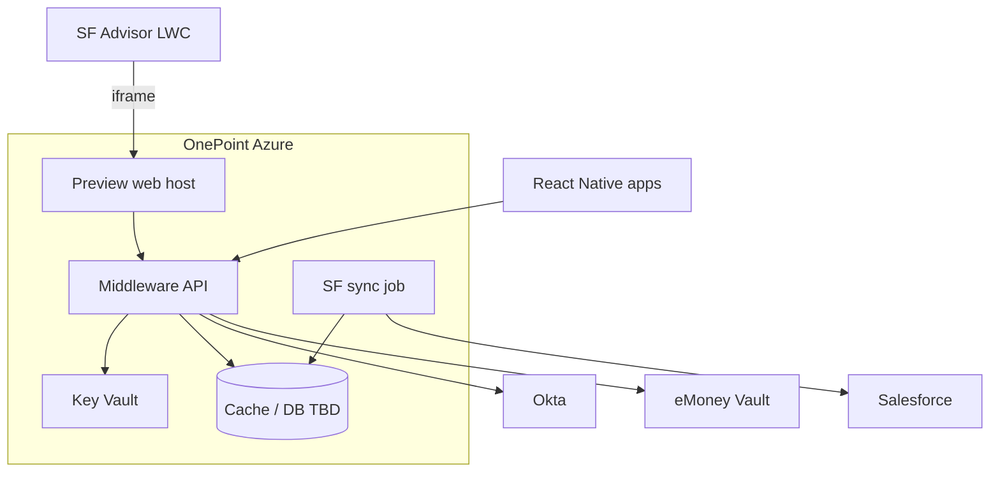

> ADRs: [ADR-008](/01-constitution/constitution/#adr-008--middleware-on-onepoint-azure) · [ADR-023](/01-constitution/constitution/#adr-023--neopix-sow-vs-client-integration-boundary)  
> Spec packs: [E01 Platform](/05-specs/01-platform/01-overview/) · [E11 Release](/05-specs/11-release/01-overview/) · Security: [architecture §9](/02-architecture/architecture/#9-security-baseline) · Status: [status.md](/04-integrations/status/)

Last updated: July 19, 2026

---

## 1. Purpose & scope

Purpose: Middleware runs on **OnePoint-owned Azure**. This spec locks ownership, environments, and known security expectations. **Runtime stack versions, exact SKUs, CI/CD pipelines, and cost** are guided by [tech-spec-proposal.md](/06-engineering/tech-spec-proposal/) (Proposed) and locked in Phase B `tech-spec.md` after stack lock.

### In scope (this document)

- Hosting ownership and environment names  
- Secret storage expectation  
- Related client-owned release prerequisites (GitHub, App Store / Play) as checklist  

### Out of scope (Phase B)

- Azure Container Apps vs App Service vs AKS choice  
- Postgres / cache engine selection and sizing  
- GitHub Actions workflow detail, branching model, cost tables  

---

## 2. Ownership

| Asset | Owner |
|---|---|
| Azure subscription / runtime | OnePoint |
| Middleware API + sync worker | Neopix (deployed into OnePoint Azure) |
| Advisor preview web host (CFG-02 iframe target) | Neopix — [ADR-047](/01-constitution/constitution/#adr-047--advisor-preview-requires-web-client-surface) |
| Key Vault / secrets | OnePoint (Neopix consumes via Managed Identity) |
| Middleware application code | Neopix (deployed into OnePoint Azure) |
| Mobile repo | OnePoint GitHub |
| SF metadata | Callaway Bitbucket |
| Apple / Google developer accounts | OnePoint (Neopix provides submission support) |
| SSL / custom domains | OnePoint |

SOW: [ADR-023](/01-constitution/constitution/#adr-023--neopix-sow-vs-client-integration-boundary).

---

## 3. Trust boundary & credentials

Obligations (locked — mechanism SKUs Phase B):

| Obligation | Rule |
|---|---|
| Secret storage | SF, Okta Admin API, Vault, feed auth → **Azure Key Vault** (or OnePoint-approved equivalent) — never git |
| Identity to Key Vault | Managed Identity preferred; if interim secret inject, document for security review |
| TLS | All middleware endpoints HTTPS only |
| Fail closed | Key Vault unavailable → secret-dependent paths fail (no plaintext fallback) |
| Env separation | `staging` ≠ `prod` credentials, Okta apps, or SF orgs |
| Egress | Middleware calls only documented dependencies (SF, Okta, Vault, feed, Calendly) — no ad-hoc third parties |
| Logs | No secrets or tokens in application logs ([architecture §9.6](/02-architecture/architecture/#96-logging-must-not)) |

Neopix shares storage/cache model with OnePoint for security review before pilot. Cross-cut: [architecture §9](/02-architecture/architecture/#9-security-baseline).

---

## 4. Logical layout

---

## 5. Environments

| Env | Purpose |
|---|---|
| `dev` | Developer + CI fixtures; may run outside client Azure |
| `staging` | Client Azure + SF sandbox + non-prod Okta |
| `prod` | Client Azure + prod dependencies |

Promotion and pipeline mechanics: Phase B.

---

## 6. Known constraints (from ADRs)

- CISO preference: Azure ([ADR-008](/01-constitution/constitution/#adr-008--middleware-on-onepoint-azure)).  
- Daily sync job must be schedulable (~post 7 AM ET).  
- Mobile talks only to middleware ([ADR-001](/01-constitution/constitution/#adr-001--middleware-as-the-only-mobile-data-plane)).
- Advisor LWC preview iframes a Neopix web host ([ADR-047](/01-constitution/constitution/#adr-047--advisor-preview-requires-web-client-surface)); HTTPS + CSP for Salesforce domains.

---

## 7. Failure modes

| Failure | Behaviour |
|---|---|
| Middleware down | Mobile error / retry; no direct SF failover |
| Key Vault unavailable | Fail closed on secret-dependent paths |
| Sync job miss | Stale `data_as_of`; ops alert ([architecture §9.7](/02-architecture/architecture/#97-ops-signals-required-vendor-phase-b)) |

---

## 8. Ops signals (hosting)

Health endpoint required in staging/prod. Cross-cut signal list: [architecture §9.7](/02-architecture/architecture/#97-ops-signals-required-vendor-phase-b). Alert routing / APM vendor = Phase B.

---

## 9. Release prerequisites checklist

- [ ] Azure subscription access for Neopix deploy  
- [ ] Key Vault (or interim secret store)  
- [ ] GitHub mobile repo provisioned  
- [ ] Apple Developer + Google Play accounts  
- [ ] Security review of storage/cache model (OnePoint)  
- [ ] Store submission handhold plan (E11)  

---

## 10. Done checklist (platform readiness)

- [ ] Staging middleware reachable over HTTPS  
- [ ] Secrets injected without plaintext in repo  
- [ ] Health endpoint for ops  
- [ ] Sync job runnable on schedule in staging  

---

## 11. Pack consumers

| Pack | Notes |
|---|---|
| [E01 Platform](/05-specs/01-platform/01-overview/) | Scaffold, CI stub, mock `/me` |
| [E11 Release](/05-specs/11-release/01-overview/) | Security QA, pilot, store submission |
