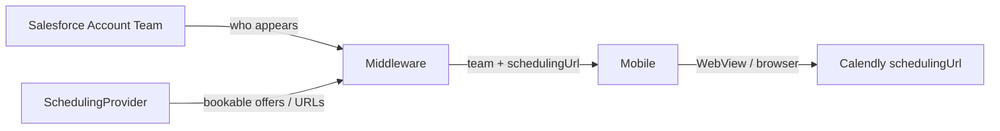

> ADRs: [ADR-034](/01-constitution/constitution/#adr-034--calendly-depth-in-v1) · [ADR-023](/01-constitution/constitution/#adr-023--neopix-sow-vs-client-integration-boundary)  
> Pack contract: [E05 scheduling.md](/05-specs/05-my-team/05-contracts/scheduling/) · Team SF: [E05 salesforce.md](/05-specs/05-my-team/05-contracts/salesforce/) · Status: [status.md](/04-integrations/status/)

Last updated: July 17, 2026

---

## 1. Purpose & scope

Purpose: Clients book advisor time via **provider-agnostic** meeting URLs. Adapter this delivery is **Calendly**. Depth = deep-link / in-app WebView only ([ADR-034](/01-constitution/constitution/#adr-034--calendly-depth-in-v1)).

### In scope (this delivery)

- `SchedulingProvider` port → Calendly adapter (or static / mapped HTTPS URLs)  
- Return `MeetingType.schedulingUrl` (+ display fields) on team APIs  
- Attribution copy from API (`providerAttribution`)  

### Out of scope (this delivery)

- Embedded Calendly widget SDK  
- Booking confirmation webhooks as Must  
- Create / cancel appointment APIs from middleware  
- Chat / full messaging (later phase)  

---

## 2. Ownership

| Party | Owns |
|---|---|
| OnePoint / advisors | Calendly accounts and event types |
| Neopix | Port, adapter, team OpenAPI |
| Callaway | Account Team membership + optional scheduling enablement fields |

SOW: [ADR-023](/01-constitution/constitution/#adr-023--neopix-sow-vs-client-integration-boundary).

---

## 3. Trust boundary & credentials

- If Calendly API is used for the offer list: credentials only in middleware.  
- If this delivery uses static / mapped URLs from config or SF: document the mapping in the pack contract.  
- Mobile opens HTTPS URL only — no Calendly OAuth in the app.  

---

## 4. Data flow

Detail: [E05 scheduling.md](/05-specs/05-my-team/05-contracts/scheduling/).

---

## 5. Sync cadence & `data_as_of`

| Concern | Rule |
|---|---|
| Team membership | Daily SF sync (~post 7 AM ET with other Tier A) |
| Meeting offers / URLs | On read or short cache (e.g. ≤1h TTL) — exact TTL engineering TBD |
| Freshness | Staleness acceptable for deep-link; no `data_as_of` required on booking URL |
| After advisor changes event type | Next cache miss or sync picks up new URL |

---

## 6. Objects / fields

OpenAPI remains provider-agnostic — never expose `calendly_*` property names to mobile. Internal `provider_ref` for debug only.

Team enablement fields (optional): `Mobile_Scheduling_Enabled__c` TBD — [E05 salesforce.md](/05-specs/05-my-team/05-contracts/salesforce/).

---

## 7. Failure modes

| Failure | Behaviour |
|---|---|
| No offers for member | Hide schedule CTA or show unavailable per MT-03 |
| Provider down | Error on meeting-types; team roster still from SF |
| Flag / member not bookable | Omit scheduling entry |

---

## 8. Environments

| Env | Notes |
|---|---|
| `dev` | Fixture offers + example HTTPS URLs |
| `staging` | Test Calendly event types |
| `prod` | Advisor production links |

---

## 9. Done checklist

- [ ] Port + Calendly adapter (or URL map)  
- [ ] OpenAPI free of vendor property names  
- [ ] WebView deep-link verified on device  
- [ ] Attribution string from API  

---

## 10. Pack consumers

| Pack | Contract / notes |
|---|---|
| [E05 Your Team](/05-specs/05-my-team/01-overview/) | MT-03 — [scheduling.md](/05-specs/05-my-team/05-contracts/scheduling/) |
| [E04 Home](/05-specs/04-home/01-overview/) | Team preview may link through |
