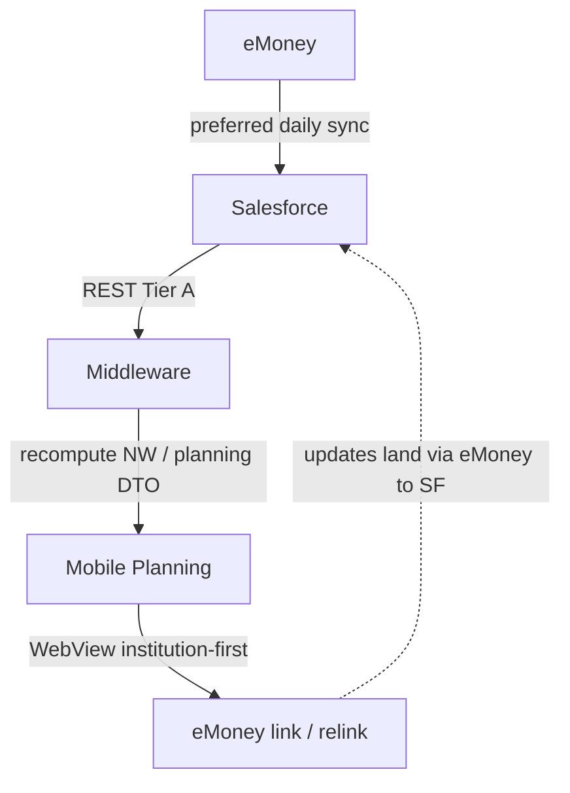

> ADRs: [ADR-009](/01-constitution/constitution/#adr-009--portfolio-orion-only-planning-emoney-only) · [ADR-012](/01-constitution/constitution/#adr-012--no-emoney-gauge-embeds) · [ADR-020](/01-constitution/constitution/#adr-020--emoney-contract-signed-tier-b-candidate) · [ADR-025](/01-constitution/constitution/#adr-025--tier-b-and-tier-c-in-neopix-sow) · [ADR-038](/01-constitution/constitution/#adr-038--net-worth-calculation) · [ADR-040](/01-constitution/constitution/#adr-040--institution-first-emoney-linking) · [ADR-041](/01-constitution/constitution/#adr-041--manual-held-away-account-entry) · [ADR-042](/01-constitution/constitution/#adr-042--account-nickname-write-back) · [ADR-043](/01-constitution/constitution/#adr-043--real-estate--zillow-home-value) · [ADR-023](/01-constitution/constitution/#adr-023--neopix-sow-vs-client-integration-boundary)  
> Entities: [data-model.md §4](/03-data/data-model/) · Pack: [E08](/05-specs/08-planning/01-overview/) · Status: [status.md](/04-integrations/status/)

Last updated: July 17, 2026

---

## 1. Purpose & scope

Purpose: eMoney powers **Planning** (when enrolled). Preferred path is **eMoney → Salesforce → middleware**. Direct eMoney API (Tier B) is **out of Neopix SOW this delivery**. Institution link/relink uses **eMoney WebView** (institution-first).

### In scope (this delivery)

- Read planning facts from SF (overview, NW inputs, Monte Carlo fields, expenses, goals, linked accounts, allocation `planning_combined`)  
- Middleware **recomputes** net worth ([ADR-038](/01-constitution/constitution/#adr-038--net-worth-calculation)) — do not trust eMoney display totals  
- Institution-first link / relink via WebView ([ADR-040](/01-constitution/constitution/#adr-040--institution-first-emoney-linking))  
- Hide Planning (and Home NW) when not enrolled ([ADR-029](/01-constitution/constitution/#adr-029--home-without-emoney))  

### Out of scope (this delivery)

- Direct Tier B eMoney API reads/writes from Neopix ([ADR-025](/01-constitution/constitution/#adr-025--tier-b-and-tier-c-in-neopix-sow))  
- eMoney gauge embeds ([ADR-012](/01-constitution/constitution/#adr-012--no-emoney-gauge-embeds))  
- Client expense edit ([ADR-039](/01-constitution/constitution/#adr-039--client-expense-edit-path) Won't)  
- Manual held-away account create ([ADR-041](/01-constitution/constitution/#adr-041--manual-held-away-account-entry) Won't)  
- Nickname write-back ([ADR-042](/01-constitution/constitution/#adr-042--account-nickname-write-back) Won't)  
- Document vault (separate — [vault.md](/04-integrations/vault/))  

---

## 2. Ownership

| Party | Owns |
|---|---|
| OnePoint | eMoney contract, eMoney → SF sync, client data access, field accuracy |
| Callaway | SF planning objects / field packaging |
| Neopix | SF sync → Planning API; NW formula; WebView deep links; **not** Tier B API productization without change order |

SOW: [ADR-023](/01-constitution/constitution/#adr-023--neopix-sow-vs-client-integration-boundary).

---

## 3. Trust boundary & credentials

- Middleware: **Salesforce** credentials for planning reads.  
- WebView: client authenticates to eMoney linking UX; middleware does not scrape WebView.  
- Tier B API credentials: **not** required for Neopix delivery this wave (exploration access ≠ production path).  

---

## 4. Data flow

---

## 5. Sync cadence & `data_as_of`

| Item | Rule |
|---|---|
| eMoney → SF | Client-owned daily sync |
| Middleware | Post SF job; Planning shows `data_as_of` |
| After link / relink WebView | Expect next sync cycle (or client-defined refresh) before balances update in app |

---

## 6. Objects & rules

| Concern | Rule |
|---|---|
| Managed AUM | From Orion via SF — not double-counted from eMoney ([ADR-011](/01-constitution/constitution/#adr-011--orion-wins-on-duplicate-account-numbers)) |
| Held-away / external | eMoney → SF linked accounts |
| Allocation | `planning_combined` taxonomy only — never marry Orion classes ([ADR-010](/01-constitution/constitution/#adr-010--dual-allocation-scopes)) |
| NW | Σ Orion AUM + eMoney external + insurance cash − liabilities (+ home value when synced — [ADR-043](/01-constitution/constitution/#adr-043--real-estate--zillow-home-value)) |
| Expenses | Read-only annual / line items from SF |
| Monte Carlo | SF-synced eMoney fields only |

Work package: [E08 salesforce.md](/05-specs/08-planning/05-contracts/salesforce/).

---

## 7. Failure modes

| Failure | Behaviour |
|---|---|
| No eMoney enrollment | Hide Planning tab; Home without NW ([ADR-029](/01-constitution/constitution/#adr-029--home-without-emoney)) |
| Partial SF field map | Unavailable sections; fixtures for demo |
| Broken linked account | Show connection status + Relink CTA (WebView) |
| WebView link abandoned | No partial invent; prior SF state remains |

---

## 8. Environments

| Env | Notes |
|---|---|
| `dev` | Planning fixtures; mock WebView URLs |
| `staging` | SF sandbox + eMoney test / golden client when provisioned |
| `prod` | After eMoney → SF field map signed |

---

## 9. Done checklist

- [ ] Planning SF objects readable for golden client  
- [ ] NW inputs present or explicitly unavailable  
- [ ] Dual allocation taxonomies verified separate from Portfolio  
- [ ] Institution-first WebView link/relink demo path  
- [ ] No Tier B API dependency in middleware config  
- [ ] Won't paths (manual, nickname, expense edit) not shipped  

---

## 10. Pack consumers

| Pack | Contract / notes |
|---|---|
| [E08 Planning](/05-specs/08-planning/01-overview/) | Primary — [salesforce.md](/05-specs/08-planning/05-contracts/salesforce/) |
| [E04 Home](/05-specs/04-home/01-overview/) | NW / planning teaser when enabled |
| [E10 Action Required](/05-specs/10-alerts/01-overview/) | May consume planning / link sync signals |
