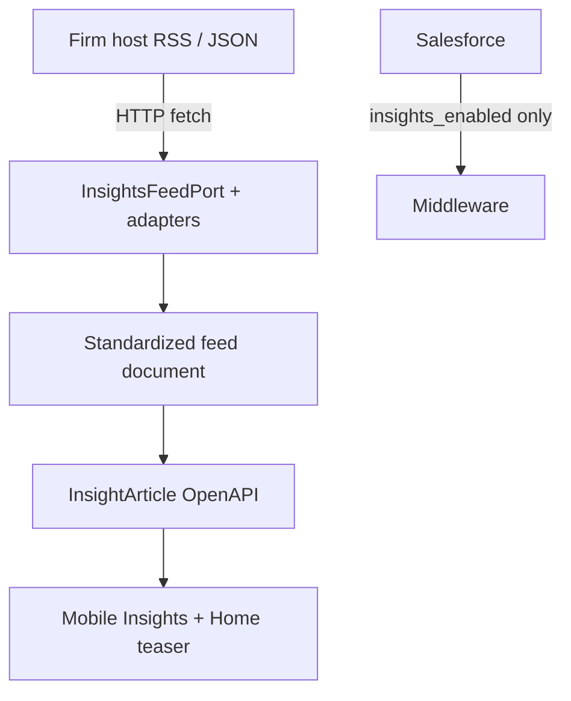

> ADRs: [ADR-017](/01-constitution/constitution/#adr-017--insights-v1--rsswebsite-feed) · [ADR-023](/01-constitution/constitution/#adr-023--neopix-sow-vs-client-integration-boundary)  
> Entities: [data-model.md §6](/03-data/data-model/) · Pack contract: [E06 feed.md](/05-specs/06-insights/05-contracts/feed/) · Status: [status.md](/04-integrations/status/)

Last updated: July 17, 2026

---

## 1. Purpose & scope

Purpose: Insights & Commentary content is owned by the firm’s **external website / RSS / JSON feed**. Middleware proxies and normalizes into `InsightArticle`. Salesforce supplies **`insights_enabled`** only — not CMS content.

### In scope (this delivery)

- HTTP fetch of firm feed  
- Adapters: RSS/Atom and/or JSON Feed → standardized feed document → OpenAPI DTOs  
- Same catalog for all clients (no per-client filtering — IC-03 Won't)  

### Out of scope (this delivery)

- Salesforce CMS for articles  
- Agentic / preference-based selection (later phase)  

---

## 2. Ownership

| Party | Owns |
|---|---|
| OnePoint | Feed URL, publishing, content |
| Neopix | Proxy, adapters, Insights API, caching |
| Callaway | Feature flag only |

SOW: [ADR-023](/01-constitution/constitution/#adr-023--neopix-sow-vs-client-integration-boundary).

---

## 3. Trust boundary & credentials

- Prefer public HTTPS feed; if auth required, credentials only in middleware.  
- Sanitize HTML content before mobile render.  
- No write path to the CMS from the app.  

---

## 4. Data flow

Normative schema and adapters: [E06 feed.md](/05-specs/06-insights/05-contracts/feed/).

---

## 5. Sync cadence & `data_as_of`

| Concern | Rule |
|---|---|
| Poll / cache refresh | Short interval (target: hourly) — exact TTL engineering TBD |
| List freshness | Endpoint may expose feed `updatedAt` as freshness signal |
| Flag | Daily SF sync for `insights_enabled` |
| On publish | Next poll picks up new articles; no push webhook required this delivery |

---

## 6. Objects / fields

See standardized feed document and `InsightArticle` in [E06 feed.md](/05-specs/06-insights/05-contracts/feed/) and [data-model.md §6.1](/03-data/data-model/).

---

## 7. Failure modes

| Failure | Behaviour |
|---|---|
| Feed URL missing | Fixtures in `dev`; staging/prod empty + ops alert |
| Parse failure | Keep last good cache if any; else empty + error |
| Flag off | Hide Insights surfaces |

---

## 8. Environments

| Env | Source |
|---|---|
| `dev` | Bundled fixture feed |
| `staging` | Client-provided URL or fixture |
| `prod` | Production feed URL |

---

## 9. Done checklist

- [ ] Feed URL from OnePoint  
- [ ] Adapter chosen (RSS vs JSON) and golden parse  
- [ ] OpenAPI list/detail match IC Must stories  
- [ ] Home teaser consumes same catalog  

---

## 10. Pack consumers

| Pack | Contract / notes |
|---|---|
| [E06 Insights](/05-specs/06-insights/01-overview/) | [feed.md](/05-specs/06-insights/05-contracts/feed/) · OpenAPI |
| [E04 Home](/05-specs/04-home/01-overview/) | Latest insights teaser |
