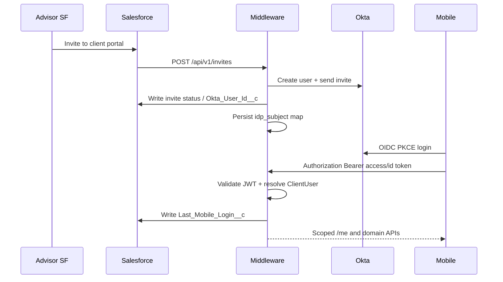

> ADRs: [ADR-007](/01-constitution/constitution/#adr-007--okta-invite-via-middleware) · [ADR-046](/01-constitution/constitution/#adr-046--mfa-off-for-this-delivery) · [ADR-001](/01-constitution/constitution/#adr-001--middleware-as-the-only-mobile-data-plane) · [ADR-023](/01-constitution/constitution/#adr-023--neopix-sow-vs-client-integration-boundary)  
> Entities: [data-model.md §1 / §13.3](/03-data/data-model/) · Behaviour: [E02 specify](/05-specs/02-users/02-specify/) · Status: [status.md](/04-integrations/status/)

Last updated: July 19, 2026
---

## 1. Purpose & scope

Purpose: Okta is the client identity provider. Advisors invite from Salesforce; middleware provisions Okta users and validates mobile OIDC logins.

### In scope (this delivery)

- OIDC authorization code + **PKCE** in the React Native app  
- Middleware: create user + invite email; map `idp_subject` ↔ `ClientUser`  
- JWT validation on every mobile API call  
- Write last-login (and related portal fields) to Salesforce after interactive login  
- MFA **off** for this delivery ([ADR-046](/01-constitution/constitution/#adr-046--mfa-off-for-this-delivery))  

### Out of scope (this delivery)

- Salesforce calling Okta directly (invite always SF → middleware → Okta)  
- Biometric unlock as a product gate ([ADR-031](/01-constitution/constitution/#adr-031--biometric-unlock) Won't)  
- Firm MFA policy changes (may reverse ADR-046 later)  

---

## 2. Ownership

| Party | Owns |
|---|---|
| OnePoint | Okta tenant, apps, policies, SSL |
| Neopix | Middleware Okta Admin API usage, mobile OIDC client, claim → user mapping |
| Callaway | SF invite actions that call middleware ([E02 SF package](/05-specs/02-users/05-contracts/salesforce/)) |

SOW: [ADR-023](/01-constitution/constitution/#adr-023--neopix-sow-vs-client-integration-boundary).

---

## 3. Trust boundary & credentials

- Mobile: public OIDC client; PKCE; tokens in Keychain / Keystore — never SF or vault secrets.  
- Middleware: Okta API token / OAuth client for Users + invites; validates JWT (`iss`, `aud`, `exp`, signature).  
- **SF service bearer** for invite endpoints ≠ Okta user tokens.  
- No Orion credentials in the auth path.  

---

## 4. Sequence

---

## 5. Sync cadence & `data_as_of`

| Concern | Rule |
|---|---|
| Identity | Near-real-time on invite / login / disable / remove |
| Financial domains | Unrelated — still daily SF sync |
| Session | Short-lived access token; refresh per Okta app config |

---

## 6. Claims & role model

| Canonical | Mapping this delivery |
|---|---|
| `ClientUser.idp_subject` | `id_token.sub` (Okta user id) |
| Email | `email` claim; PersonEmail at invite time |
| `ClientInvite.idp_invite_ref` | Okta invite/activation transaction id when the Users/invite API returns one; otherwise `idp_subject` + invite-sent timestamp (middleware-owned) |
| SF write-back | `Account.Okta_User_Id__c` ← `idp_subject` |

Full field table: [data-model.md §13.3](/03-data/data-model/).

### 6.1 Client vs admin (locked)

| Role | How middleware recognizes it | Provisioning |
|---|---|---|
| Client | Valid JWT whose `sub` maps to a `ClientUser` with portal status `active` (or provisioning wait) | Advisor invite only (**A-01**) — never admin group |
| Admin | Valid JWT whose `sub` is in the OnePoint Okta **admin** group **or** custom claim `onepoint_portal_role=admin` (OnePoint names the exact group/claim in tenant setup; middleware config points at that name) | Ops-provisioned Okta users (**AD-01**) — not via client invite |

Rules:

- Middleware is the authorization enforcement point after JWT validation.  
- **Impersonation is not an Okta token claim.** Admin starts/ends impersonation via middleware APIs (**AD-03**, **AD-04**); audit is middleware-owned.  
- Client app users must not be members of the admin group. Presenting client credentials to admin APIs → access denied.  
- Advisors have **no** mobile IdP login ([ADR-013](/01-constitution/constitution/#adr-013--roles-and-surfaces)).

Client-owned TBD (config values only): exact Okta group id / claim attribute string in each environment — behaviour above is locked.

MFA: not required for the **client** Okta app this delivery ([ADR-046](/01-constitution/constitution/#adr-046--mfa-off-for-this-delivery)). `mfa_enrolled` may be read for future use; it does **not** gate login this delivery. Unexpected MFA challenge → configuration failure (no app MFA UX).
---

## 7. Failure modes

| Failure | Behaviour |
|---|---|
| Invite API fails | SF shows error; status `failed`; advisor may resend |
| User already exists | Idempotent map or clear error per E02 specify |
| Invalid / expired JWT | `401`; app re-auth |
| Disabled / removed portal | Block API; clear UX per E02 |
| Last-login write-back fails | Login OK; retry; ops log |

---

## 8. Environments

| Env | Okta | Notes |
|---|---|---|
| `dev` | Dev tenant or mock IdP | Fixtures for CI |
| `staging` | Non-prod Okta app | Matches SF sandbox invites |
| `prod` | Prod tenant | Store review + security sign-off |

---

## 9. Done checklist

- [ ] Okta non-prod tenant + OIDC app (PKCE) provisioned  
- [ ] Middleware service credentials for Users / invite  
- [ ] `POST /invites` creates user + email + SF write-back  
- [ ] Mobile login → JWT validation → `/me`  
- [ ] Disable / remove / reset-password paths per E02  
- [ ] MFA off confirmed with OnePoint security  
- [ ] Admin Okta group / `onepoint_portal_role` claim configured; middleware config points at it  
- [ ] Impersonation start/end + audit verified ([architecture §9.4](/02-architecture/architecture/#94-sessions--impersonation))  

---

## 10. Pack consumers

| Pack | Contract / notes |
|---|---|
| [E02 Users](/05-specs/02-users/01-overview/) | Behaviour + OpenAPI + [SF invite package](/05-specs/02-users/05-contracts/salesforce/) |

This file is the **global Okta contract** (no separate pack `okta.md`).
