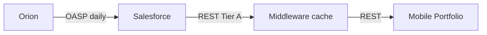

> ADRs: [ADR-003](/01-constitution/constitution/#adr-003--no-orion-connect-api-in-neopix-scope) · [ADR-009](/01-constitution/constitution/#adr-009--portfolio-orion-only-planning-emoney-only) · [ADR-011](/01-constitution/constitution/#adr-011--orion-wins-on-duplicate-account-numbers) · [ADR-024](/01-constitution/constitution/#adr-024--holdings--orion-performance-source) · [ADR-025](/01-constitution/constitution/#adr-025--tier-b-and-tier-c-in-neopix-sow) · [ADR-044](/01-constitution/constitution/#adr-044--orion-portal-parity-for-v1-portfolio) · [ADR-023](/01-constitution/constitution/#adr-023--neopix-sow-vs-client-integration-boundary)  
> Entities: [data-model.md §3](/03-data/data-model/) · Pack: [E07](/05-specs/07-portfolio/01-overview/) · Status: [status.md](/04-integrations/status/)

Last updated: July 17, 2026

---

## 1. Purpose & scope

Purpose: Orion is the system of record for **managed** portfolio AUM. Neopix never calls Orion Connect live. Mobile reads Orion-originated data **only after it lands in Salesforce** (OASP / FSC packages).

### In scope (this delivery — Neopix)

- Consume SF objects for managed accounts, balances, allocation (`portfolio_orion`), holdings, performance  
- Dedupe: Orion wins on duplicate account numbers vs eMoney ([ADR-011](/01-constitution/constitution/#adr-011--orion-wins-on-duplicate-account-numbers))  
- Portfolio UI stick to prototype / agreed surfaces ([ADR-044](/01-constitution/constitution/#adr-044--orion-portal-parity-for-v1-portfolio))  

### Out of scope (this delivery — Neopix)

- Live Orion Connect API from middleware or mobile ([ADR-003](/01-constitution/constitution/#adr-003--no-orion-connect-api-in-neopix-scope))  
- Tier C holdings feed (API → AWS staging, Redshift, Athena) as a Neopix ingest path ([ADR-025](/01-constitution/constitution/#adr-025--tier-b-and-tier-c-in-neopix-sow))  
- Tax-lot drill-down, activities/transactions, nested benchmark tabs (Won't until ADR-044 says otherwise)  

---

## 2. Ownership

| Party | Owns |
|---|---|
| OnePoint | Orion → SF sync accuracy; holdings/performance presence in SF |
| Callaway | SF object/field packaging; FSC licenses |
| Neopix | SF → cache sync; Portfolio API; field-gap reporting — **not** Orion credentials for live Connect |

Exploration credentials shared with Neopix are for **gap analysis only**, not production Connect from Neopix.

SOW: [ADR-023](/01-constitution/constitution/#adr-023--neopix-sow-vs-client-integration-boundary).

---

## 3. Trust boundary & credentials

- Production middleware: Salesforce credentials only for portfolio data.  
- **No Orion API secrets** in mobile or middleware runtime this delivery.  
- Client may run Orion → SF (or future Tier C) under a **separate change order** — outside Neopix SOW this delivery.  

---

## 4. Data flow

---

## 5. Sync cadence & `data_as_of`

| Item | Rule |
|---|---|
| Upstream Orion → SF | Client-owned daily job |
| Middleware | After SF job (~post 7 AM ET) |
| UI | Portfolio screens show **data as of** |
| Missing holdings / performance | `unavailable` / empty — never invent ([ADR-024](/01-constitution/constitution/#adr-024--holdings--orion-performance-source)) |

---

## 6. Objects & expectations

| Need | SF expectation | If missing |
|---|---|---|
| Managed FA list + balances | `FinServ__FinancialAccount__c` + OASP | Field gap / empty |
| Holdings rows | `FinServ__FinancialHolding__c` (or OASP equiv.) | Empty list / unavailable |
| Performance series | OASP / custom (TBD OnePoint) | Unavailable |
| Allocation `portfolio_orion` | SF rollups by category & class | Unavailable per dimension |

Field maps: [data-model.md](/03-data/data-model/) · work package: [E07 salesforce.md](/05-specs/07-portfolio/05-contracts/salesforce/).

NW: Orion AUM from SF contributes to middleware NW formula ([ADR-038](/01-constitution/constitution/#adr-038--net-worth-calculation)); Planning never uses Orion allocation taxonomy ([ADR-010](/01-constitution/constitution/#adr-010--dual-allocation-scopes)).

---

## 7. Failure modes

| Failure | Behaviour |
|---|---|
| Holdings empty in SF | Empty holdings UI; do not call Orion |
| Allocation missing one dimension | That dimension `unavailable`; other may be `ready` |
| Stale sandbox | Fixture/demo data until refreshed sandbox |

---

## 8. Environments

| Env | Source |
|---|---|
| `dev` | Fixtures shaped like SF holdings/FA payloads |
| `staging` | SF sandbox (may lack holdings until OnePoint hydrates) |
| `prod` | SF prod after OnePoint confirms Orion → SF completeness |

---

## 9. Done checklist

- [ ] FA list + balances sync verified for golden client  
- [ ] Holdings field map agreed (OnePoint / Callaway) or explicit unavailable UX signed  
- [ ] Performance / allocation sources named or marked unavailable  
- [ ] No Orion Connect credentials in middleware config  
- [ ] ADR-044 Won't surfaces not built  

---

## 10. Pack consumers

| Pack | Contract / notes |
|---|---|
| [E07 Portfolio](/05-specs/07-portfolio/01-overview/) | Primary — [salesforce.md](/05-specs/07-portfolio/05-contracts/salesforce/) |
| [E08 Planning](/05-specs/08-planning/01-overview/) | Orion AUM for NW only |
| [E04 Home](/05-specs/04-home/01-overview/) | Portfolio teaser from same Tier A data |
