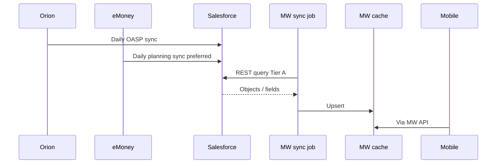

> ADRs: [ADR-002](/01-constitution/constitution/#adr-002--salesforce-tier-a-default-source) · [ADR-006](/01-constitution/constitution/#adr-006--all-advisor-and-admin-configuration-in-salesforce) · [ADR-007](/01-constitution/constitution/#adr-007--okta-invite-via-middleware) · [ADR-018](/01-constitution/constitution/#adr-018--effective-feature-flag-resolution) · [ADR-023](/01-constitution/constitution/#adr-023--neopix-sow-vs-client-integration-boundary)  
> Entities: [data-model.md](/03-data/data-model/) · Status: [status.md](/04-integrations/status/)

Last updated: July 17, 2026

---

## 1. Purpose & scope

Purpose: Salesforce is the **default Tier A** data plane for the mobile middleware — identity graph, managed accounts, balances, holdings/performance (when present), Account Team, feature flags, invite metadata, and planning facts landed from eMoney → SF.

### In scope (this delivery)

- Scheduled Salesforce REST **read** sync → middleware cache  
- Limited **write-back** (invite / login / legal / profile-proposal events)  
- Preference / feature-flag objects + LWC config (Callaway)  
- SF-triggered invite call-out to middleware  

### Out of scope (this delivery)

- Mobile calling Salesforce directly ([ADR-001](/01-constitution/constitution/#adr-001--middleware-as-the-only-mobile-data-plane))  
- Salesforce as Insights CMS ([ADR-017](/01-constitution/constitution/#adr-017--insights-v1-rss-website-feed))  
- Document binary storage in SF ([ADR-030](/01-constitution/constitution/#adr-030--document-vault-api-path))  

---

## 2. Ownership

| Party | Owns |
|---|---|
| Neopix | Sync job, cache, field-gap analysis, invite API consumed by SF |
| Callaway | Field map, preference objects, LWC, invite actions, permission sets, sandbox packaging |
| OnePoint | SF sandbox/prod orgs, data quality, Orion/eMoney accuracy **in SF** |

SOW: [ADR-023](/01-constitution/constitution/#adr-023--neopix-sow-vs-client-integration-boundary).

---

## 3. Trust boundary & credentials

- Middleware uses a **Salesforce integration user** (or Connected App) for REST sync.  
- Sync credentials: **read** on Tier A objects; write only on agreed portal fields (invite status, last login, terms, Okta subject, profile proposal updates).  
- SF → middleware invite call-out uses a **service bearer** (named credential) — never end-user Okta tokens.  
- No Orion or eMoney Tier B credentials stored for the SF sync path.  

---

## 4. Data flow

Invite / write-back: [okta.md](/04-integrations/okta/) · [architecture.md](/02-architecture/architecture/).

---

## 5. Sync cadence & `data_as_of`

| Item | Rule |
|---|---|
| Cadence | Daily, after client Orion/eMoney → SF jobs (~post **7 AM ET**) ([ADR-004](/01-constitution/constitution/#adr-004--daily-data-cadence-and-data-as-of)) |
| Client UI | Show per-domain **data as of** from sync metadata (`GET /meta/data-as-of`) |
| On-demand | Not required for financial domains this delivery; stub/fixture until sync ready |

---

## 6. Objects & fields

Canonical maps: [data-model.md](/03-data/data-model/). Prefer Callaway sandbox export API names (external resource: Salesforce data-model export) when they differ from docs.

| Domain | Typical SF objects | Spec pack |
|---|---|---|
| Identity / invite / profile proposals | Person `Account`, portal write-backs, `Mobile_Profile_Proposal__c` | [E02 salesforce.md](/05-specs/02-users/05-contracts/salesforce/) |
| Feature flags | Preference / `Mobile_Feature_Flags__c` pattern | [E03 salesforce.md](/05-specs/03-configuration/05-contracts/salesforce/) |
| Team | `AccountTeamMember` (+ `Mobile_Client_Facing__c` / `Mobile_Scheduling_Enabled__c` TBD) | [E05 salesforce.md](/05-specs/05-my-team/05-contracts/salesforce/) |
| Portfolio | FA, holdings, performance, allocation rollups | [E07 salesforce.md](/05-specs/07-portfolio/05-contracts/salesforce/) |
| Planning | `Planning_Overview__c`, goals, expenses, `Linked_Account__c` (+ `Relink_Url__c` TBD) | [E08 salesforce.md](/05-specs/08-planning/05-contracts/salesforce/) |

Holdings: required from SF for Portfolio ([ADR-024](/01-constitution/constitution/#adr-024--holdings-source-tier-c)). If empty → empty list / `unavailable` — do not invent.

Effective flags: [E03 resolution.md](/05-specs/03-configuration/05-contracts/resolution/) ([ADR-018](/01-constitution/constitution/#adr-018--effective-feature-flag-resolution)).

---

## 7. Failure modes

| Failure | Client / advisor behaviour |
|---|---|
| Sync job fails | Keep last good cache; surface stale `data_as_of`; ops alert |
| Object/field missing | Domain `unavailable` or empty; log field gap — never fabricate |
| Invite call-out fails | SF must not mark invite success; show middleware error to advisor |
| Write-back fails (last login) | Login still succeeds; retry write-back; ops visibility |

---

## 8. Environments

| Env | SF | Middleware |
|---|---|---|
| `dev` | Fixtures / mocks | Local fixtures |
| `staging` | OnePoint sandbox (refreshed + FSC) | Sync against sandbox |
| `prod` | Production org | Production sync |

---

## 9. Done checklist

- [ ] Integration user + Connected App in sandbox  
- [ ] Named credential for invite call-out  
- [ ] Sync covers identity, FA, flags, team; holdings/performance when present  
- [ ] Write-back fields deployed (Callaway package)  
- [ ] `data_as_of` exposed per domain  
- [ ] Golden client readable end-to-end  

---

## 10. Pack consumers

| Pack | Contract / notes |
|---|---|
| [E02 Users](/05-specs/02-users/01-overview/) | [salesforce.md](/05-specs/02-users/05-contracts/salesforce/) — invite, profile, legal write-backs |
| [E03 Configuration](/05-specs/03-configuration/01-overview/) | [salesforce.md](/05-specs/03-configuration/05-contracts/salesforce/) · [resolution.md](/05-specs/03-configuration/05-contracts/resolution/) |
| [E05 Your Team](/05-specs/05-my-team/01-overview/) | [salesforce.md](/05-specs/05-my-team/05-contracts/salesforce/) — Account Team |
| [E07 Portfolio](/05-specs/07-portfolio/01-overview/) | [salesforce.md](/05-specs/07-portfolio/05-contracts/salesforce/) |
| [E08 Planning](/05-specs/08-planning/01-overview/) | [salesforce.md](/05-specs/08-planning/05-contracts/salesforce/) |
| [E04 Home](/05-specs/04-home/01-overview/) · [E10 Action Required](/05-specs/10-alerts/01-overview/) | Consume Tier A via other packs’ APIs |

Pack `05-contracts/salesforce.md` files are **domain work packages** under this global contract.
