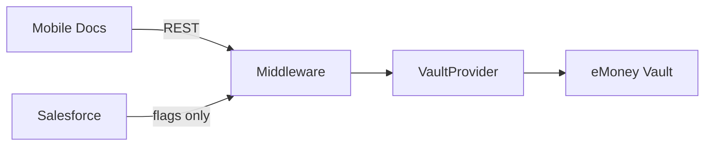

> ADRs: [ADR-030](/01-constitution/constitution/#adr-030--document-vault-api-path) · [ADR-001](/01-constitution/constitution/#adr-001--middleware-as-the-only-mobile-data-plane) · [ADR-023](/01-constitution/constitution/#adr-023--neopix-sow-vs-client-integration-boundary)  
> Entities: [data-model.md §5](/03-data/data-model/) · Pack port: [E09 vault.md](/05-specs/09-documents/05-contracts/vault/) · Status: [status.md](/04-integrations/status/)

Last updated: July 17, 2026

---

## 1. Purpose & scope

Purpose: Client documents are stored in **eMoney Vault**. Middleware exposes Docs via a replaceable **`VaultProvider`** port. Feature flags still come from Salesforce. Binaries are **not** stored long-term in middleware.

### In scope (this delivery)

- List / filter documents (all, needs signature, archive)  
- Short-lived download URLs  
- Upload via middleware → vault  
- External sign URL when vault provides one (in-app DocuSign signing is Won't)  

### Out of scope (this delivery)

- DocuSign embedded signing ([DOC-08](/05-specs/09-documents/02-specify/) Won't)  
- Salesforce as document blob store  
- Alternate vault vendor without a new ADR (port allows swap later)  

---

## 2. Ownership

| Party | Owns |
|---|---|
| OnePoint | Vault product access, credentials, retention policy |
| Neopix | `VaultProvider` + eMoney Vault adapter, Docs API, household scoping |
| Callaway | `documents_enabled` (and related) flags in SF only |

SOW: [ADR-023](/01-constitution/constitution/#adr-023--neopix-sow-vs-client-integration-boundary).

---

## 3. Trust boundary & credentials

- Vault API credentials **only in middleware** (Key Vault / secret store on Azure).  
- Mobile never holds vault secrets; uses middleware download URLs.  
- Every list / download / upload scoped to authenticated household.  

---

## 4. Data flow

Port methods: [E09 vault.md](/05-specs/09-documents/05-contracts/vault/).

---

## 5. Sync cadence & `data_as_of`

| Concern | Rule |
|---|---|
| Metadata | On demand from vault (cache optional with short TTL) |
| Flags | Daily SF sync |
| Download URL | Short TTL; client refreshes on expiry |

---

## 6. Objects / fields

Document entity: [data-model.md §5.1](/03-data/data-model/). Maps vault document id, name, type, upload metadata, signature flags, archive.

---

## 7. Failure modes

| Failure | Behaviour |
|---|---|
| Vault unreachable | Docs error state; no stale invent |
| Expired download URL | Client re-requests URL |
| Upload rejected (size / MIME) | Clear validation error |
| Flag off | Hide Docs / empty gated UX |

---

## 8. Environments

| Env | Adapter |
|---|---|
| `dev` | Fixture `VaultProvider` |
| `staging` | eMoney Vault sandbox when credentials available |
| `prod` | Production vault |

---

## 9. Done checklist

- [ ] Vault credentials in middleware secret store  
- [ ] Port + eMoney adapter (or fixture for fly-in demo)  
- [ ] List filters match DOC-02–DOC-04  
- [ ] Upload + download verified  
- [ ] Household isolation tested  

---

## 10. Pack consumers

| Pack | Contract / notes |
|---|---|
| [E09 Documents](/05-specs/09-documents/01-overview/) | [openapi.yaml](/05-specs/09-documents/05-contracts/openapi/) · [vault.md](/05-specs/09-documents/05-contracts/vault/) |
| [E10 Action Required](/05-specs/10-alerts/01-overview/) | May compute signature-pending from vault metadata |
