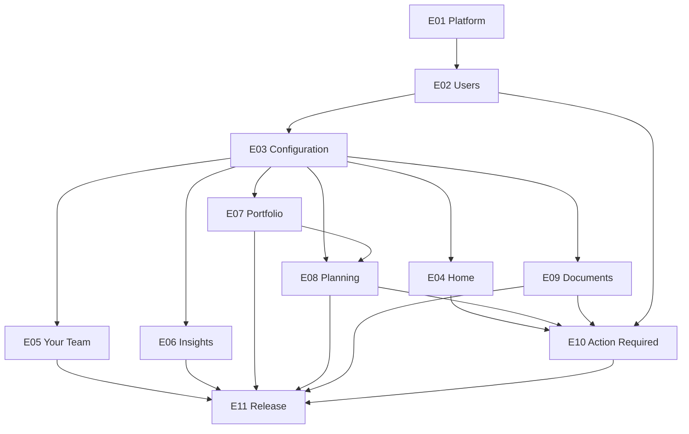
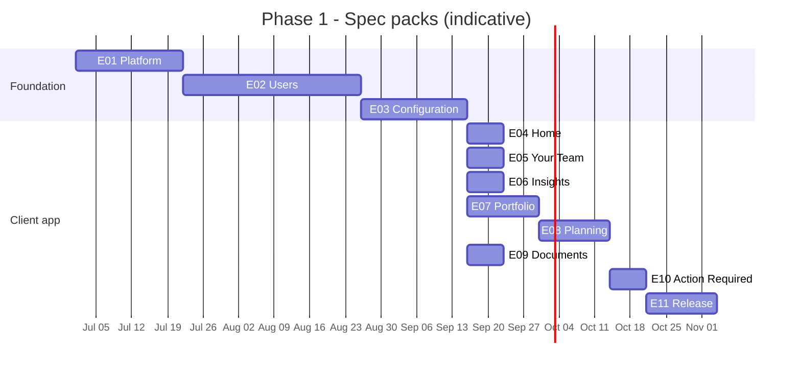

> Purpose: Phase 1 feature specs for engineering handoff.  
> Phase 1 target: Advisor fly-in demo (late Sep 2026) → October pilot → end-of-year rollout.  
> Bundle: [README.md](/readme/) · [READY.md](/ready/) · [AGENTS.md](/agents/) · Product: [prd.md](/product/prd/)  
> References: [constitution](/01-constitution/constitution/) · [architecture](/02-architecture/architecture/) · [data-model](/03-data/data-model/) · [integrations](/04-integrations/readme/)

Package IDs use `E01`…`E11` for stable cross-reference. Prefer the term *spec pack* / *feature spec* in client-facing prose (not “epic”).

Delivery rules: [AGENTS.md](/agents/) · reference pack: [07-portfolio/](/05-specs/07-portfolio/01-overview/).

Last updated: July 21, 2026

---

## Package shape

Every Phase 1 feature spec lives in `05-specs/NN-slug/` (zero-padded number + short name):

| Artifact | Role |
|---|---|
| `01-overview.md` | Pack context: problem, outcomes, scope (+ product constraints), prereqs, risks, acceptance demo, Discovery DoD |
| `02-specify.md` | Behaviour source of truth — stories + pack NFRs (when present) |
| `03-plan.md` / `04-tasks.md` | Reserved for Phase B delivery (not in discovery lock) |
| `05-contracts/` | Optional OpenAPI / Salesforce / provider build contracts |
| `CHANGELOG.md` | Package history (stub OK for overview-only packs) |

Not in discovery packs: sprint plans, task lists, GWT suites, separate UAT files, runbooks (delivery / QA own those after handoff).

Overview-only packs (no specify): [01-platform](/05-specs/01-platform/01-overview/), [04-home](/05-specs/04-home/01-overview/) (composite wiring), [11-release](/05-specs/11-release/01-overview/).

### Overview section template (all packs)

1. Problem → 2. Outcomes → 3. Scope summary *(include Product constraints subsection when needed)* → 4. What the client must provide → 5. Assumptions → 6. Risks → 7. Cross-pack hooks → 8. Acceptance demo → 9. Discovery DoD → 10. Build baseline

---

## Pack front-matter (required)

Each `01-overview.md` metadata table should include:

| Field | Meaning |
|---|---|
| Package version | Semver for this pack |
| Status | `Discovery locked` (build baseline) |
| Specify | Link or `—` |
| Depends on | Hard prerequisites (package IDs) |
| Soft parallel | Work that may overlap once deps land |

---

## How to use

1. Start here for MoSCoW, Discovery DoD, and the dependency graph.  
2. Open the pack’s `01-overview.md` for context and the acceptance demo bar.  
3. Open `02-specify.md` (when present) for stories and acceptance criteria — the specify wins if anything else disagrees.  
4. Use `05-contracts/` for Salesforce / OpenAPI build contracts when present; link upward to [04-integrations/](/04-integrations/readme/).  
5. Plan *build* work with the delivery team after discovery is signed.  
6. Product decisions: [constitution.md](/01-constitution/constitution/) (ADR log — keep updated).

---

## MoSCoW

Priorities are defined once here. Packages do not repeat this table. Per-story tags live on `02-specify.md`.

| Priority | Meaning |
|---|---|
| Must | Required for a shippable delivery of that pack |
| Should | Planned for this delivery unless blocked by a dependency outside the pack |
| Could | Included if capacity remains |
| Won't | Out of scope for this delivery (ADR or reason required) |

Untagged V1 stories in a specify are treated as Must unless listed under Out of scope (Won't).

### Cost

Each story index includes a Cost column — a relative delivery-cost score for that story. Higher cost means higher delivery investment to ship the story; lower cost means a thinner or largely shared change. Costs are comparable across packs and roll up for planning. Won't stories also carry Cost — indicative only, based on known intent where detail is thin. Domain OS-push stories (**IC-04**, **DOC-10**, **AR-14**) are incremental wiring on top of platform push (**C-16**); do not add them to **C-16** when rolling up Phase 2 push. Cost is not calendar duration and not a schedule commitment.

---

## Discovery Definition of Done

Shared bar for every package (check on each `01-overview` §9; do not restate definitions there):

- [ ] MoSCoW Must / Should / Could / Won't match agreed delivery; Won't has ADR or reason  
- [ ] Overview complete — prereqs, assumptions, risks documented  
- [ ] Behaviour locked — specify covers happy + unhappy paths; no open decisions on Must *(N/A for overview-only packs)*  
- [ ] Architecture / ownership clear for the pack’s systems  
- [ ] Data model aligned where the pack owns entities (or gaps listed)  
- [ ] Contracts Done or stubbed when the pack needs SF/API build packs  
- [ ] Acceptance demo (§8) is the demo bar for the pack  
- [ ] Cross-pack hooks called out with owners  
- [ ] Open items tracked with owner and “blocks implementation start? / blocks pilot?”

---

## Delivery rules

1. Respect the dependency graph — do not start a pack until its Depends on packs meet their exit / demo bar (overview §8). Parallel work is allowed when the graph permits (see Soft parallel).  
2. Each pack ends with a demo — working build on device/simulator, not just merged PRs.  
3. Middleware before mobile UI — API endpoints land before or with the screen.  
4. Stub first, integrate second — mock/fixture data until client integration is ready.  
5. Spec-driven acceptance — stories in `02-specify.md` (or overview demo for overview-only packs) are the acceptance checklist.

---

## Dependency graph (normative for sequencing)

Indicative calendar is guidance only; this graph governs hard starts.

| Rule | Detail |
|---|---|
| Hard gate | E01 before E02; E02 before E03; E03 before domain packs that need flags |
| Soft parallel | E05–E09 may proceed in parallel after E03 (and E07 before E08 for NW merge clarity) |
| Home composite | E04 wires teasers as domain packs land; does not block domain Must demos |
| Release | E11 after Must domains demoable |

### Indicative calendar (non-binding)

---

## Phase 1 deliverables

| # | Deliverable | Overview | Specify | CHANGELOG |
|:---:|---|---|---|---|
| E01 | Platform & Discovery | [01-platform/01-overview.md](/05-specs/01-platform/01-overview/) | — | [stub](/05-specs/01-platform/changelog/) |
| E02 | Users & Identity | [02-users/01-overview.md](/05-specs/02-users/01-overview/) | [specify](/05-specs/02-users/02-specify/) | [log](/05-specs/02-users/changelog/) |
| E03 | Configuration & App Shell | [03-configuration/01-overview.md](/05-specs/03-configuration/01-overview/) | [specify](/05-specs/03-configuration/02-specify/) | [log](/05-specs/03-configuration/changelog/) |
| E04 | Home Dashboard | [04-home/01-overview.md](/05-specs/04-home/01-overview/) | — (composite) | [stub](/05-specs/04-home/changelog/) |
| E05 | Your Team | [05-my-team/01-overview.md](/05-specs/05-my-team/01-overview/) | [specify](/05-specs/05-my-team/02-specify/) | [log](/05-specs/05-my-team/changelog/) |
| E06 | Insights & Commentary | [06-insights/01-overview.md](/05-specs/06-insights/01-overview/) | [specify](/05-specs/06-insights/02-specify/) | [log](/05-specs/06-insights/changelog/) |
| E07 | Portfolio | [07-portfolio/01-overview.md](/05-specs/07-portfolio/01-overview/) | [specify](/05-specs/07-portfolio/02-specify/) | [log](/05-specs/07-portfolio/changelog/) |
| E08 | Planning | [08-planning/01-overview.md](/05-specs/08-planning/01-overview/) | [specify](/05-specs/08-planning/02-specify/) | [log](/05-specs/08-planning/changelog/) |
| E09 | Documents | [09-documents/01-overview.md](/05-specs/09-documents/01-overview/) | [specify](/05-specs/09-documents/02-specify/) | [log](/05-specs/09-documents/changelog/) |
| E10 | Action Required | [10-alerts/01-overview.md](/05-specs/10-alerts/01-overview/) | [specify](/05-specs/10-alerts/02-specify/) | [log](/05-specs/10-alerts/changelog/) |
| E11 | Security, QA & Pilot Release | [11-release/01-overview.md](/05-specs/11-release/01-overview/) | — | [stub](/05-specs/11-release/changelog/) |

### Story index by specify

| Specify | Story prefix | Count |
|---|---|:---:|
| [02-users/02-specify.md](/05-specs/02-users/02-specify/) | A-, C-, AD-, S-, SP- | 40+ |
| [03-configuration/02-specify.md](/05-specs/03-configuration/02-specify/) | CFG- | 6 (4 Must + 2 Won't) |
| [05-my-team/02-specify.md](/05-specs/05-my-team/02-specify/) | MT- | 6 (3 Must + 3 Won't) |
| [06-insights/02-specify.md](/05-specs/06-insights/02-specify/) | IC- | 5 (2 Must + 3 Won't) |
| [07-portfolio/02-specify.md](/05-specs/07-portfolio/02-specify/) | P- | 10 (7 Must + 3 Won't) |
| [08-planning/02-specify.md](/05-specs/08-planning/02-specify/) | PL- | 14 (11 Must + 3 Won't) |
| [09-documents/02-specify.md](/05-specs/09-documents/02-specify/) | DOC- | 10 (7 Must + 3 Won't) |
| [10-alerts/02-specify.md](/05-specs/10-alerts/02-specify/) | AR- | 14 (8 Must + 2 Should + 4 Won't) |

---

## Integration readiness

Normative contracts: [04-integrations/](/04-integrations/readme/). Living blockers: [status.md](/04-integrations/status/).

| Pack | Integration must be ready |
|:---:|---|
| E02 | Okta dev tenant; SF Person Account mapping — [okta.md](/04-integrations/okta/), [salesforce.md](/04-integrations/salesforce/) |
| E03 | SF preference objects + LWC (Callaway) — [salesforce.md](/04-integrations/salesforce/) |
| E05 | Salesforce Account Team; Calendly deep-link — [calendly.md](/04-integrations/calendly/) |
| E06 | RSS/website feed URL (fixtures OK initially) — [insights-feed.md](/04-integrations/insights-feed/) |
| E07 | SF account list + holdings/performance in SF (unavailable if missing) — [orion.md](/04-integrations/orion/) |
| E08 | eMoney→SF planning fields; WebView link (Tier B API out of Neopix V1 SOW) — [emoney.md](/04-integrations/emoney/) |
| E09 | eMoney Vault credentials + VaultProvider — [vault.md](/04-integrations/vault/) |
| E11 | App Store accounts, Azure, security review — [azure-hosting.md](/04-integrations/azure-hosting/) |

---

## What each pack adds to Home

| Pack | Home section |
|:---:|---|
| E04 | Layout, greeting, shortcuts |
| E05 | Your Team preview |
| E06 | Latest Insights |
| E07 | Portfolio allocation teaser |
| E08 | Net worth + planning allocation (when `planning_enabled`) |
| E10 | Action Required + bell badge |

---

## Suggested sprint mapping

| Sprint | Dates (indicative) | Packs | Milestone |
|:---:|---|---|---|
| 1 | Jul 1–14 | E01 | Design lock |
| 2 | Jul 15–28 | E01, E02 | Platform + auth |
| 3 | Jul 29–Aug 11 | E03, E04, E05 | Shell + Home + Team |
| 4 | Aug 12–25 | E06, E07 | Insights + Portfolio |
| 5 | Aug 26–Sep 8 | E08, E09 | Planning + Documents |
| 6 | Sep 9–22 | E10, E11 | Alerts + release |
| — | Late Sep | — | Advisor fly-in demo |
| — | Oct | — | Pilot cohort |

---

## OpenAPI compose (Phase B)

Per-pack fragments live under `05-contracts/openapi.yaml`. Root composed OpenAPI is deferred to [06-engineering/](/06-engineering/readme/).

---

## Pack → ADR → contracts

Orientation index for eng and agents. Specify stories remain behaviour SoT.

| Pack | Primary ADRs | Global integrations | Domain contracts |
|:---:|---|---|---|
| E01 | 001, 008, 021 | [azure-hosting](/04-integrations/azure-hosting/) | — |
| E02 | 007, 013, 026, 046 | [okta](/04-integrations/okta/), [salesforce](/04-integrations/salesforce/) | [openapi](/05-specs/02-users/05-contracts/openapi.yaml), [salesforce](/05-specs/02-users/05-contracts/salesforce/) |
| E03 | 005, 006, 014, 018, 028, 047 | [salesforce](/04-integrations/salesforce/) | [openapi](/05-specs/03-configuration/05-contracts/openapi.yaml), [salesforce](/05-specs/03-configuration/05-contracts/salesforce/), [resolution](/05-specs/03-configuration/05-contracts/resolution/) |
| E04 | 015, 029, 045 | — (composite) | DTO: [data-model §12.2](/03-data/data-model/); OpenAPI deferred |
| E05 | 034 | [calendly](/04-integrations/calendly/), [salesforce](/04-integrations/salesforce/) | [openapi](/05-specs/05-my-team/05-contracts/openapi.yaml), [salesforce](/05-specs/05-my-team/05-contracts/salesforce/), [scheduling](/05-specs/05-my-team/05-contracts/scheduling/) |
| E06 | 017 | [insights-feed](/04-integrations/insights-feed/) | [openapi](/05-specs/06-insights/05-contracts/openapi.yaml), [feed](/05-specs/06-insights/05-contracts/feed/) |
| E07 | 003, 009, 010, 024, 026, 033, 037, 044 | [orion](/04-integrations/orion/), [salesforce](/04-integrations/salesforce/) | [openapi](/05-specs/07-portfolio/05-contracts/openapi.yaml), [salesforce](/05-specs/07-portfolio/05-contracts/salesforce/) |
| E08 | 009, 010, 012, 025, 029, 038, 040, 041, 042, 043 | [emoney](/04-integrations/emoney/), [salesforce](/04-integrations/salesforce/) | [openapi](/05-specs/08-planning/05-contracts/openapi.yaml), [salesforce](/05-specs/08-planning/05-contracts/salesforce/) |
| E09 | 030 | [vault](/04-integrations/vault/) | [openapi](/05-specs/09-documents/05-contracts/openapi.yaml), [vault](/05-specs/09-documents/05-contracts/vault/) |
| E10 | 016, 032, 036 | (computed from SF / vault / planning) | [openapi](/05-specs/10-alerts/05-contracts/openapi.yaml), [computation](/05-specs/10-alerts/05-contracts/computation/) |
| E11 | 021, 022, 031 | [azure-hosting](/04-integrations/azure-hosting/) | — |

### Story prefix → specify

| Prefix | Pack | Specify |
|---|:---:|---|
| A-, C-, AD-, S-, SP- | E02 | [02-users/02-specify.md](/05-specs/02-users/02-specify/) |
| CFG- | E03 | [03-configuration/02-specify.md](/05-specs/03-configuration/02-specify/) |
| MT- | E05 | [05-my-team/02-specify.md](/05-specs/05-my-team/02-specify/) |
| IC- | E06 | [06-insights/02-specify.md](/05-specs/06-insights/02-specify/) |
| P- | E07 | [07-portfolio/02-specify.md](/05-specs/07-portfolio/02-specify/) |
| PL- | E08 | [08-planning/02-specify.md](/05-specs/08-planning/02-specify/) |
| DOC- | E09 | [09-documents/02-specify.md](/05-specs/09-documents/02-specify/) |
| AR- | E10 | [10-alerts/02-specify.md](/05-specs/10-alerts/02-specify/) |

---

## Phase 2 (post-V1)

No discovery packages yet. See [constitution ADR-022](/01-constitution/constitution/#adr-022--phase-1-explicit-exclusions). Cost is indicative (same meaning as story-index Cost) where known.

| ID | Capability | Cost | Notes |
|:---:|---|---:|---|
| P2-01 | Client Profile & Suitability | — | Digital Client Profile; SF review queue |
| P2-02 | DocuSign in-app signing | 16 | [DOC-08](/05-specs/09-documents/02-specify/) Won't |
| P2-03 | Messaging, scheduling & push | 32 | Chat [MT-04](/05-specs/05-my-team/02-specify/) 20 + OS push platform [C-16](/05-specs/02-users/02-specify/) 12; domain push wiring (IC-04 / DOC-10 / AR-14) is incremental on C-16 — not added here; full Calendly beyond V1 deep-link |
| P2-04 | Client journey & money movement | 20 | Timeline; ACAT/wire alerts ([AR-13](/05-specs/10-alerts/02-specify/) 8 + journey remainder) |
| P2-05 | Refer-a-friend | 3 | [C-17](/05-specs/02-users/02-specify/) / [MT-05](/05-specs/05-my-team/02-specify/) |
| P2-06 | Client / product analytics | 10 | SDKs, event taxonomy, privacy — specialist instrumentation; not ops §9.7. See [architecture §10.10](/02-architecture/architecture/#1010-product--user-analytics-wont) |

---

## Engineering notes (delivery)

### Phase B plan/task slots

Slots `03-plan.md` / `04-tasks.md` under each pack are reserved for Phase B delivery decomposition — not part of discovery lock. Do not invent those files until Phase B.

### Importing to Jira / Linear

Use package key `OP-E01` … `OP-E11`. Link stories to:

- Specify — story ID (e.g. `P-03`, `CFG-04`)
- Overview — acceptance demo / pack context
- Contracts — SF / OpenAPI tasks when present

Story template fields: Package ID, specify story ID, entity ([data-model.md](/03-data/data-model/)), feature flag, constitution ADR ref, mock vs live data.
