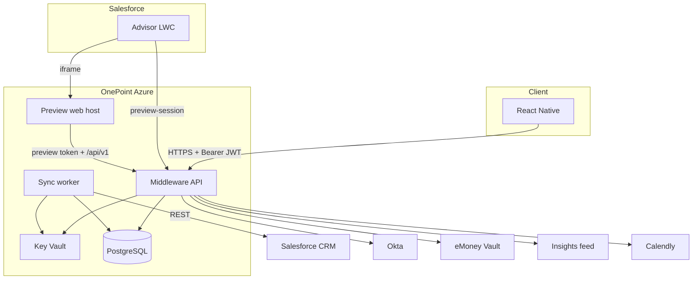

> Status: Proposed — discovery’s engineering guideline; not locked like ADRs, architecture, and specify.  
> Purpose: How we intend to build the system discovery already defined (runtime, structure, practices).  
> Spec-driven rule: Behaviour lives in specify; systems and security in architecture. This file only proposes implementation approach.  
> When it hardens: Stack lock with OnePoint → `tech-spec.md`.

Must not contradict: [constitution](/01-constitution/constitution/) · [architecture](/02-architecture/architecture/) · [04-integrations](/04-integrations/readme/) · `05-specs/*/02-specify.md` + OpenAPI · [AGENTS](/agents/)  
Start building: [READY](/ready/)

Last updated: 2026-07-21

---

## 1. Where this sits

```text
product/          What & why
01-constitution/  Decisions (ADRs) — locked
02-architecture/  Systems + security — locked
03-data/          Entities & mappings — locked
04-integrations/  Connection contracts — locked
05-specs/         Behaviour + contracts — locked (specify wins)
06-engineering/   HOW to build — this proposal → later tech-spec.md
READY / AGENTS    Start rules and agent constraints
```

| Layer | Answers | At handoff |
|---|---|---|
| Specify | What does the product do? | Locked |
| Architecture | Systems and trust boundaries? | Locked |
| Tech-spec proposal | Stack and engineering approach? | Proposed |
| Phase B `tech-spec.md` | Exact versions / SKUs? | After stack lock |

If this file and a locked doc disagree, the locked doc wins — then fix this proposal.

---

## 2. Goals

Shared defaults for language, hosting, repos, modules, CI, fixtures, and observability — without inventing user-visible behaviour or publishing a cost sheet.

---

## 3. Proposed solution

React Native mobile app → .NET middleware on OnePoint Azure. Middleware validates Okta JWTs, enforces tenancy, serves APIs from a Salesforce-projected PostgreSQL read model, and keeps secrets in Key Vault. A sync worker pulls Salesforce off the request path. Okta, vault, insights feed, and Calendly sit behind ports (fixtures until credentials are green — [READY](/ready/)).

Advisor client-view preview is a separate Neopix web surface iframed from Salesforce ([ADR-047](/01-constitution/constitution/#adr-047--advisor-preview-requires-web-client-surface)).

Authoritative systems: [architecture](/02-architecture/architecture/). Contracts: [04-integrations](/04-integrations/readme/). Stack defaults: §4.

---

## 4. Technology decisions

Proposed until stack lock. Exact versions and SKUs pin in `tech-spec.md`.

### Client

React Native + TypeScript (product-locked). Expo vs bare open at stack lock; default Expo.

### Advisor preview

Web host + `preview-session` per [ADR-047](/01-constitution/constitution/#adr-047--advisor-preview-requires-web-client-surface). Do not treat the native app as satisfying CFG-02. Phasing (shell vs RN Web) is in the ADR; schedule the workstream in the plan.

### Middleware

ASP.NET Core on .NET 8 (preferred). Alternative at stack lock: Node.js + TypeScript. Modular API by pack; JWT and tenancy in the pipeline.

Sync and sweepers: .NET Worker Service (or sibling container) sharing application services with the API.

### Data and secrets

PostgreSQL on Azure for identity map, projections, sync watermarks, and audit. EF Core and/or thin SQL; versioned migrations in deploy. Redis deferred until measured need. Key Vault + Managed Identity.

### Hosting and delivery

Container Apps or App Service (Linux); Linux containers either way. CI: GitHub Actions on OnePoint GitHub (SF metadata stays on Callaway Bitbucket). IaC: Bicep or Terraform. Default repos: `onepoint-middleware` and `onepoint-mobile`; preview web may live with mobile or beside middleware — decide at stack lock.

### Integrations and contracts

HttpClient / SDKs behind ports. Pack OpenAPI → generated types; CI fails on drift where practical.

### Observability and local

OpenTelemetry (traces, metrics, logs) to OnePoint’s sink; architecture §9.7 signals; `/health`; correlation ids; mobile crash reporting before store. Local: Docker Compose + mock IdP + fixtures. Testing bar in §7.

---

## 5. Deployment view



| Environment | Intent |
|---|---|
| `dev` | Local + CI; fixtures / mock IdP |
| `staging` | OnePoint Azure + SF sandbox + non-prod Okta |
| `prod` | Live dependencies after architecture §9.9 gates |

Ownership: [azure-hosting](/04-integrations/azure-hosting/) · ADR-008 · ADR-023.

---

## 6. Application structure

| Repo | Contents |
|---|---|
| `onepoint-middleware` | API, worker, migrations, adapters, preview-session |
| `onepoint-mobile` | React Native app |
| Preview web | CFG-02 surface ([ADR-047](/01-constitution/constitution/#adr-047--advisor-preview-requires-web-client-surface)) — placement at stack lock |
| Discovery bundle | Specs — behaviour SoT |

| Layer | Responsibility |
|---|---|
| HTTP API | Auth pipeline; OpenAPI-bound handlers |
| Application services | Use-cases (invite, sync, portfolio, …) |
| Domain logic | Rules from ADRs/specify only |
| Adapters | Salesforce, Okta, VaultProvider, feed, SchedulingProvider, clock |
| Worker | Sync and sweepers |

Fixture vs live adapters switch at the port boundary.

| Code area | Pack |
|---|---|
| Auth, invites, impersonation | E02 |
| Config / `/me` flags | E03 |
| Home | E04 |
| Team + scheduling | E05 |
| Insights | E06 |
| Portfolio | E07 |
| Planning + NW | E08 |
| Documents | E09 |
| Alerts | E10 |
| Health, scaffold, CI | E01 |
| Release / store | E11 |

---

## 7. Build practices

Required unless stack lock or an ADR changes them.

### Spec before code

Behaviour changes start in specify (and ADR/PRD when needed) before the implementation PR. Do not invent user-visible behaviour or AuthZ in code alone.

### Contracts

Implement pack OpenAPI; generate types; CI fails on drift where practical. Resolve ambiguity in specify, not in ad-hoc handlers.

### Testing

Ship coverage with the feature:

- Unit tests for domain rules from specify/ADRs (offline).
- API/contract tests against OpenAPI with fixture adapters.
- AuthZ/tenancy denial cases for every household-scoped path (required in CI).
- Adapter/worker tests for sync and failure paths without live SF in PR CI.
- Mobile tests for flags, empty/`unavailable`/error envelopes; device E2E for critical paths only as needed.

PR CI stays deterministic (mock IdP, fixtures, local Postgres). Staging proves live sandboxes. Label fixture demos. Do not invent SF API names or fake balances in tests.

### Data plane and money

Salesforce bulk I/O in the worker only; interactive GETs read PostgreSQL projections. Decimal-safe types for money — no float accumulation. Schema, indexes, and AuthZ lookups must support growth to ~100k enabled client users without a structural rewrite ([architecture §10.5](/02-architecture/architecture/#105-scalability)); Phase B sizes SKUs for that target and the confirmed concurrent peak.

### Secrets, schema, errors

Config from environment + Key Vault; no secrets in git, images, or binaries. Versioned migrations in deploy. One transport error envelope; UX copy from specify. Correlation id on every request through logs and egress.

### CI and mobile

PR: lint, unit, contract, AuthZ, and touched adapter/worker tests. Staging: deploy + health/auth smoke. Prod: gated promote. Mobile: API base URL per flavor; tokens in Keychain/Keystore; Figma is layout authority.

### Observability and security

OTel + health + §9.7 signals from the first slice. Crash reporting before store. Implement [architecture §9](/02-architecture/architecture/#9-security-baseline) as written — do not redefine here.

Product / user analytics SDKs, funnel event pipelines, and behavioural warehouses are out of scope this delivery ([ADR-022](/01-constitution/constitution/#adr-022--phase-1-explicit-exclusions), [architecture §10.10](/02-architecture/architecture/#1010-product--user-analytics-wont)). Do not add analytics SDKs in mobile or middleware “for later.” Ops signals and crash reporting are not product analytics.

### Accessibility

Use platform accessibility APIs on critical paths (invite, login, Home, money/plan/docs reads) per [architecture §10](/02-architecture/architecture/#10-quality-attributes). No separate WCAG certification program in this proposal unless Phase B adds one.

---

## 8. Implementation sequence

Follow [READY](/ready/). This proposal does not replace stub rules or Pilot DoD.

---

## 9. Open items for stack lock

Confirm or amend §4. Product/trust changes → ADR. Pins → `tech-spec.md`.

- API language: .NET 8 (preferred) vs Node/TS
- Compute: Container Apps vs App Service
- Redis: defer vs now
- Mobile toolchain: Expo vs bare
- Preview web approach and host placement ([ADR-047](/01-constitution/constitution/#adr-047--advisor-preview-requires-web-client-surface))
- APM / log sink; mobile crash tool
- Network edge: public HTTPS vs Private Link / WAF
- IaC: Bicep vs Terraform
- Repos: two vs monorepo
- Data access: EF Core vs lighter SQL

---

## 10. Related documents

| Doc | Role |
|---|---|
| [prd](/product/prd/) | Product narrative |
| [constitution](/01-constitution/constitution/) | Locked decisions |
| [architecture](/02-architecture/architecture/) | Locked systems and security |
| [data-model](/03-data/data-model/) | Entities and fields |
| [integrations](/04-integrations/readme/) | Locked connection contracts |
| [05-specs](/05-specs/readme/) | Locked behaviour and OpenAPI |
| [READY](/ready/) | How to start and run delivery |
| `tech-spec.md` | Future locked engineering SoT |
