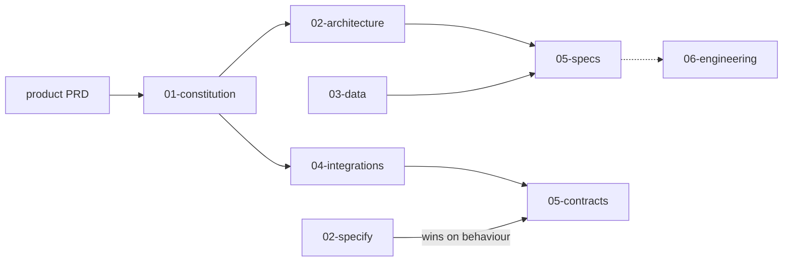

> Phase 1 discovery package for client sign-off and engineering handoff.  
> Lock date: 2026-07-17 · Version: [VERSION](/VERSION) · Pilot target: October 2026 · Advisor fly-in: late September 2026

Product start: [product/prd.md](/product/prd/) · [glossary](/product/glossary/)  
Changelog: [CHANGELOG.md](/changelog/)

---

## Package layout

```text
.
├── README.md                 ← you are here
├── VERSION / CHANGELOG.md / READY.md / AGENTS.md
├── product/                  Product brief (PRD) + glossary
├── 01-constitution/          Why — ADRs
├── 02-architecture/          Systems picture
├── 03-data/                  Entities & field maps
├── 04-integrations/          How systems connect + status tracker
├── 05-specs/                 Feature specs (overview → specify → contracts)
│   └── NN-slug/
│       ├── 01-overview.md
│       ├── 02-specify.md
│       ├── 05-contracts/
│       └── CHANGELOG.md
└── 06-engineering/           Tech-spec proposal → Phase B tech-spec.md after stack lock
```

Folders `01`–`05` plus `product/` are the locked discovery layers. `06-engineering/`, `READY.md`, and `AGENTS.md` support delivery after sign-off.

---

## Dual reading paths

| Audience | Path |
|---|---|
| Client sign-off | This README → [prd](/product/prd/) → [glossary](/product/glossary/) → [constitution](/01-constitution/constitution/) → [architecture](/02-architecture/architecture/) (§9–§10) → [data-model](/03-data/data-model/) → [04-integrations](/04-integrations/readme/) normative specs (*not* living [status](/04-integrations/status/)) → [05-specs](/05-specs/readme/) overviews + specifies + contracts → [VERSION](/VERSION) |
| Engineering / delivery | This README → [prd](/product/prd/) → [READY](/ready/) → [AGENTS](/agents/) → [architecture](/02-architecture/architecture/) → [04-integrations](/04-integrations/readme/) (including [status](/04-integrations/status/)) → [data-model](/03-data/data-model/) → `05-specs/*/02-specify.md` + contracts → [05-specs/README](/05-specs/readme/) → [tech-spec proposal](/06-engineering/tech-spec-proposal/) |

Engineering appendix (not required for product sign-off): [READY.md](/ready/) delivery ops, [AGENTS.md](/agents/), [status.md](/04-integrations/status/), [tech-spec-proposal.md](/06-engineering/tech-spec-proposal/), full [CHANGELOG.md](/changelog/), Jira/authoring notes in [05-specs/README](/05-specs/readme/).

---

## Bundle map

| # | Layer | Path | Owns |
|:---:|---|---|---|
| — | Product | [product/prd.md](/product/prd/) | Vision, personas, V1 outcomes, in/out of scope |
| — | Glossary | [product/glossary.md](/product/glossary/) | Shared terms |
| 01 | Why | [01-constitution/constitution.md](/01-constitution/constitution/) | Accepted ADRs |
| 02 | Systems | [02-architecture/architecture.md](/02-architecture/architecture/) | Diagrams, data plane, §9 security |
| 03 | Entities | [03-data/data-model.md](/03-data/data-model/) | Fields, SF mappings |
| 04 | Integrations | [04-integrations/](/04-integrations/readme/) | System contracts |
| 04 | Tracker | [04-integrations/status.md](/04-integrations/status/) | Living blockers (operational) |
| 05 | Specs | [05-specs/](/05-specs/readme/) | Feature packs |
| 06 | Engineering | [06-engineering/tech-spec-proposal.md](/06-engineering/tech-spec-proposal/) | Proposed how to build |
| — | Ready | [READY.md](/ready/) | Implementation start + PM ops |
| — | Delivery rules | [AGENTS.md](/agents/) | Non-negotiables for build |



---

## Spec-driven rules

1. Product brief narrates; it does not replace ADRs or specifies.  
2. Accepted ADRs bind every spec and implementation.  
3. Specify wins — if overview, architecture, and specify disagree on behaviour, `02-specify.md` wins.  
4. Spec contracts implement [04-integrations/](/04-integrations/readme/); they do not redefine them. Security: [architecture §9](/02-architecture/architecture/#9-security-baseline).  
5. Behaviour changes update the spec first.  
6. Missing SF data → empty / `unavailable`, never fabricated.  
7. [Tech-spec proposal](/06-engineering/tech-spec-proposal/) guides scaffolding; ADRs / specify / architecture stay authoritative. Pin versions after stack lock.  
8. Start from locked specs — [READY.md](/ready/).  
9. Self-contained package — no links outside itself. Workshops and research are external resources (cite by name).  
10. Missing credentials / fields → fixtures — never invent financial data or API names.

---

## How discovery was run

Workshops Jun 23 – Jul 14, 2026. Decisions locked 2026-07-17 in [01-constitution](/01-constitution/constitution/). Workshop notes are external resources — not part of this deliverable.

| Milestone | When |
|---|---|
| Client kickoff | 2026-06-25 |
| Roles / UX / flags | Workshop 3 (Jun 29) |
| SF-only middleware (Tier A) | Workshop 4 (Jun 30) |
| Portfolio / Planning split | Workshops 6–9 |
| Institution linking / portal parity | Workshop 10 (Jul 14) |
| Discovery lock | 2026-07-17 |

---

## Phase 1 specs

Shared MoSCoW, Discovery DoD, and dependency graph: [05-specs/README.md](/05-specs/readme/).

| # | Package | Client entry | Behaviour |
|:---:|---|---|---|
| E01 | Platform | [overview](/05-specs/01-platform/01-overview/) | — |
| E02 | Users & Identity | [overview](/05-specs/02-users/01-overview/) | [specify](/05-specs/02-users/02-specify/) |
| E03 | Configuration | [overview](/05-specs/03-configuration/01-overview/) | [specify](/05-specs/03-configuration/02-specify/) |
| E04 | Home | [overview](/05-specs/04-home/01-overview/) | composite |
| E05 | Your Team | [overview](/05-specs/05-my-team/01-overview/) | [specify](/05-specs/05-my-team/02-specify/) |
| E06 | Insights | [overview](/05-specs/06-insights/01-overview/) | [specify](/05-specs/06-insights/02-specify/) |
| E07 | Portfolio | [overview](/05-specs/07-portfolio/01-overview/) | [specify](/05-specs/07-portfolio/02-specify/) |
| E08 | Planning | [overview](/05-specs/08-planning/01-overview/) | [specify](/05-specs/08-planning/02-specify/) |
| E09 | Documents | [overview](/05-specs/09-documents/01-overview/) | [specify](/05-specs/09-documents/02-specify/) |
| E10 | Action Required | [overview](/05-specs/10-alerts/01-overview/) | [specify](/05-specs/10-alerts/02-specify/) |
| E11 | Release | [overview](/05-specs/11-release/01-overview/) | — |

Each pack: `01-overview` (context + demo) → `02-specify` (acceptance SoT) → `05-contracts/` (OpenAPI / SF / provider).

---

## What is not in this bundle

| Excluded | Why |
|---|---|
| Sprint plans, task lists, GWT, UAT scripts | Delivery owns after handoff |
| Locked full tech-spec (pinned versions, SKUs, cost) | Confirm [proposal](/06-engineering/tech-spec-proposal/) at stack lock → `tech-spec.md` |
| Root composed OpenAPI | Per-spec fragments today; compose later |
| Raw workshop transcripts / research drafts | External resources |

---

## Next (implementation)

1. Implement from locked specifies + contracts; stub per [READY.md](/ready/) and [status.md](/04-integrations/status/).  
2. Chase client credentials / field maps in parallel — do not block first commits.  
3. Scope change → ADR, then specify, then code (and PRD if the product story changes).  
4. Use [tech-spec-proposal.md](/06-engineering/tech-spec-proposal/) as a guideline; confirm stack with OnePoint, then promote to `tech-spec.md`.
